.NET Advanced
==========================

---

# Table of Contents

## **1. C# Language Features**
- [1.1 C# Types](#11-c-types)  
  - [1.1.1 General](#111-general)  
    - [1.1.1.1 Understanding stack and heap memory](#1111-understanding-stack-and-heap-memory-in-c)  
    - [1.1.1.2 Why two types of memory](#1112-why-do-we-have-two-types-of-memory)  
  - [1.1.2 Reference Types](#112-reference-types)  
  - [1.1.3 Value Types](#113-value-types)  
  - [1.1.4 Stack](#114-stack)  
  - [1.1.5 Heap](#115-heap)  
  - [1.1.6 Passing Parameters](#116-passing-parameters)  
    - [1.1.6.1 Passing Value Types by Value](#1161-passing-value-types-by-value)  
    - [1.1.6.2 Passing Value Types by Reference](#1162-passing-value-types-by-reference)  
    - [1.1.6.3 Passing Reference Types by Value](#1163-passing-reference-types-by-value)  
  - [1.1.7 Structs](#117-structs)  
  - [1.1.8 Enums](#118-enums)

- [1.2 Property Accessibility](#12-property-accessibility)  
  - [1.2.1 Read‑only](#121-read-only)

- [1.3 Attributes](#13-attributes)  
- [1.4 Extension Methods](#14-extension-methods)  
- [1.5 Null‑conditional Operator](#15-null-conditional-operator)  
- [1.6 Nullable Reference Type](#16-nullable-reference-type)  
- [1.7 The *is* Operator](#17-the-is-operator)  
- [1.8 Readonly](#18-readonly)  
- [1.9 Anonymous Types](#19-anonymous-types)  
- [1.10 Lambdas](#110-lambdas)

---

## **2. LINQ**
- [2.1 Three Parts of a LINQ Query](#21-three-parts-of-a-linq-query-operation)  
- [2.2 LINQ Providers](#22-linq-providers)  
- [2.3 Syntax](#23-syntax)  
  - [2.3.1 Query Syntax](#231-query-syntax)  
    - [2.3.1.1 from](#2311-from-clause)  
    - [2.3.1.2 where](#2312-where-clause)  
    - [2.3.1.3 select](#2313-select-clause)  
    - [2.3.1.4 orderby](#2314-orderby-clause)  
    - [2.3.1.5 join](#2315-join-clause)  
    - [2.3.1.6 Other clauses](#2316-other-clauses)  
  - [2.3.2 Method Syntax](#232-method-syntax)  
- [2.4 Execution of a LINQ Query](#24-execution-of-a-linq-query)

---

## **3. ASP.NET Core – MVC**
- [3.1 Overview of ASP.NET Core](#31-overview-of-aspnet-core)  
- [3.2 ASP.NET Core Fundamentals](#32-aspnet-core-fundamentals-overview)  
  - [3.2.1 Program.cs & Top‑level Statements](#321-programcs-and-top-level-statements)  
  - [3.2.2 Dependency Injection](#322-dependency-injection)  
  - [3.2.3 Host](#323-host)  
  - [3.2.4 Kestrel](#324-kestrel)  
  - [3.2.5 Middleware](#325-middleware)  
  - [3.2.6 Routing](#326-routing)

- [3.3 ASP.NET Core MVC Introduction](#33-aspnet-core-mvc-introduction)  
  - [3.3.1 MVC Pattern](#331-understanding-the-mvc-pattern)  
  - [3.3.2 Setting up an MVC Project](#332-setting-up-an-aspnet-core-mvc-project)  
  - [3.3.3 Views](#333-views)  
    - [3.3.3.1 Benefits of Views](#3331-benefits-of-views)  
    - [3.3.3.2 Returning Views](#3332-returning-views-from-controller-actions)  
    - [3.3.3.3 Passing Data to Views](#3333-passing-data-to-views)  
    - [3.3.3.4 Partial Views & View Components](#3334-partial-views-and-view-components-self-study)  
      - [3.3.3.4.1 Partial Views](#33341-partial-views)  
      - [3.3.3.4.2 Session State](#33342-session-state)  
      - [3.3.3.4.3 Using Session State](#33343-using-session-state)  
      - [3.3.3.4.4 ShoppingCart Demo](#33344-shoppingcart-demo)  
      - [3.3.3.4.5 View Component](#33345-view-component)

- [3.4 Controllers](#34-controllers)  
  - [3.4.1 Introduction](#341-introduction-to-controllers)  
  - [3.4.2 Dependency Injection in Controllers](#342-dependency-injection-in-controllers)  
  - [3.4.3 Routing](#343-routing-self-study)  
    - [3.4.3.1 Types of Routing](#3431-types-of-routing)  
      - [3.4.3.1.1 Convention‑based routing](#34311-convention-based-routing)  
      - [3.4.3.1.2 Convention‑based route with parameter](#34312-convention-based-route-with-parameter)  
      - [3.4.3.1.3 Route defaults](#34313-convention-based-routing--route-defaults)  
      - [3.4.3.1.4 Optional segment](#34314-convention-based-routing--optional-segment)  
      - [3.4.3.1.5 Constraints](#34315-convention-based-routing--constraints)  
      - [3.4.3.1.6 Default route](#34316-the-default-convention-based-route)  
      - [3.4.3.1.7 Tag Helpers Navigation](#34317-navigating-with-tag-helpers)  
      - [3.4.3.1.8 More Tag Helpers](#34318-some-more-tag-helpers)

- [3.5 Other MVC Topics](#35-other-aspnet-core-mvc-topics)  
  - [3.5.1 Razor](#351-razor)  
  - [3.5.2 Client‑side Libraries](#352-client-side-frameworks-and-libraries)  
  - [3.5.3 ViewStart & Layout](#353-viewstart-and-layout)  
  - [3.5.4 ViewImports](#354-viewimports)

- [3.6 Forms & Model Binding](#36-working-with-forms-and-model-binding-in-aspnet-core-mvc)  
  - [3.6.1 Tag Helpers for Forms](#361-tag-helpers-for-forms)  
    - [3.6.1.2 Order Form Demo](#3612-creating-the-order-form-demo)  
  - [3.6.2 Model Binding](#362-model-binding)  
    - [3.6.2.1 Accessing Posted Data Demo](#3621-accessing-posted-data-demo)  
  - [3.6.3 Validation](#363-validation)  
    - [3.6.3.1 Validation Summary](#3631-displaying-a-validation-summary)  
  - [3.6.4 Client‑side Validation](#364-client-side-validation)

- [3.7 RESTful API](#37-restfull-api-making-the-site-interactive)  
  - [3.7.1 Disadvantages of SSR](#371-disadvantages-of-server-side-rendering)  
  - [3.7.2 Creating an API](#372-creating-an-api)  
  - [3.7.3 Configuring the Application](#373-configuring-the-application)  
  - [3.7.4 API Controller](#374-api-controller)  
  - [3.7.5 Attribute‑based Routing](#375-attribute-based-routing)  
  - [3.7.6 API Response](#376-the-api-response)  
  - [3.7.7 OpenAPI / Swagger](#377-openapi--swagger)  
  - [3.7.8 Consuming an API](#378-consume-an-api-from-a-browser)

---

## **4. Entity Framework**
- [4.1 What is EF](#41-what-is-entity-framework)  
- [4.2 ORM](#42-orm)  
- [4.3 The Data Model](#43-the-data-model)  
- [4.4 EF Core Data Providers](#44-ef-core-data-providers)  
- [4.5 How EF Interprets the Model](#45-how-ef-core-interprets-your-data-model)  
- [4.6 Creating the Data Model & DB](#46-creating-the-datamodel-and-the-database)  
- [4.7 Migrations](#47-ef-core-database-migrations)  
  - [4.7.1 Installing Tools](#471-installing-the-tools)  
  - [4.7.2 Using Tools](#472-using-the-tools)  
  - [4.7.3 Seeding via Migrations](#473-seeding-a-database-via-migrations)

- [4.8 Querying](#48-querying-a-database-using-EF)  
  - [4.8.1 Querying & Filtering](#481-querying-and-filtering)  
  - [4.8.2 Eager Loading Related data](#482-eager-loading-related-data)  
  - [4.8.3 BasicWorkflow](#483-basic-workflow)

- [4.9 Inserting Simple Objects](#49-inserting-simple-objects)  
- [4.10 Updating Simple Objects](#410-updating-simple-objects)  
- [4.11 EF in ASP.NET Core](#411-ef-in-an-aspnet-core-app)  
  - [4.11.1 EF NuGet Packages](#4111-ef-nuget-packages)  
  - [4.11.2 Create Data Model](#4112-create-a-data-model)  
  - [4.11.3 Register DbContext](#4113-register-the-dbcontext)  
  - [4.11.4 Use DbContext](#4114-use-the-dbcontext)

---

## **5. Automated Testing with NUnit**
- [5.1 Why Write AutomatedTests](#51-why-write-automated-tests)  
- [5.2 Getting Started with NUnit](#52-getting-started-with-nunit)  
  - [5.2.1 Testing Frameworks & Runners](#521-testing-frameworks--test-runners)  
  - [5.2.2 Creating a Production Project](#522-creating-a-production-project)  
  - [5.2.3 Creating a Test Project](#523-creating-a-test-project)  
  - [5.2.4 Upgrade to NUnit 4](#524-upgrade-to-nunit-4x)  
  - [5.2.5 Writing a First Test](#525-writing-a-first-test)  
    - [5.2.5.1 TestFixture attribute](#5251-testfixture-attribute)  
    - [5.2.5.2 Test attribute](#5252-test-attribute)  
    - [5.2.5.3 Arrange‑Act‑Assert](#5253-arrange-act-assert-pattern)  
  - [5.2.6 Running Tests](#526-running-tests)

- [5.3 Defining Tests](#53-defining-tests)  
  - [5.3.1 Kinds of Tests](#531-kinds-of-automated-tests)  
  - [5.3.2 Qualities of a Good Test](#532-qualities-of-a-good-test)

- [5.4 Asserts](#54-asserts)  
  - [5.4.1 Equality](#541-equality-assertions)  
  - [5.4.2 Reference Equality](#542-reference-equality-assertions)  
  - [5.4.3 Collection assertions](#543-collection-assertions)  
  - [5.4.4 Exception assertions](#544-exception-assertions)  
  - [5.4.5 Null & Boolean assertions](#545-null-and-boolean-assertions)  
  - [5.4.6 Range assertions](#546-range-assertions)

- [5.5 Test Execution Lifecycle](#55-test-execution-lifecycle)  
- [5.6 TestCases](#56-testcases)

---

## **6. Extra’s**
- [6.1 Packages to Install](#61-packages-to-install)  
- [6.2 Reminders](#62-reminders)

---


## 1. C# Language features
### 1.1 C# types
#### 1.1.1 General
C# is strongly typed, every variable should be declared with a type, there are 2 categories of types:
- Value type : contains an instance of a type
- Reference type : contains a reference (memory address) to an instance of the type (located in the heap)

Every type in C# directly or indirectly derives from the _Object_ class type, this is the ultimate base class of all types

##### 1.1.1.1 Understanding stack and heap memory in C#

There are 2 types of memory allocation for the variables that we create: stack memory and heap memory

- Stack : responsible for keeping track of what's executing in code
    - Stack memory allocation is done on a **Last In First Out** principle
    - When a method is done executing, the top block is thrown away

- Heap : Responsible for holding information (instances)
    - All instances can be accessed at all times
    - Has to deal with garbage collection

##### 1.1.1.2 Why do we have two types of memory?
Object types need dynamic memory (heap), primitive types need static memory (stack)

#### 1.1.2 Reference types

Variables hold a reference (pointer/memory address) to the instance on the heap
- Multiple variables can point to the same instance
- Some built-in types (primitives) are reference types : object, string
- Most of the types in the .NET class library are reference types : Dictionary< Tkey, Tvalue >, Random, List, Console, ...
- You can define your own using the _class_ keyword

#### 1.1.3 Value types

Variables hold the value, there is no reference to the heap.
- Two variables cannot point to the same instance. On assignment a copy is made
- Many built-in types (primitives) are value types : int, double, float, bool, char
- Some of types in the .NET class library are value types : DateTime, KeyValuePair, ...
- You can define your own using the _struct_ keyword, but structs have limitations:
    - Cannot declare parameterless constructors (implicit exists)
    - Cannot initialize an instance field or property at declaration
    - Constructor **must** initialize all fields 
    - Cannot inherit from other class or struct (but can implement interfaces)
- Value types are fast to instantiate

Enum creates a value type, it is a set of named constants of type int by default (starting with 0)

#### 1.1.4 Stack

The Stack is more or less responsible for keeping track of what’s executing in our code (or what’s been "called"). Think of the Stack as a series of boxes stacked one on top of the next. The Stack is self-maintaining, meaning that it basically takes care of its own memory management. When the top box is no longer used, it’s thrown out.

#### 1.1.5 Heap

The Heap is more or less responsible for keeping track of our objects. The Heap is similar except that its purpose is to hold information (not keep track of execution most of the time) so anything in our Heap can be accessed at any time. The Heap has to worry about Garbage Collection (GC) - which deals with how to keep the Heap clean.

#### 1.1.6 Passing parameters
##### 1.1.6.1. Passing Value Types by Value

For example: The variable n is passed by value to the method SquareIt. Any changes that take place inside the method have no effect on the original value of the variable.

##### 1.1.6.2. Passing Value Types by Reference

When you do want the original variable to change if it is passed to a method you can use the keyword _ref_, this means that not the variable itself is passed to a method but a **reference** to the variable.

##### 1.1.6.3. Passing Reference Types by Value

If you pass a reference type to a method and make changes, this will affect the original variable, but if you allocate a new portion of memory by using _new_ `pArray = new int[5] { -3, -1, -2, -3, -4 };`, this makes it reference a new array and makes the change local (inside the method).

#### 1.1.7 Structs

See [1.1.3 Value Types](#113-value-types)

#### 1.1.8 Enums

See [1.1.3 Value Types](#113-value-types)

### 1.2 Property Accessibility

The get and set portions of a property or indexer are called accessors. By default these have the same visibility or access level as the property or indexer to which they belong.
Property declarations can be:
- public : Accessible from anywhere
- protected : Accessible within the containing class and derived classes
- internal : Accessible anywhere within the same assembly (project)
- protected internal : Accessible from any class in the same assembly OR derived classes in other assemblies
- private : Accessible only within the containing class

#### 1.2.1 Read-only
It is also possible to restrict modifications to a property so it can only be set in a constructor:<br>
For example:
```CSHARP
public class Person
{
    public Person(string firstName) => FirstName = firstName;

    public string FirstName { get; }

    // Omitted for brevity.
}
```

### 1.3 Attributes
Attributes provide a way of associating information with code in a declarative way. They can also provide a reusable element that can be applied to a variety of targets.
In C#, attributes are classes that inherit from the Attribute base class. Any class that inherits from Attribute can be used as a sort of "tag" on other pieces of code.<br>
For example:
```CSHARP
[Obsolete("This class is obsolete. Use ThisClass2 instead.")]
public class ThisClass
{
    // Omitted for brevity.
}
```
Attributes can be used on a number of targets such as: Assembly, Class, Constructor, Delegate, Enum, Event, Field, GenericParameter, Interface, Method, Module, Parameter, Property, ReturnValue, Struct

### 1.4 Extension methods

Enable you to “add” methods to existing types without modifying the original type or creating a derived type. Extension methods are **static** methods, but they are called as if they are **instance** methods on the extended type.
(Note the 3 keywords: _static static this_)

For example:
```CSHARP
namespace ExtensionMethods
{
    public static class MyExtensions
    {
        public static int WordCount(this string str)
        {
            return str.Split(new char[] { ' ', '.', '?' },
                             StringSplitOptions.RemoveEmptyEntries).Length;
        }
    }
}
```

To use an extended method you have to:
- Bring the namespace of the static class that defines the extension into scope with a _using_ directive.
- Extension method can be called as if it is a member of the extended type<br>
For example:
```CSHARP
using ExtensionMethods;
...
string s = "Hello Extension Methods";
int i = s.WordCount();
```

### 1.5 Null-conditional operator

C# 6 introduces the "null-conditional operator" **_?_**. When used on an object on the right-hand side of an expression, the null-conditional operator returns the member value if the object is not null and null otherwise.
For example:
```CSHARP
var employee = new Employee();
string lowerName = employee.FirstName?.ToLower(); // notice the .?
```

### 1.6 Nullable reference type

Prior to C# 8.0, all reference types were nullable. The syntax is the same as a nullable value type : **_?_** making it possible to minimize the risk of _NullReferenceExceptions_ when dereferencing (accessing a variables' members using the .(dot) operator) a variable.
It is possible to set the nullable context for a project using the < Nullable > element in your _.csproj_ file (enabled by default)

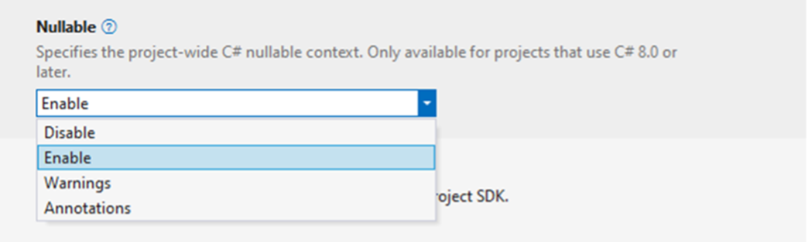

| Context | Reference types | ? suffix | ! operator |
|:-------:|:-------|:--------|:--------|
| disable | All are nullable | Can’t be used | Has no effect |
| enable | Non-nullable unless declared with ? | Declares nullable type | Suppresses warnings for possible null assignment |
| warnings | All are nullable, but members are considered not null at opening brace of method | Produces a warning | Suppresses warnings for possible null assignment |
| annotations | Non-nullable unless declared with ? | Declares nullable type | Has no effect |

Why nullable reference types?
- Less null checks, so make the compiler do a lot of the work for you
- Let the compiler find potential null-references, instead of finding them at runtime, especially in production!
- Make your code more expressive

### 1.7 The _is_ operator

The is operator checks if the result of an expression is compatible with a given type.
From C# 7.0 onwards, it is also possible to use it to match an expression against a pattern.<br>
For example:
```CSHARP
static bool IsFirstFridayOfOctober(DateTime date) =>
    date is { Month: 10, Day: <= 7, DayOfWeek: DayOfWeek.Friday };
```

The _is_ operator can be useful in the following scenarios:
- to check the run-time type of an expression:
```CSHARP
int i = 34;
object iBoxed = i;
int? jNullable = 42;
if (iBoxed is int a && jNullable is int b)
{
    Console.WriteLine(a + b); // output: 76
}
```
- To check for _null_ `if (input is null)`, also possible to use negation `if (result is not null)`
- To match elements of a list or array:
```CSHARP
int[] odd = { 1, 3, 5 };
int[] fib = { 1, 1, 2, 3, 5 };

Console.WriteLine(odd is [1, _, 2, ..]);   // false
Console.WriteLine(fib is [1, _, 2, ..]);   // true
```
### 1.8 Readonly

In a field declaration, the _Readonly_ keyword indicates that assignment to the field can only occur as part of the declaration or in a constructor in the same class. A _Readonly_ field can’t be assigned after the constructor exits.
Using Readonly makes it:
- A value type becomes **immutable**
- A reference type always refers to the same object (that object is not immutable)

### 1.9 Anonymous types

Anonymous types provide a convenient way to encapsulate a set of read-only properties into a single object without having to explicitly define a type first. You create anonymous types by using the new operator together with an object initializer.<br>
For example:
```CSHARP
var v = new { Amount = 108, Message = "Hello" };

// Rest the mouse pointer over v.Amount and v.Message in the following
// statement to verify that their inferred types are int and string.
Console.WriteLine(v.Amount + v.Message);
```
The type name is generated by the compiler and is not available at the source code level. The type of each property is inferred by the compiler. These types are typically used in the select clause of a query expression (see LINQ).

### 1.10 Lambda's

You use a lambda expression to create an anonymous function. Use the lambda declaration operator ⇒ to separate the lambda’s parameter list from its body. To create a lambda expression, you specify input parameters (if any) on the left side of the lambda operator and an expression or a statement block on the other side.

Specify zero input parameters with empty parentheses:
```CSHARP
() => Console.WriteLine("Hello, World!");
```
If a lambda expression has only one input parameter, parentheses are optional:
```CSHARP
x => x * x * x;
```
Two or more input parameters are separated by commas:
```CSHARP
(int x, string s) => s.Length > x;
```

Input parameters and return types of a lambda expression are strongly typed at compile time. When the compiler can infer the types of input parameters, you may omit type declarations. If you need to specify the type of input parameters, you must do that for each parameter.

A lambda expression can be of any of the following two forms:
- Expression lambda that has an expression as its body:
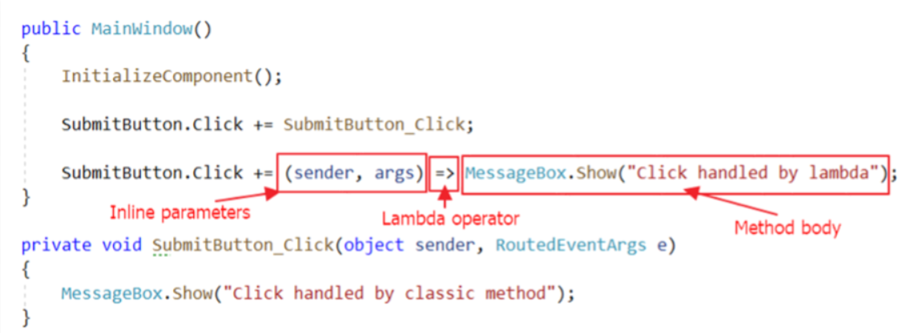

- Statement lambda that has a statement block as its body:
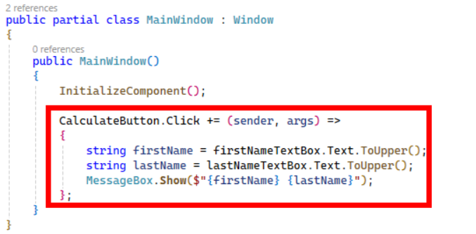

With multiple lines of code in the body a return statement and curly brackets are needed (`MessageBox.Show(...)` in example).

---
## 2. LINQ
### 2.1 Three parts of a LINQ query operation

LINQ (Language Integrated Query) is a powerful feature in C# that allows you to query and manipulate data in a consistent way, no matter the data source. Data source must be an object that implements _IEnumerable< T >_

All LINQ query operation consist of three distinct actions:
- Obtain the data source
- Create the query
- Execute the query

For example:
```CSHARP
class IntroToLINQ
{
    static void Main()
    {
        // The Three Parts of a LINQ Query:
        // 1. Data source.
        int[] numbers = new int[7] { 0, 1, 2, 3, 4, 5, 6 };

        // 2. Query creation.
        // numQuery is an IEnumerable<int>
        var numQuery =
            from n in numbers
            where (n % 2) == 0
            select n;

        // 3. Query execution.
        foreach (int number in numQuery)
        {
            Console.Write("{0,1} ", number);
        }
    }
}
```
It is important to realize that the query is not executed when it is created, but only when it is iterated over. This is known as **deferred execution**.

### 2.2 LINQ Providers

LINQ works through providers. A LINQ provider translates your LINQ queries into commands that the underlying data source understands.
Some common LINQ providers are:
- LINQ to Objects – queries in-memory collections like arrays, lists, or dictionaries
- LINQ to Entities – queries relational databases and translates LINQ into SQL (Entitiy framework uses this provider)
- LINQ to XML – queries and manipulates XML documents (out of scope for this course)<br>
**No matter the data source, the syntax of a LINQ query is always the same!**

### 2.3 Syntax

LINQ queries can be written in two syntaxes: _query syntax_ and _method syntax_

Query syntax:
- SQL-like (from, join, where, select)
- Recommended for complex queries
Method syntax
- Extension methods on IEnumerable< T > (Where, Select, OrderBy, OrderByDescending, Join, ...)
- Recommended for simple queries

For example:
```CSHARP
// Query syntax (SQL-like)
var adultsQuery = from person in people
             where person.Age >= 18
             select person;

// Method syntax (does the same thing)
var adultsQuery2 = people.Where(person => person.Age >= 18);
```

#### 2.3.1 Query syntax
##### 2.3.1.1 _from_ clause

A query expression must begin with a from clause, it specifies the following:
- The data source on which the query will be run. The data source is a sequence of values that implements IEnumerable< T >
- A local range variable that represents an element in the source sequence
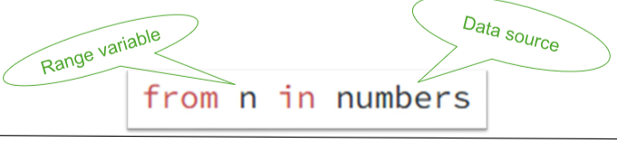

##### 2.3.1.2 _where_ clause

The where clause is used in a query expression to specify which elements from the data source will be returned in the query expression (it is the _filter_). 
- It applies a true-false condition (predicate) on each source element
- It is possible to use range variables defined in _from_ (or _join_)
- It can call methods
- Combine predicates with && or ||<br>
For example:
```CSHARP
// Data source.
        int[] numbers = { 5, 4, 1, 3, 9, 8, 6, 7, 2, 0 };

        // Query with a where that filters even numbers greater than 4.
        // Note that you can call methods in the where clause and combine predicates with && and || operators.
        var query =
            from n in numbers
            where IsEven(n) && n > 4
            select n;
```

##### 2.3.1.3 _select_ clause

A LINQ query always produces a sequence of values (IEnumerable<T>). The type of those values can be determined by the select clause. It can also transform the source sequence to a sequence of a new type:

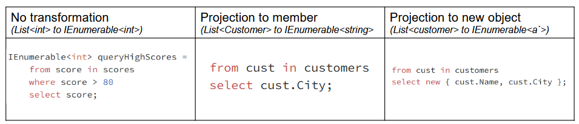

##### 2.3.1.4 _orderby_ clause

In a query expression, the orderby clause causes the returned sequence to be sorted in either ascending or descending order.Multiple keys can be specified in order to perform one or more secondary sort operations. The default sort order is ascending. Typically, the orderby clause is placed right before the select clause.

For example:
```CSHARP
// Data source.
        string[] fruits = { "cherry", "apple", "blueberry" };

        // Query for ascending sort.
       IENumerable<string> sortAscendingQuery =
            from fruit in fruits
            orderby fruit // ascending is the default
            select fruit;

        // Query for descending sort.
        IENumerable<string> sortDescendingQuery =
            from fruit in fruits
            orderby fruit descending
            select fruit;
```

##### 2.3.1.5 _join_ clause

A join clause takes two source sequences as input and merges them into one sequence. The join clause compares the specified keys for equality by using the special equals keyword. Attention: use the _equals_ keyword (not ==)!<br>
For example:
```CSHARP
var innerJoinQuery =
    from category in categories
    join product in products on category.Id equals product.CategoryId
    select new { ProductName = product.Name, Category = category.Name };
// produces flat sequence of "product name / category" pairs
```

##### 2.3.1.6 Other clauses

Other query clauses include let (to create a new range variable), group (to group results by a key), and into (to continue a query after a group or join clause). These clauses are more advanced and are not covered in this course.

#### 2.3.2 Method syntax

Under the hood LINQ queries written in query syntax are translated into method calls such as Where, Select, OrderBy, OrderByDescending, Join. It is possible to call these methods directly using the method syntax (when _using System.Linq_ namespace)<br>
For example:
```CSHARP
int[] numbers = {5, 10, 8, 3, 6, 12 };

        // Query syntax:
        IENumerable<int> numQuery1 =
            from n in numbers
            where n % 2 == 0
            orderby n
            select n;

        // Method syntax:
        IENumerable<int> numQuery2 = numbers.Where(n => n % 2 == 0).OrderBy(n => n);
```

### 2.4 Execution of a LINQ query

A LINQ query uses deferred execution. It is not executed when it is defined. Instead, it is executed when you iterate over the query variable (e.g., in a foreach loop). But this is not always necessary, there are _execution_ methods that force immediate execution of a LINQ query under the hood and return a single value or a collection:

| Method | What it does | When to use |
|:-------:|:-------|:--------|
| _ToList()_ | Converts the query result to a List<T> | When you want a mutable list and to force immediate execution |
| _ToArray()_ | Converts the query result to an array | When you need a fixed-size array and want to force immediate execution |
| _ToDictionary(keySelector, elementSelector)_ | Converts the query result to a Dictionary<TKey, TValue> using the provided key and value selectors | When you need a key-value pair collection and want to force immediate execution |
| _First()_ | Returns the first element; throws an exception if the sequence is empty | When you expect at least one result and want an error if not |
| _FirstOrDefault()_ | Returns the first element, or the default value (e.g., null or 0) if empty | When the sequence might be empty and you want to avoid exceptions |
| _Single()_ | Returns the only element; throws an exception if there are zero or more than one | When you expect exactly one result and want an error otherwise |
| _SingleOrDefault()_ | Returns the only element or default value; throws an exception if more than one | When zero or one result is valid, but more than one is an error |
| _Count()_ | Returns the number of elements | When you need to know how many items match your query |
| _Any()_ | Returns true if any elements exist | To check if the query returns at least one result |
| _All(predicate)_ | Returns true if all elements match a condition | To check if every result matches a predicate |

There are many more execution methods, check the Microsoft documentation for more info: https://learn.microsoft.com/en-us/dotnet/csharp/linq/get-started/introduction-to-linq-queries#classification-table

---

## 3. ASP.NET Core - MVC
### 3.1 Overview of ASP.NET Core

ASP.NET Core is an open-source web framework created by Microsoft and the community for building modern web applications and services with .NET. It is a modular framework existing out of many libraries that you can select to be included in your applications.

What can be built with ASP.NET Core can be grouped into 3 categories:
- Server-side rendered applications
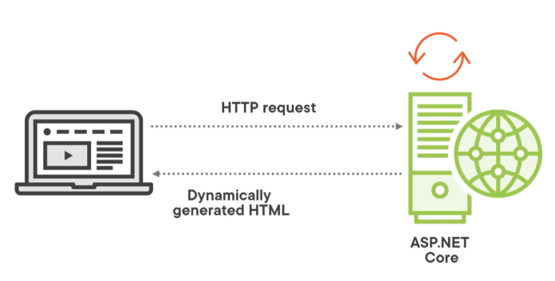
- Services
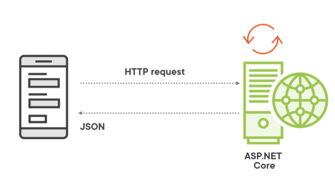
- Client-side rendered applications
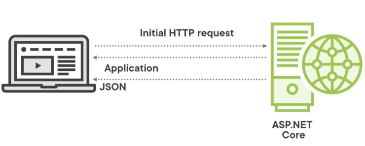

### 3.2 ASP.NET Core fundamentals overview
#### 3.2.1 Program.cs and top-level statements

ASP.NET Core applications start like console applications, it contains a 'main' function (static void main), but due to the use of top-level statemtents this, and the class declaration can be omitted (they can still be included but are optional). The _Program.cs_ file is where:
- Services required by the app are configured (DI)
- The app's request handling pipeline is defined as a series of middleware components

#### 3.2.2 Dependency Injection

Dependency injection is a design pattern that allows for the decoupling of components in an application (achieves **Inversion of Control (IoC)**), this is done in the _Program.cs_ file. Services can be registered with different lifetimes:
- _AddTransient_ : A new instance of the service is created each time it is requested
- _AddScoped_ : A new instance of the service is created per scope. In web applications, a scope typically corresponds to a single client request
- _AddSingleton_ : A single instance of the service is created and shared throughout the application’s lifetime

For example: `builder.Services.AddScoped<ILoggerService, LoggerService>()` in _Program.cs_
And in the controller:
```CSHARP
public class AController
{
    private ILoggerService _loggerService
    public AController(ILoggerService anInjectedService)
    {
        _loggerService = anInjectedService
    }

    public void doSomeMagic()
    {
        // actual logic here
        // I can just use the service, the DI container will make sure a good one is injected
        _loggerService.Log("Log something from a step in the logic);

        // continue with the logic
    }
}
```

#### 3.2.3 Host

The host is responsible for app startup and lifetime management. It encapsulates all app resources, such as:
- A HTTP server implementation (Kestrel)
- Dependency injection (DI) services
- Configuration
- Logging

`WebApplication.Create` initializes a new instance of the WebApplication class with preconfigured defaults.

#### 3.2.4 Kestrel

Because ASP.NET Core is cross-platform it can't make use of a vendor-specific webserver (like IIS), this is why it uses its own: Kestrel. It is used as a standalone webserver or in combination with a reverse proxy server (like IIS, apache, Nginx, ...) in that case Kestrel will handle the application logic while the reverse proxy will manages tasks like SSL termination and load balancing.

#### 3.2.5 Middleware

When a request is received, it will travel through a set of middleware components, often referred to as the middleware pipeline or the request pipeline. A response will be created and that will eventually be sent back to the browser.

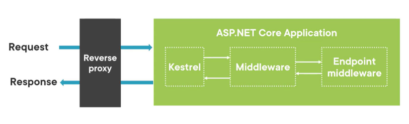

Middleware can be used to perform tasks such as authentication, logging, error handling, and more. Request delegates are used to build the request pipeline. The request delegates handle each HTTP request. The middleware is configured in _Program.cs_ using extension methods on the _IApplicationBuilder_ interface.
The order in which middleware components are added to the pipeline is important, as it determines the order in which they are executed.
The configuration can be recognized by the _app.Use…​_ methods. For example, _app.UseRouting()_ adds the routing middleware to the pipeline.

#### 3.2.6 Routing

Routing is the process of mapping incoming HTTP requests to the appropriate controller actions. In ASP.NET Core MVC, routing is configured using the UseRouting and UseEndpoints middleware components

More on this in: **3.4.3**

### 3.3 ASP.NET Core MVC introduction
#### 3.3.1 Understanding the MVC pattern

The MVC pattern divides an application into three main components:

- **Model**: Represents the data and business logic of the application. It is responsible for managing the data, including retrieving it from a database and performing any necessary calculations or transformations.
- **View**: Represents the user interface of the application. It is responsible for displaying data to the user and capturing user input.
- **Controller**: Acts as an intermediary between the Model and the View. It processes user input, interacts with the Model to retrieve or update data, and selects the appropriate View to render the response.

#### 3.3.2 Setting up an ASP.NET Core MVC Project

GUTS exercise for MVC (lab 3).

#### 3.3.3 Views

In the Model-View-Controller (MVC) pattern, the view handles the app’s data presentation and user interaction. It is a HTML template with embedded Razor markup (code that interacts with HTML markup). Views are _.cshtml_ files. Usually, view files are grouped into folders named for each of the app’s controllers. The folders are stored in a Views folder at the root of the app:

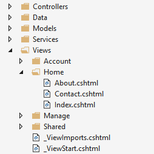

The Home controller is represented by a Home folder inside the Views folder. The Home folder contains the views for the About, Contact, and Index (homepage) webpages. When a user requests one of these three webpages, controller actions in the Home controller determine which of the three views is used to build and return a webpage to the user.

##### 3.3.3.1 Benefits of views

Views help to establish separation of concerns within an MVC app by separating the user interface markup from other parts of the app.

- The app is easier to maintain because it’s better organized
- The parts of the app are loosely coupled
- It’s easier to test the user interface parts of the app because the views are separate units
- Due to better organization, it’s less likely that you’ll accidentally repeat sections of the user interface

##### 3.3.3.2 Returning views from controller actions

Views are typically returned from actions as a ViewResult, which is a type of ActionResult. Your action method can create and return a ViewResult directly, but that isn’t commonly done. Since most controllers inherit from Controller, you simply use the View helper method to return the ViewResult:<br>
HomeController.cs:
```CSHARP
public IActionResult Index()
{
    return View();
}
```
View discovery: process to determine which view file is used based on the view name: runtime looks in the _Views/[ControllerName]_ folder for the view. If it doesn’t find a matching view there, it searches the Shared folder for the view.

##### 3.3.3.3 Passing data to views

You can use several approaches to pass data to views:
- Weakly typed data:
    - ViewData (ViewDataAttribute)
    - ViewBag
- Strongly typed data:
    - viewmodel
    - single model object

It is advised to use strongly typed data (view models) to pass data to views (provides compile-time checking and IntelliSense support in the view).
The Model property of the view is used to access the (view)model data and can be defined at the top of the view using the @model directive:
```CSHTML
@model MVCProject.Models.ToDoItem
<h1>@Model.Title</h1>  <!-- Model is strongly typed! -->
```

Viewmodel: a class that wraps multiple properties so that the view can access all the data it needs
For example:
```CSHARP
public class PieListViewModel
{
    public IEnumerable<Pie>? Pies {get; set;};
    public String? CurrentCategory {get; set;};
}
```
Such a view model can literally be seen as a model for the view

##### 3.3.3.4 Partial views and View components (Self study)

###### 3.3.3.4.1 Partial views:
	
- Code reuse, it is just a view but is used as part of another view
- Typed (using @model)
- Name starts with _ and lives in the "shared" folder under views OR in the folder in which the view that uses it is located
- To use the partial view we use the "partial" tag helper:

```CSHTML
@foreach (var pie in Model.Pies)
{
	<partial name="_PieCard" model="pie"/>
}
```

- Doesn't execute the _ViewStart code

###### 3.3.3.4.2 Session state:
- Web is stateless, after response, the server forgets about the request
- To improve we can make use of GUIDs stored in a session variable placed in a cookie (the specific user GUID is also stored in the database along with for example the items in a shoppingcart)
- This way it is possible to store data on the server in between requests

###### 3.3.3.4.3 Using Session State:
- Not enabled by default
- Register framework service in Program.cs:
```CSHARP
builder.Services.AddSession(); //support for sessions
// ...
app.UseSession(); //plug middleware for sessions
```

###### 3.3.3.4.4 ShoppingCart Demo:

Things to do: 
- Create Entity class and DbSet (remember to "add-migration" and "update-database")
- Create ShoppingCartItem model class (ShoppingCartItemId, Pie, Amount and ShoppingCartId (GUID) as properties)
	=> This means that when we surf to the site we will get a ShoppingCartId, used to store any items we add to our shoppingcart using shoppingcartitems
- Create ShoppingCart interface with several methods (AddToCart, RemoveFromCart, GetShoppingCartItems,ClearCart and GetShoppingCartTotal)
- Dependency Injection for the DbContext and the ShoppingCartId
- Make the constructor private and create a factory method for creating ShoppingCart instances, this method needs session and a context
- DI for shoppingcarts:
```CSHARP
builder.Services.AddScoped<IShoppingCart, ShoppingCart>(provider =>
{
    IHttpContextAccessor httpContextAccessor = provider.GetRequiredService<IHttpContextAccessor>();
    ISession? session = httpContextAccessor.HttpContext?.Session;
   	BethanysPieShopDbContext dbContext = provider.GetRequiredService<BethanysPieShopDbContext>();

    return ShoppingCart.GetCart(session, dbContext);
});
```
- Access to the session information is needed, gotten from HttpContext, `builder.Services.AddHttpContextAccessor();` is needed for the the DI-container to be able to create an IHttpContextAccessor. We retrieve the session, create the dbcontext and call GetCart to obtain the cart instance that the DI-container will return
- Create a controller, inject IPieRepository and an IShoppingCart using DI
- Controller has: Index action, AddToShoppingCart and RemoveFromShoppingCart methods (receive PieId and then redirect back to the Index action: `return RedirectToAction("Index");`
- Create View: new folder (ShoppingCart, same name as controller) and Index.cshtml file (action name)
- Create redirect button to ShoppingCart in _PieCard and Details page to AddToShoppingCart action using tag helpers (asp-controller, asp-action and asp-route-pieId)

###### 3.3.3.4.5 View Component:
- Similar to partial views
- Partial views are limited: Data gets passed to them from their calling view, view components are different
- Works with data and dependency injection
- Not a standalone component, always invoked by parent view but can execute code to load different data
- Used in: login panels, dynamic navigation, shopping cart, …
- Name ends in "ViewComponent" and uses the ViewComponent base class
- MUST be public, non-abstract and non-nested (like controllers)
- Functionality is added in the invoke method (NOT an override)
- View parts live in the Views/Shared/Components folder, each viewcomponent will get a separate subfolder in this directory
- The view files are usually called default.cshtml
- Using the viewcomponents:
```CSHTML
@await Component.InvokeAsync("shoppingCartSummary")
<vc:shopping-cart-summary></vc:shopping-cart-summary>
```

### 3.4 Controllers
#### 3.4.1 Introduction to controllers

A controller is used to define and group a set of actions (action methods). This aggregation of actions allows common sets of rules, such as routing, caching, and authorization, to be applied collectively. Requests are mapped to actions through routing. Controllers are activated and disposed on a per request basis.<br>
By convention, controller classes:
- Reside in the project’s root-level Controllers folder
- Inherit from Microsoft.AspNetCore.Mvc.Controller
In a controller at least one of the following conditions is true:
- The class name is suffixed with Controller
- The class inherits from a class whose name is suffixed with Controller
- The [Controller] attribute is applied to the class

#### 3.4.2 Dependency injection in controllers

Controllers can take advantage of dependency injection (DI) to get the services they need.
For example:
```CSHARP
public class MyController : Controller
{
    private readonly ILogger<MyController> _logger;
    private readonly IDataRepository _dataRepository;

    public MyController(ILogger<MyController> logger, IDataRepository dataRepository)
    {
        _logger = logger;
        _dataRepository = dataRepository;
    }

    // Action methods go here
}
```
This does mean that _ILogger_ and _IDataRepository_ are registered in the DI container in **Program.cs**.

#### 3.4.3 Routing (Self study)

Routing = mapping incoming HTTP requests to an endpoint (configured at startup in program.cs)

- In ASP.NET Core MVC requests are handled by action methods in controllers, MVC maps requests to correct action methods on the correct controllers
- For example: `app.MapGet( "/", () => "Hello World!");`
    - When HTTP GET is sent to root url, it will execute the delegate and that will send "Hello World!" back in the response

An application will have one or more endpoints, these are defined in the configuration of the application, typically **Program.cs**
- `app.UseRouting()` (Brings route matching capability to the pipeline)
- `app.UseEndpoints()` (Add endpoint execution)
	- No longer needed in program.cs, ASP.NET Core adds these by default

##### 3.4.3.1 Types of Routing

- Convention-based: Matching using route templates, used for controllers that return views (HTML response)
- Attribute-based: Matching based on attributes in controllers, used for API controllers (JSON or XML response)

###### 3.4.3.1.1 Convention-based routing
- Define routes using app.MapControllerRoute()
- For example: "www.bethanyspieshop.com/Pie/List"
	- Made up out of the host and several segments: "www.bethanyspieshop.com" (host), "Pie" and "List"
    - Typically the first segment points to the controller and the second to the action, this is defined using "MapControllerRoute" in program.cs
    - So the request to Pie/List will be handled by the List action on the PieController
    - In program.cs: app.MapControllerRoute(name:"default", pattern:"{controller}/{action}");

###### 3.4.3.1.2 Convention-based route with parameter
- For example: "www.bethanyspieshop.com/Pie/Details/1"
- In program.cs: 
`app.MapControllerRoute(name:"default", pattern:"{controller}/{action}/{id}");`
- A new segment added: "id", this value will be passed to the method parameter

###### 3.4.3.1.3 Convention-based routing – Route defaults
- It is possible to define default values for segments
- For example: 
`app.MapControllerRoute(name:"default", pattern:"{controller=home}/{action=index}");`
- When a request comes in that does not specify a segment, the default value is used:
	- www.bethanyspieshop/Pie/List (Controller = Pie, Action = List)
	- www.bethanyspieshop/Home/Index (Controller = Home, Action = Index)
	- www.bethanyspieshop/Home (Controller = Home, Action = Index)
	- www.bethanyspieshop (Controller = Home, Action = Index)

###### 3.4.3.1.4 Convention-based routing – Optional segment
- Segments in the pattern can have a question mark (e.g. {id?}) making it optional
- For example: 
`app.MapControllerRoute(name:"default", pattern:"{controller}/{action}/{id?}");`
	- www.bethanyspieshop/Pie/List (Controller = Pie, Action = List)
	- www.bethanyspieshop/Pie/Details/1 (Controller = Pie, Action = Details, Id = 1)

###### 3.4.3.1.5 Convention-based routing – Constraints
- It is possible to check the content of a segment (E.g. {id:int} enforces the id segment to be an integer)
- For example: 
`app.MapControllerRoute(name:"default", pattern:"{controller}/{action}/{id:int?}");`
	- www.bethanyspieshop/Pie/Details/1 (Controller = Pie, Action = Details, Id = 1) WILL WORK
	- www.bethanyspieshop/Pie/Details/banana WILL NOT WORK

###### 3.4.3.1.6 The default convention-based route
- The pattern "{controller=Home}/{action=Index}/{id?}" is very common, it is possible to use `app.MapDefaultControllerRoute();` to add this pattern
- This utility method matches this pattern: 
`app.MapControllerRoute(name:"default", pattern:"{controller}/{action}/{id?}");`
- In real life applications, multiple templates will often be needed and will have to be manually added!

###### 3.4.3.1.7 Navigating with Tag helpers

- Razor code in cshtml files
- For example:
```CSHTML
<a asp-controller="Pie" asp-action="List">
	View Pie List
</a>
```
- Will result in HTML:
```HTML
	<a href="Pie/list"> View Pie List</a>
```
- These tag helpers will help create the correct link to navigate to the List action on the pie controller, this is markup code that is executed server-side
	- To be able to use these tag helpers, we need to add it to each view individually OR add it to **_ViewImports.cshtml**:
		- `@addTagHelper *, Microsoft.AspNetCore.Mvc.TagHelpers`

###### 3.4.3.1.8 Some more Tag helpers
- asp-controller (Specifies the controller route parameter)
- asp-action (Specifies the action route parameter)
- asp-route-* (E.g. asp-route-id=“1”, specifies a route parameter with name id and value 1)
- asp-route (Force to use a specific route by name)
- ...

### 3.5 Other ASP.NET Core MVC Topics
#### 3.5.1 Razor

Used for:
- Rendering HTML
- Razor syntax
- Implicit Razor expressions
- Explicit Razor expressions
- Razor code blocks
- Control structures
- Directives (@model)

#### 3.5.2 Client-side frameworks and libraries

Add client-side packages in VS with the Library Manager (LibMan)
- Right-click project -> Add -> Client-Side Library
- Should be placed in wwwroot folder (Convention)
- Installed packages are defined in libman.json file

#### 3.5.3 ViewStart and Layout

The **_ViewStart.cshtml** file (located in the Views folder) is a special file that contains code that is executed at the start of each view rendering. It is typically used to set common properties for all views, such as the layout page.

ASP.NET Core MVC comes with a layout file, which is a template that our views can refer to. It contains the general markup and other views can place their content in the layout template (**@RenderBody()**), a view can also specify which Layout file to use by placing this snippet at the top:
```CSHTML
@{
    Layout = "_Layout";
}
```
(If this snippet is placed, it will use the **_layout** file in the Shared folder)
#### 3.5.4 ViewImports

The _ViewImports.cshtml file (located in the Views folder) is a special file in ASP.NET Core MVC that allows you to define common directives and namespaces that are shared across multiple views. It is typically used to import namespaces, define tag helpers, and set other view-related settings.
For example:
```CSHTML
@using MVCProject.Models
@addTagHelper *, Microsoft.AspNetCore.Mvc.TagHelpers
```

### 3.6 Working with Forms and Model Binding in ASP.NET Core MVC
#### 3.6.1 Tag helpers for forms

ASP.NET Core provides built-in tag helpers that simplify form creation and binding to model properties:

- Form Tag Helper: Generates the < form > element and supports attributes like asp-controller, asp-action, and asp-antiforgery for routing and CSRF protection.
- Input and Label Tag Helpers: Use asp-for to bind inputs and labels to model properties.
- Select and Textarea Tag Helpers: Enable dropdowns and multi-line text inputs.
- Validation Tag Helpers: Display validation messages using asp-validation-for and summaries with asp-validation-summary<br>
For Example:

```CSHTML
Checkout
    <label asp-for="FirstName"></label>
    <input asp-for="FirstName" />
    <span asp-validation-for="FirstName"></span>
</form>
```

##### 3.6.1.2 Creating The Order Form Demo
	
- Things to do: 
- Create domain Classes: Order and OrderDetail
- Add DbSet (remember to "add-migration" and "update-database")
- Create IOrderRepository interface (CreateOrder method)
- Implement the interface, use DI injection for the DbContext and the shoppingcart
- Add the OrderRepository to the DI container in program.cs
- Create the OrderController, use DI injection for the repository and the shoppingcart
- Create the view (Views/Order directory with checkout.cshtml), use tag helpers to create the form using:

```HTML
<label asp-for="..." class="form-label"></label>, 
<input asp-for="..." class="form-control" />, 
<span asp-validation-for="..." class="text-danger"></span> // validation, more on this later
```

- On the shoppingcart index view, make sure to add an asp-controller and asp-action tag helpers to redirect to checkout when pressing the button

```HTML
<a class="btn btn-secondary" asp-controller="Order" asp-action="Checkout"><h4>Check out now!</h4></a>
```


#### 3.6.2 Model Binding

Model binding automatically maps incoming request data (query strings, form fields, route values) to action method parameters and complex types
- Works for both simple types (e.g., int id) and complex types (e.g., Order object)
- Different model binders: **route values → form data → query string** (in that order, as soon as a match is found, the process stops)

##### 3.6.2.1 Accessing Posted Data Demo
	
- Things to do: - 
Add [HttpPost] attribute to ordercontroller action checkout, in checkout.cshtml we have:
```HTML
<form asp-action="Checkout" method="post" role="form">
```
See: `method="post"`, if nothing is added as attribute it will default to **[HttpGet]**
- Implement the Checkout action using ModelState, a byproduct of model binding. You can use the IsValid property 
	- If ModelState.IsValid passes, we create the order, clear the cart and `return RedirectToAction("CheckoutComplete");`
	- If not, we `return View(order);`, we pass the order again so it will repopulate all the fields (the user doesnt have to enter everything again)

For example:
```CSHARP
[HttpPost]
public IActionResult Checkout(Order order)
{
    if (ModelState.IsValid)
    {
        // Save order to database
    }
    return View(order);
}
```

#### 3.6.3 Validation

ModelState contains binding and validation errors
- **ModelState.IsValid** (Model validation in one go)
- **ModelState.GetValidationState** (accepts a single property for validation)
- **ModelState.AddModelError** (If we are performing any manual validation rules, we can also manually add model errors)
	- By default validation is pretty basic
	- More in depth validation can be done with: attributes on model classes ([Required], [StringLength], [Range], [RegularExpression], [EmailAdress], [Phone], ...)
	- Length and DeniedValues are also attributes<br>

For example:
```CSHARP
public class Order
{
    [Required(ErrorMessage = "Please enter your first name")]
    [StringLength(50)]
    public string FirstName { get; set; }

    [RegularExpression(".+@.+\\..+", ErrorMessage = "Invalid email address")]
    public string Email { get; set; }
}
```

##### 3.6.3.1 Displaying a Validation Summary

- Displayed using Tag helpers
	- `<div asp-validation-summary="All" class="text-danger"></div>` (for showing all errors)
	- `<span asp-validation-for="..." class="text-danger"></span>` (for showing errors for a single thing)

#### 3.6.4 client-side validation

Done by using client-side packages (jquery-validate and jQuery validation unobtrusive)
- right click on the project, Add, Client-Side Library
- Added to Libman.json

### 3.7 RESTfull API (Making the site interactive)

#### 3.7.1 Disadvantages of server-side rendering
- Full page needs to refresh
- More data (HTML) over the wire
- Slower
- ‘Data’ is not accessible for third-party
 
Update parts of the page!

#### 3.7.2 Creating an API
- JSON (or XML), data in a key-value format
- Same concepts as before using controllers
- Same HTTP verbs as normal (GET, POST, PUT, PATCH, DELETE)
- API Controller (!= MVC Controller)
- Action methods return data (instead of a view) - JsonResult or ObjectResult -> IActionResult
- Attribute-based routing (instead of convention-based routing)
- Other concepts are identical (Dependency Injection, ...)

#### 3.7.3 Configuring the application
- For Dependency Injection we need to add: `builder.Services.AddControllers();` (Not needed when `builder.Services.AddControllersWithViews();` is present)
-  JsonSerializerOptions: ignore cycles<br>
For example:
```CSHARP
builder.Services.AddControllersWithViews().AddJsonOptions(options =>
{
   	options.JsonSerializerOptions.ReferenceHandler = ReferenceHandler.IgnoreCycles;
});
```
- Middleware configuration, Activates attribute-based routing:  `app.MapControllers();` (Not needed when `app.MapDefaultControllerRoute();` is present.)

#### 3.7.4 API controller
- Name ends with "controller"
- Inherits from ControllerBase
- Has attribute [ApiController]
- Contains action methods

#### 3.7.5 Attribute-based routing
- Controller gets a [Route] attribute - [Route("api/[controller]")] ([controller] is replaced by the name of the controller)
For example:
```CSHARP
[Route("api/[controller]")]
[ApiController]
public class PiesApiController : ControllerBase
```
- Use Http verbs to route to different actions ([HttpGet], [HttpGet("{id}")], [HttpPost], [HttpDelete("{id}")], [HttpPost("search")], ...)

#### 3.7.6 The API response
- Contains: the data, typically in JSON format and a status code
- ControllerBase has several helper methods: 
	- Ok(data) -> Return status 200 and data
	- BadRequest() -> Return status 400
	- NotFound() -> Return status 404
	- NoContent() -> Return status 204
	- CreatedAtAction() -> Return status 201
    - RedirectToAction() -> Return status 302
	- …

#### 3.7.7 OpenAPI / Swagger
- There are two main OpenAPI-implementations for .NET that also provide a Swagger.UI: Swashbuckle and NSwag
- Basic setup:  
    - Install the NuGet Package ‘Swashbuckle.AspNetCore’
	- Add the Json deserialization to program.cs
	- Add to program.cs to enable swagger: 
```CSHARP
if (app.Environment.IsDevelopment())
{
    app.UseSwagger();
    app.UseSwaggerUI();
}
```
- Swagger is now available at /swagger

#### 3.7.8 Consume an API from a browser
- Include JS script in the search.cshtml file
- This will making async calls to our API and then refresh that part of the page and update the view

---
## 4. Entity Framework
### 4.1 What is Entity Framework

Entity Framework (EF) Core is a lightweight, extensible, open source and cross-platform version of the popular Entity Framework data access technology. EF Core encompasses a set of .NET APIs for performing data access in your software, and it is the official data access platform for Microsoft. It enables .NET developers to work with a database using .NET objects.

### 4.2 ORM

ORM : Object relational mappers
Does the transformations of our queries to valid SQL.

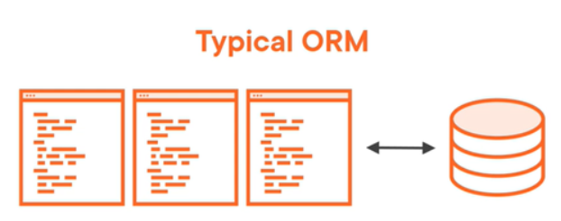
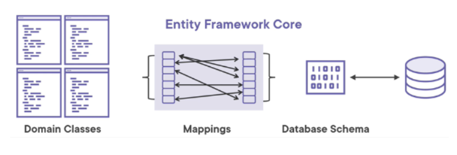

### 4.3 The Data model
With EF Core, data access is performed using a model. A model is made up of entity classes and a context object that represents a session with the database. The entity classes we create are POCO (Plain Old CLR Objects)

We will make use of a _context_ class: a bridge between your domain or entity classes and the database.The dbContext instance represents. a session with the database and can be used to query and save instances of your entities.
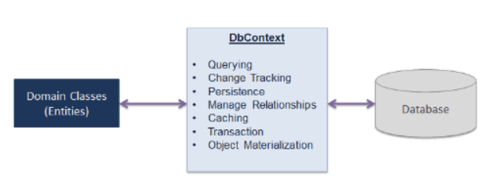

- a class that derives from DbContext
- exposes DbSet< TEntity > properties
DbSet< TEntity > classes are added as properties to the DbContext and are mapped by default to database tables that take the name of the DbSet< TEntity > property.

### 4.4 EF Core data providers

Entity Framework Core can access many different databases through plug-in libraries called database providers. To use these, you will need to install these providers as NuGet packages.
For example, when you use a SQL Server Database, you need to install the Nuget Package _Microsoft.EntityFrameworkCore.SqlServer_. For Oracle, this would be _Oracle.EntityFrameworkCore_.

When you’ve installed the package, you can specify the connection string. There are a few ways to do this:
- directly in the DbContext class (good for demos and first looks)
- Using the OnConfiguring method 
- It is also possible to keep your connection strings in configuration files (like _appsettings.json_):

```JSON
{
  "Logging":
  {
    "LogLevel":
    {
      "Default": "Warning"
    }
  },
  "AllowedHosts": "*",
  "ConnectionStrings":
  {
    "MyConnection": "server=(localdb)\mssqllocaldb;database=myDb;trusted_connection=true;"
  }
}
```
For example:
```CSHARP
protected override void OnConfiguring(DbContextOptionsBuilder optionsBuilder)
{
  optionsBuilder.UseSqlServer("server=(localdb)\\mssqlserver;database=myDb;trusted_connection=true;");
}
// OR with connection string in appsettings.json
protected override void OnConfiguring(DbContextOptionsBuilder optionsBuilder)
{
  optionsBuilder.UseSqlServer(Configuration.GetConnectionString("MyConnection"));
}
```

### 4.5 How EF Core Interprets your Data Model

Entity Framework Core uses a set of conventions to build a model, based on the shape of your entity classes.
- Entity Framework Core will map an entity to a table with the same name as its corresponding _DbSet< TEntity >_ property
- EF Core will map entity properties to database columns with the same name
- If a property is named Id or < entity name >Id (not case-sensitive), it will be configured as the primary key
- The convention for a foreign key is that it must have the same data type as the principal entity’s primary key property and the name must follow one of these patterns:
```CSHARP
<navigation property name><principal primary key property name>Id
<principal class name><primary key property name>Id
<principal primary key property name>Id
```

- You can override the OnModelCreating method in your derived context class and use the ModelBuilder API to configure your model. This will override conventions and data annotations
```CSHARP
public class SchoolDBContext: DbContext
{
    public DbSet<Student> Students { get; set; }

    protected override void OnModelCreating(ModelBuilder modelBuilder)
    {
        //Write Fluent API configurations here

        //Property Configurations
        modelBuilder.Entity<Student>()
                .Property(s => s.StudentId)
                .HasColumnName("Id")
                .HasDefaultValue(0)
                .IsRequired();
    }
}
```

### 4.6 Creating the Datamodel and the Database

EF can create your data model and database on the fly at runtime or you can explicitly do this at design time using tools.
You even have the option of letting it create the database directly or just having it create SQL scripts.

The first time EF Core instantiates the context at runtime, it will trigger the OnConfiguring method. It will learn which database provider to use, and at the same time be aware of the connection string. That way it will be able to find the database and do its work

### 4.7 EF Core Database Migrations

At a high level, migrations function in the following way:
- When a data model change is introduced, the developer uses EF Core tools to add a corresponding migration describing the updates necessary to keep the database schema in sync. It compares the current model against a snapshot of the old model and generates migration source files depending on what was changed 
- Once a new migration has been generated, it can be applied to a database in various ways (these are also stored in a special history table)

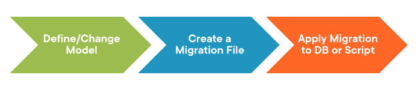

#### 4.7.1 Installing the tools

- Install the Package Manager Console tools by running the following command in Package Manager Console into the executable project

```CONSOLE
Install-Package Microsoft.EntityFrameworkCore.Tools -Version 8.*
```

- Right click on the console project and select “Set as Startup Project”
- Open the Package Manager Console (Tools -> NuGet Package Manager -> Package Manager Console)
    - Change the “Default project” to the project that contains the **DbContext** file
- You can verify that the tools are installed using:
```CONSOLE
Get-Help about_EntityFrameworkCore
```

#### 4.7.2 Using the tools

There are 2 ways to create migrations:
- Using **PowerShell** migration commands
- Using **dotnet** migration commands (we will use these)

- Add your first migration: `Add-Migration Initial`
- EF will now create a new folder called Migrations and a script will be generated for you (to export it to and actual SQL script use: `Script-Migration`)
- It is also possible to remove the last migration: `Remove-Migration` (WARNING, be careful with this!)
- List all existing migrations: `Get-Migration`
- To reset all migrations: delete your _Migrations_ folder and drop your database (you will need to create a new _initial_ migration)
- Apply a migration: `Update-Database`
- Go back to a specific previous migration snapshot: `Update-Database Initial` (we go back to the _Initial_ migration)

#### 4.7.3 Seeding a Database via Migrations

In a class derived from **DbContext**, the _OnModelCreating_ method can be overridden. Seed data is specified in the modelBuilder with a method called _HasData_<br>
For example:
```CSHARP
modelBuilder.Entity<Post>().HasData(
    new Post { BlogId = 1, PostId = 1, Title = "First post", Content = "Test 1" });
```
The primary key value needs to be specified!

### 4.8 Querying a database using EF
#### 4.8.1 Querying and Filtering

Entity Framework Core uses Language-Integrated Query (LINQ) to query data from the database. LINQ allows you to use C# (or your .NET language of choice) to write strongly typed queries.
Some examples:<br>
This loads all the data:
```CSHARP
using (var context = new BloggingContext())
{
    var blogs = context.Blogs.ToList();
}
```
This loads a single entity:
```CSHARP
using (var context = new BloggingContext())
{
    var blog = context.Blogs.Single(b => b.BlogId == 1);
}
```
You can filter the data you want to load:
```CSHARP
using (var context = new BloggingContext())
{
    var blogs = context.Blogs
        .Where(b => b.Url.Contains("dotnet"))
        .ToList();
}
```

#### 4.8.2 (Eager) Loading Related Data

When you query for a particular type it is possible to also include related data which is, by default, not included in the initial query (this is called **eager loading**). This is achieved using the _Include_ method.
For example:
```CSHARP
using (var context = new BloggingContext())
{
    var blogs = context.Blogs
        .Include(blog => blog.Posts)
        .ToList();
}
```

#### 4.8.3 Basic workflow

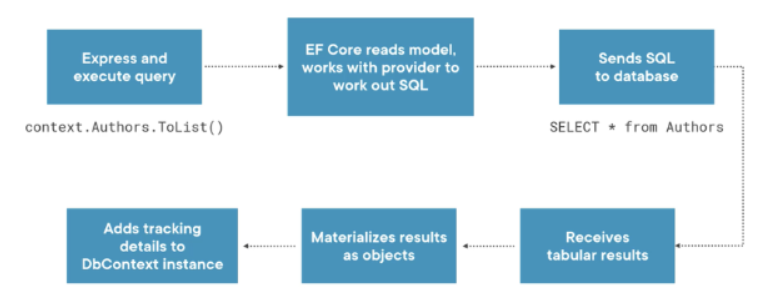

- A LINQ query is executed
- the DbContext first transforms the query into proper SQL
- The DbContext opens the connection using the connection string and provider information and executes the SQL command in the database
- The DbContext translates the resulting rows and columns of data back into instances of C# types (materializing the results)
- The DbContext starts keeping track of the objects (entities) returned by the query (by creating instances of type EntityEntry that point to an Entity and remember its original values). This way it can detect changes to entities

**WARNING - Triggering queries via enumeration**<br>
Because LINQ uses _deferred_ execution, the database connection remains **open** during enumeration!
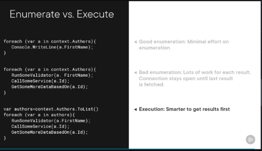


### 4.9 Inserting simple objects

To add a row to the database, first create an instance of an object (e.g. Author). 

The most common way to add an object is to use the _Add_ method of **DbSet**.
The _Add_ method is one of those triggers that lets the context be aware of the object. At the same time, because you use the _Add_ method, the context marks the state of the object to be Added.

The **SaveChanges()** method is used to persist changes made to the context to the database.<br>
For example:
```CSHARP
void insertAuthor()
{
    var author = new Author {FirstName = "Frank", LastName = "Herbert"};
    _context.Authors.Add(author);
    _context.SaveChanges();
}
```

We don't add a value for Id, because the database will handle that for us.

### 4.10 Updating simple objects

For Example:<br>
We read the data from the database and add a null check to make sure we did get back some data. We set the first name to Julia and call _SaveChanges()_.
```CSHARP
void updateAuthor()
{
    var author = _context.Authors.FirstOrDefault(a => a.FirstName == "Julie" && a.LastName == "Lerman");
    if (author != null)
    {
        author.FirstName = "Julia";
        _context.SaveChanges();
    }
}
```

### 4.11 EF in an ASP.NET Core app
#### 4.11.1 EF NuGet packages

In this course we use SQL Server, the provider package is **Microsoft.EntityFrameworkCore.SqlServer**. Add this package in the project that will contain the DbContext class (The ASP.NET project or e.g. an infrastructure layer project).

To be able to use migration commands in the Package Managager Console, the **Microsoft.EntityFrameworkCore.Tools** package needs to be installed in the executable project (The ASP.NET project).

#### 4.11.2 Create a data model

The main class that coordinates EF functionality for a given data model is a class derived from the _DbContext_ class. This derived class specifies which entities are included in the data model.

#### 4.11.3 Register the DbContext

To register the DbContext we use Dependency Injection.
For example:
```CSHARP
builder.Services.AddDbContext<BethanysPieShopDbContext>(options => {
    options.UseSqlServer(
        builder.Configuration["ConnectionStrings:BethanysPieShopDbContextConnection"]);
});
```

#### 4.11.4 Use the DbContext

Thanks to the built-in dependency injection system of ASP.NET Core, all that is needed to use an instance of the DbContext, is to pass (inject) it in the constructor of a class.<br>
For example:
```CSHARP
public class PieDbRepository : IPieRepository
{
    private readonly BethanysPieShopDbContext _context;

    public PieDbRepository(BethanysPieShopDbContext context)
    {
        _context = context;
    }

    public IEnumerable<Pie> AllPies
    {
        get
        {
            return _context.Pies.Include(c => c.Category);
        }
    }

    // ... other methods
}
```

---
## 5. Automated testing with NUnit
### 5.1 Why write automated tests?

- Happier development team (find defects earlier)
- Happier users (Fewer bugs reach production, improving the user experience)
- Reduced business cost (Issues found early are cheaper to fix than production incidents)
- Reliability (Automated tests are repeatable and reduce human error)
- Faster execution (Automated suites run much faster than manual testing)

### 5.2 Getting started with NUnit
#### 5.2.1 Testing frameworks & test runners

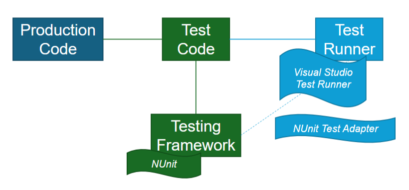

- Testing framework: provides standard ways to write, group, and check tests. NUnit is a common and well-supported framework; MSTest is another framework included with Visual Studio
- Test runner is the tool that finds and runs tests written using a framework, reports outcomes and error messages (can be part of an IDE, run from command line or by CI servers)
Installing the NUnit Test Adapter in Visual Studio allows the IDE’s test runner to find NUnit tests and show results in the test explorer.

#### 5.2.2 Creating a production project

Nothing special, just a very simple calculator project

#### 5.2.3 Creating a test project

To create a test project in Visual studio:
- Open Visual Studio and select "Create a new project".
- Search for "NUnit" in the project template search box.
- Select the "NUnit Test Project" template and click "Next".
- Set the name of the project to MathApp.Tests and click "Next".
- Choose .NET 8 as the target framework and click "Create".

#### 5.2.4 Upgrade to NUnit 4.x

By default the project template will create a project with NUnit version 3.x, to upgrade to the latest version you need to:
- Open the NuGet package manager
- Go to the "updates" tab
- Select the "NUnit" and the "Microsoft.NET.Test.Sdk" packages
- Click the "update" button

#### 5.2.5 Writing a first test

To create a test you create a new class in the x.Tests project.<br>
For example CalculatorTests.cs:
```CSHARP
namespace MathApp.Tests
{
    [TestFixture]
    public class CalculatorTests
    {
        [Test]
        public void Add_ShouldReturnSum()
        {
            // Arrange
            int a = 3;
            int b = 5;
            var calculator = new Calculator();

            // Act
            int result = calculator.Add(a, b);

            // Assert
            Assert.That(result, Is.EqualTo(8));
        }
    }
}
```

##### 5.2.5.1 [TestFixture] attribute

This marks a class that contains tests. It is a convention to name test classes with the suffix Tests to indicate that they contain tests for a specific class. In this case, CalculatorTests contains tests for the Calculator class.

##### 5.2.5.2 [Test] attribute

This marks a method as a test method. When the test runner executes this method, it will report whether the test passed or failed. A test passes if it completes without throwing any exceptions.

##### 5.2.5.3 Arrange, Act, Assert pattern

The test method follows the Arrange, Act, Assert pattern:
- Arrange: Set up everything that is needed to run the test
- Act: Call the method (or property) under test.
- Assert: Verify the result 

The Assert.That method in the example is used to verify that the actual result matches the expected value. If the assertion fails, an _AssertionException_ is thrown, and the test is marked as failed.

#### 5.2.6 Running tests

To run the tests in Visual Studio:
- Open the Test Explorer by going to Test > Test Explorer in the menu.
- Click the "Run All" button in the Test Explorer to run all tests in the solution.
- The Test Explorer will show the results of the tests, indicating which tests passed and which failed.

### 5.3 Defining tests

When testing a piece of functionality, it is important to identify the different scenarios that should be tested. This ensures that the functionality is thoroughly tested and that any potential issues are identified and addressed.

- Business logic : verify all the core business rules and processes of the functionality
- Code coverage : Write tests that execute all code branches in the method or property that is being tested (for example in an _if_ test: one test will cause the **true** branch to execute and another for the **false** branch)
- Bad data / input : Write tests that verify how the system behaves when it receives bad data or input

#### 5.3.1 Kinds of automated tests

- Unit tests: These tests focus on individual units of code, such as methods or properties of classes
- Integration tests: These tests focus on the interactions between different units of code or components
- End-to-end tests: These tests focus on the entire system, from the user interface to the backend

#### 5.3.2 Qualities of a good test

A good automated test should have the following qualities:
- Fast
- Repeatable
- Isolated
- Trustworthy
- Valuable

### 5.4 Asserts
#### 5.4.1 Equality assertions
For example:
```CSHARP
[TestFixture]
public class NameJoinerTests
{
    [Test]
    public void JoinNames_ShouldReturnJoinedNames()
    {
        // Arrange
        var nameJoiner = new NameJoiner();

        // Act
        var fullName = nameJoiner.JoinNames("Sarah", "Smith");

        // Assert
        Assert.That(fullName, Is.EqualTo("Sarah Smith"));
        Assert.That(fullName, Is.Not.EqualTo("Sarah"));
        Assert.That(fullName, Is.EqualTo("SARAH SMITH").IgnoreCase);
    }
}
```

#### 5.4.2 Reference equality assertions
For example:
```CSHARP
public class PlayerCharacter
{
    public string Name { get; }

    public PlayerCharacter(string name)
    {
        Name = name;
    }

    public override bool Equals(object? obj)
    {
        if (obj is PlayerCharacter other)
        {
            return Name == other.Name;
        }
        return false;
    }
}

public class PlayerCharacterTests
{
  [Test]
  public void ReferenceEquality_Demo()
  {
      var player1 = new PlayerCharacter("Alice");
      var player2 = new PlayerCharacter("Alice");

      Assert.That(player1, Is.SameAs(player2)); // Fails (2 different instances in memory)
      Assert.That(player1, Is.EqualTo(player2)); // Passes (because Equals is overridden)

      var player3 = player1;
      Assert.That(player1, Is.SameAs(player3)); // Passes (both references point to the same instance)
      Assert.That(player1, Is.EqualTo(player3)); // Passes
  }
}
```

#### 5.4.3 Collection assertions
For example:
```CSHARP
public class PlayerCharacter
{
    public IList<string> Weapons { get; }

    public PlayerCharacter()
    {
        Weapons = new List<string>{ "Short Sword", "Short Bow", "Long Bow" };
    }
}

public class PlayerCharacterTests
{
  [Test]
  public void Collection_Demo()
  {
      var player = new PlayerCharacter();
      var expectedWeapons = new List<string> { "Short Sword", "Short Bow", "Long Bow" };

      Assert.That(player.Weapons, Is.EquivalentTo(expectedWeapons)); // Passes (same contents)
      Assert.That(player.Weapons, Does.Contain("Short Sword")); // Passes (contains specific item)
      Assert.That(player.Weapons, Has.Exactly(3).Items); // Passes (exactly 3 items)
      Assert.That(player.Weapons, Has.Some.Contain("Sword")); // Passes (contains item with "Sword" in the name)
      Assert.That(player.Weapons, Has.None.EqualTo("Staff of wonder")); // Passes (does not contain "Staff of wonder")
      Assert.That(player.Weapons, Is.Not.Empty); // Passes (collection is not empty)

      // ... and many more assertions available
  }
}
```

#### 5.4.4 Exception assertions
For example:
```CSHARP
public class Calculator
{
    public int Divide(int value, int by)
    {
        if (value > 100)
        {
            throw new ArgumentOutOfRangeException(nameof(value), "Value is too big (max 100)");
        }
        return value / by; // Note: this will throw DivideByZeroException if 'by' is 0
    }
}

public class CalculatorTests
{
    [Test]
    public void Divide_ByZero_ShouldThrowException()
    {
        var calculator = new Calculator();

        Assert.That(() => calculator.Divide(200, 0), Throws.Exception);
    }


    [Test]
    public void Divide_ByZero_ShouldThrowDivideByZeroException() //more specific
    {
        var calculator = new Calculator();

        Assert.That(() => calculator.Divide(99, 0), Throws.TypeOf<DivideByZeroException>());
    }


    [Test]
    public void Divide_ValueTooBig_ShouldThrowArgumentOutOfRangeException()
    {
        var calculator = new Calculator();

        Assert.That(() => calculator.Divide(200, 2), Throws.TypeOf<ArgumentOutOfRangeException>());
    }


    [Test]
    public void Divide_ValueTooBig_ShouldThrowArgumentOutOfRangeExceptionForValueArgument()
    {
        var calculator = new Calculator();

        Assert.That(() => calculator.Divide(200, 2),
            Throws.TypeOf<ArgumentOutOfRangeException>()
            .With.Matches<ArgumentOutOfRangeException>(x => x.ParamName == "value"));

        Assert.That(() => calculator.Divide(200, 2),
            Throws.TypeOf<ArgumentOutOfRangeException>().With.Message.Contain("big"));
    }
}
```
Notice that the first parameter to Assert. That is a lambda expression that calls the method we expect to throw an exception. By passing the logic as a method (lambda) it can be executed by the assertion framework to check for exceptions. Otherwise the test itself would throw an exception!

#### 5.4.5 Null and boolean assertions 
For example:
```CSHARP
public class PlayerCharacter
{
    public string? Nickname { get; }
    public bool IsNoob { get; private set; }

    public PlayerCharacter(string? nickname)
    {
        Nickname = nickname;
        IsNoob = true;
    }
}

public class PlayerCharacterTests
{
  [Test]
  public void NullAndBool_Demo()
  {
      var player = new PlayerCharacter("Alice");

      Assert.That(player.Nickname, Is.Not.Null); // Passes
      Assert.That(player.Nickname, Is.Null); // Fails

      Assert.That(player.IsNoob, Is.True); // Passes
      Assert.That(player.IsNoob, Is.False); // Fails
  }
}
```

#### 5.4.6 Range assertions
For example:
```CSHARP
public class PlayerCharacter
{
    public int Health { get; private set; }

    public PlayerCharacter()
    {
        Health = 100;
    }

    public void Sleep()
    {
        int healthIncrease = Random.Shared.Next(1, 101); // Random value between 1 and 100
        Health += healthIncrease;
    }
}

public class PlayerCharacterTests
{
  [Test]
  public void Range_Demo()
  {
      var player = new PlayerCharacter();

      player.Sleep();

      Assert.That(player.Health, Is.InRange(1, 200)); // Passes
      Assert.That(player.Health, Is.GreaterThan(100)); // Passes
      Assert.That(player.Health, Is.LessThanOrEqualTo(200)); // Passes
  }
}
```

### 5.5 Test execution lifecycle

NUnit provides several attributes that can be used to control the lifecycle of test execution. These attributes allow you to set up and tear down resources before and after tests are run.

- **[SetUp]**: This attribute is used to mark a method that should be run before each test method in the test class
- **[TearDown]**: This attribute is used to mark a method that should be run after each test method in the test class
- **[OneTimeSetUp]**: This attribute is used to mark a method that should be run once before any of the test methods in the test class are run
- **[OneTimeTearDown]**: This attribute is used to mark a method that should be run once after all of the test methods in the test class have been run
If the test class implements IDisposable, the Dispose method will be called after all tests have been run and after the **[OneTimeTearDown]** method (if present) has been executed. This provides an additional opportunity to clean up resources.

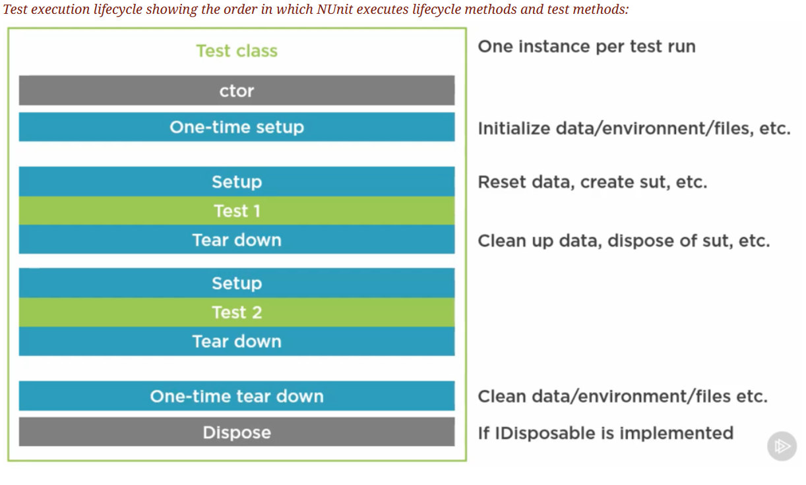

### 5.6 Testcases

The **[TestCase]** attribute allows you to run the same test method with different input values. It is possible to add parameters to a test method and provide values using one or more **[TestCase]** attributes. Typically, one parameter represents the expected result.<br>
For example:
```CSHARP
[TestFixture]
public class CalculatorTests
{
    [TestCase(1, 2, 3)]
    [TestCase(2, 3, 5)]
    [TestCase(5, 5, 10)]
    public void Add_ShouldReturnSum(int a, int b, int expected)
    {
        var calculator = new Calculator();
        var result = calculator.Add(a, b);
        Assert.That(result, Is.EqualTo(expected));
    }
}
```
NUnit also provides the **[TestCaseSource]** attribute (when using a large number of testcases or when the testcases are generated dynamically), but this is **out of scope** for this course.

---

## 6. Extra's

### 6.1 Packages to install 
These are screenshots for the different packages used in the demo's from class:
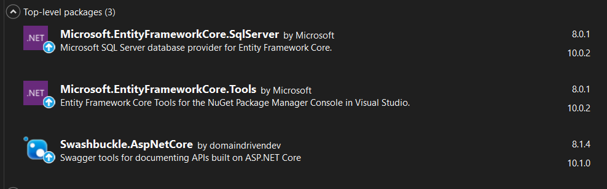
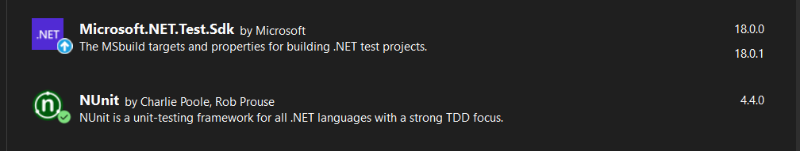
Take notice of their versions! (if you want to be safe just install the ones for .NET 8.*)

### 6.2 Reminders

- Check your Program.cs! You might be missing something there
- Remember _ViewImports
- Remember attributes for testing/API/model classes
- You can do this! Stay calm and think positive thoughts!