Cloud Essentials
================

# Table of Contents

1. [Cloud Concepts](#1-cloud-concepts)

2. [Amazon Web Services Introduction](#2-amazon-web-services-introduction)  
   - [2.1 Storage Service Category](#21-storage-service-category)  
   - [2.2 Compute Service Category](#22-compute-service-category)  
   - [2.3 Database Service Category](#23-database-service-category)  
   - [2.4 Networking and Content Delivery](#24-networking-and-content-delivery-service-category)  
   - [2.5 Security, Identity and Compliance](#25-security-identity-and-compliance-service-category)  
   - [2.6 AWS Cost Management](#26-aws-cost-management-service-category)  
   - [2.7 Management and Governance](#27-management-and-governance-service-category)  
   - [2.8 Regions and Availability Zones](#28-regions-and-availability-zones)  
   - [2.9 AWS CLI](#29-aws-cli)

3. [Compute](#3-compute)  
   - [3.1 EC2 Overview](#31-ec2-overview)  
   - [3.2 EC2 Lifecycle](#32-ec2-lifecycle)

4. [Storage](#4-storage)  
   - [4.1 Storage Categories](#41-storage-categories)  
     - [4.1.1 File Storage](#411-file-storage)  
     - [4.1.2 Block Storage](#412-block-storage)  
     - [4.1.3 Object Storage](#413-object-storage)  
     - [4.1.4 Storage Categories Overview](#414-storage-categories-overview)

5. [Networking I](#5-networking-i)  
   - [5.1 VPC Concepts & Fundamentals](#51-vpc-concepts--fundamentals)  
   - [5.2 IP Addressing](#52-ip-addressing)  
   - [5.3 Route Tables and Routes](#53-route-rables-and-routes)  
   - [5.4 Security Groups](#54-security-groups)  
   - [5.5 NAT-Gateway](#55-nat-gateway)  
   - [5.6 Network ACLs](#56-network-access-control-lists)  
   - [5.7 Security Groups vs Network ACLs](#57-security-groups-vs-network-acls)

6. [Networking II](#6-networking-ii)  
   - [6.1 What is Scaling?](#61-what-is-scaling)  
   - [6.2 Load Balancers](#62-load-balancers)  
   - [6.3 Types of Cloud Load Balancers](#63-types-of-cloud-load-balancers)

7. [Databases](#7-databases)  
   - [7.1 Database Options](#71-database-options)  
   - [7.2 Amazon RDS](#72-amazon-rds)  
   - [7.3 Amazon DynamoDB](#73-amazon-dynamodb)

8. [Lambda](#8-lambda)  
   - [8.1 Creating a Lambda Function](#81-creating-a-lambda-function)

9. [API Gateway](#9-api-gateway)  
   - [9.1 RESTful APIs](#91-restful-apis)  
   - [9.2 Types of HTTP Gateways](#92-types-of-http-gateways)  
   - [9.3 Creating an API Gateway](#93-creating-an-api-gateway)  
   - [9.4 Endpoints](#94-endpoints)  
   - [9.5 Controlling Access](#95-controlling-access-to-rest-apis)  
   - [9.6 Authentication](#96-authentication-on-rest-apis)  
   - [9.7 Caching](#97-caching)

10. [IAM](#10-iam)  
    - [10.1 AWS Shared Responsibility Model](#101-aws-shared-responsibility-model)  
    - [10.2 AWS Identity and Access Management](#102-aws-identity-and-access-management-iam)  
    - [10.3 IAM Components](#103-iam-essential-components)  
    - [10.4 IAM Authorization](#104-iam-authorization)  
    - [10.5 IAM Policies](#105-iam-policies)  
    - [10.6 IAM Permissions](#106-iam-permissions)

11. [Monitoring and Reporting](#11-monitoring-and-reporting)  
    - [11.1 Basic Monitoring](#111-basic-monitoring-in-aws)  
    - [11.2 Metrics and Metric Specifics](#112-metrics-and-metric-specifics)  
    - [11.3 CloudWatch Alarms](#113-cloudwatch-alarms)  
    - [11.4 CloudWatch Events](#114-cloudwatch-events)  
    - [11.5 Automatic Dashboards](#115-cloudwatch-automatic-dashboards)  
    - [11.6 CloudWatch Logs](#116-amazon-cloudwatch-logs)  
    - [11.7 AWS CloudTrail](#117-aws-cloudtrail)  
    - [11.8 Auto Scaling](#118-autoscaling)  
      - [11.8.1 Auto Scaling Groups](#1181-auto-scaling-groups)  
    - [11.9 Other Monitoring Tools](#119-other-monitoring-tools)


---

## 1. Cloud Concepts

Cloud computing is shared **pools of configurable computer system resources** and **higher-level services** that can be **rapidly provisioned** with minimal management effort, **often over the internet**.

From the user's perspective, this model requires minimal management and interaction with IT staff, streamlined provisioning processes, and provides dramatic cost savings (this depends on the case) over traditional IT.

On the back end, cloud computing requires the establishment of complex networking, storage and server configurations that optimally are configured to be self-monitoring and self-healing.

There are five essential characteristics, defined by NIST:
- On-demand self-service
    - Users can access services from **anywhere, anytime and any location**
- Broad network access
    - Users can access services **from any device** over the internet
- Resource pooling
    - Provider has to invest in proper hardware, configuration and maintenance
- Rapid elasticity
    - Elasticity and scalability (always have a buffer)
    - Vertical scaling, allocate more resources to a machine (pets) <-> horizontal scaling - in/out scaling: provide more instances on additional vm's and divide the load (cattle)
- Measured service
    - Pay as you go
    - Monitoring by the provider AND consumer (can also be a service)

Container tech became cloud benefits:
- Easily upgraded
- Always up
- Lower cost of ownership
- ...

Service models: seperation of responsibilities
- SaaS: software as a service (users)
- PaaS: platform as a service (software engineer)
- IaaS: infrastructure as a service (system admin)
- On premises

Cloud computing comes in three forms: public clouds, private clouds and hybrid clouds. Depending on the type of data you are working with you will want to compare them in terms of the different levels of security and management required.

- private/internal
	- one organization
	- managed internally/3rd party, hosted internally or externally
	- high cost (space, hardware, environmental controls)
	- needs updates regularly -> more costs
- public/external
	- available over a network open to the public
	- similar to private, but security concerns differ greatly
	- serve broad public user base
	- providers like: AWS, Azure, Google cloud platform
- hybrid
	- combines public and private
	- sensitive data on private cloud
	- public cloud used for scalable, high-demand apps
	- offers flexibilty, choosing where to run apps based on cost, performance, security needs

---

## 2. Amazon Web Services Introduction

AWS has been the cloud computing leader since 2006 and has a broad spectrum of services that have evolved over the years.
Its foundational services consist of: Compute, Networking and Storage (object, block and archive).

### 2.1 Storage service category
 
 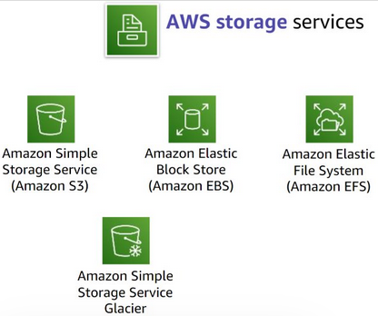

- _Amazon S3_: Scalable **object** storage for data. Supports various applications such as websites, mobile apps and big data analytics
- _Amazon EBS (Elastic Block Storage)_: High-performance **block** stoage designed for Amazon EC2. Supports intensive workloads like databases and enterprise applications
- _Amazon EFS (Elastic File System)_: Scalabel, managed NFS file system that automatically adjusts to petabytes of data. For use with AWS Cloud and on-premises resources.
- _Amazon S3 Glacier_: Secure and extremely low-cost storage for archiving and long-term backup. Offers high durability and compliance features.

### 2.2 Compute service category

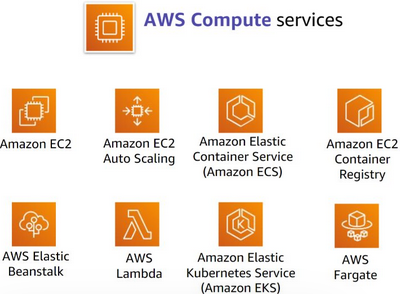

- _Amazon Elastic Compute Cloud (EC2)_: Resizeable compute capacity as virtual machines in the cloud
    - _Amazon EC2 auto scaling_: enables you to automatically add or remove EC2 instance according to conditions that you define
- _Amazon Elastic Container Service (ECS)_: highly scalable, high-performance container orchestration service that supports docker containers
- _Amazon Elastic Container Registry (ECR)_: A fully managed Docker container registry that makes it easy for developers to store, manage and deploy Docker container images
- _AWS Elastic Beanstalk_: A service for deploying and scaling web applications and services (Apache, Microsoft Internet Information services, ...)
- _AWS Lambda_: Enables you to run code without provisioning or managing servers (you pay only for the compute time that you consume, no charge when your code is not running)
- _Amazon Elastic Kubernetes Service (EKS)_: Makes it easy to deploy, manage and scale containerized applications that use Kubernetes on AWS
- _AWS Fargate_: A compute engine for Amazon ECS that allows you to run containers without having to manage servers or clusters

### 2.3 Database service category

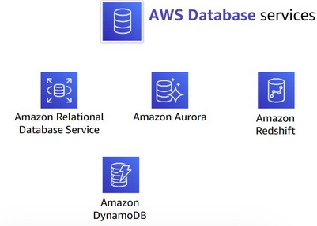

- _Amazon Relational Database Service (RDS)_: Simplifies setting up, operating and scaling relational databases and automating tasks like hardware provisioning and backups
- _Amazon Aurora_: Compatible with and more performative than MySQL and PostgreSQL
- _Amazon Redshift_: Allows analytic queries on petabytes of local data or exabytes in Amazo S3, with fast performance at scale
- _Amazon DynamoDB_: A key-value and document database with single-digit milisecond latency, built-in security and caching

### 2.4 Networking and Content Delivery service category

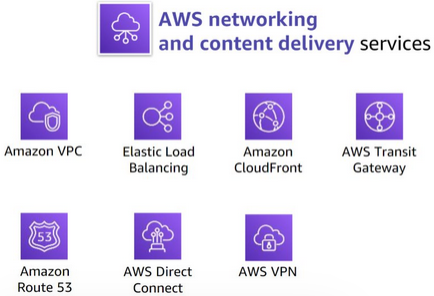

- _Amazon VPC_: Provisions isolated sections of AWS for enhanced security and control
- _Elastic load balancing_: Distributes application traffic accross multiple resources for better performance and fault tolerance
- _Amazon Cloudfront_: A CDN service for delivering content with low latency and high transfer speeds globally
- _AWS Transit gateway_: Connects VPCs and on-premise networks through a central hub
- _Amazin Route 53_: A scalable DNS web service that routes users to internet applications by translating names to IP-addresses
- _AWS Direct Connect_: Establishes a private network connection between your premises and AWS for improved network performance

### 2.5 Security, Identity and Compliance service category

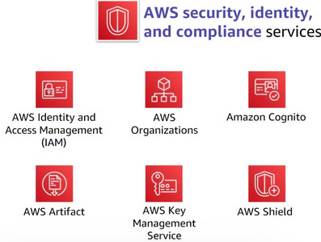

- _AWS Identity and Access Management (IAM)_: Enables you to manage access to AWS services and resources securely (by creating AWS users and groups and using IAM permissions to allow and deny user and group acces to AWS resources)
- _AWS Organization_: Allows you to restrict what services and actions are allowed in your accounts
- _Amazon Cognito_: Lets you add user sign-up, sign-in and acces control to your web and mobile apps
- _AWS Artifact_: Provides on-demand access to AWS security and compliance reports and select online agreements
- _AWS Key Management Service (AWS KMS)_: Enables you to create and manage keys. Used to control the use of encryption accross a wide range of AWS services in your applications
- _AWS Shield_: A managed Distributed Denial of Service (DDoS) protection service that safeguards applications running on AWS

### 2.6 AWS Cost Management service category

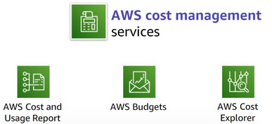

- _AWS Cost and Usage Report_: Contains the most comprehensive set of AWS cost and usage data, including additional metadata about services, pricing and reservations
- _AWS Budgets_: Enables you to set custom budgets that alert you when your costs or usage exceed (or are forecasted to exceed) your budgeted amount
- _AWS Cost Explorer_: An easy-to-use interface that enables you to visualize, understand and manage your AWS costs and usage over time

### 2.7 Management and Governance service category

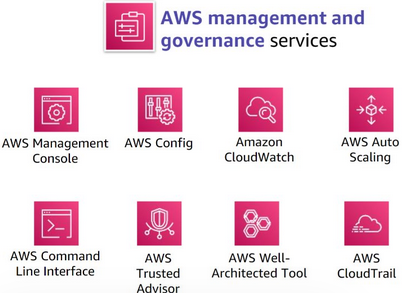

- _AWS Management Console_: Provides a web-based user interface for accessing your AWS account
- _AWS Config_: Provides a services that helps track your resource inventory and changes
- _Amazon Cloudwatch_: Allows you to monitor resources and applications
- _AWS Auto scaling_: Provides features that allow you to scale multiple resources to meet demand
- _AWS Command Line Interface_: Provides a unified tool to manage AWS services
- _AWS trusted advisor_: Helps you optimize performance and security
- _AWS Well-Architected Tool_: Provides help in reviewing and improving workloads
- _AWS Cloudtrial_: Tracks user activity and API usage

### 2.8 Regions and Availability zones

An **AWS Region** is a geographical area (for example: London). Each region provides full redundancy and connectivity to the network (these usually consist of 2 or more **availability zones**). Determine the right region by keeping in mind the following:
- Data governance/legal requirements
- Proximity to costumers
- The services available in the region
- Costs

Each region has multiple availability zones, each zone is a fully isolated partition of the AWS infrastructure and consist of discrete data centers. They are designed for fault isolation and interconnected by using high-speed private networking.

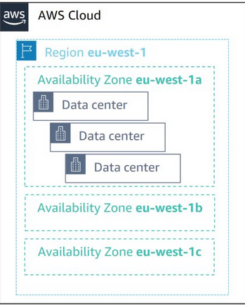

### 2.9 AWS CLI

```Console
aws <command> <subcommand> [options and parameters]
```

The AWS Command Line Interface uses a multipart structure on the command line that must be specified in this order:
- The base call to the **aws** program
- The top level **command**, which usually corresponds to an AWS service
- The **subcommand** that specifies which operation to perform
- General CLI **options** or **parameters** required by the operation (can be in any order as long as they follow the first 3 parts, if something is specified multiple times, only the last value applies)

Filtering and querying can be done with the **--filter** and **--query** flags. Not all AWS CLI commands support the **--filter** flag to limit items returned by the server.

---

## 3. Compute

### 3.1 EC2 overview

Amazon Elastic Compute Cloud (Amazon EC2) provides _virtual machines_ referred to as **EC2 instances** in the cloud. Gives you full control over the guest operating system (linux or windows) on each instance. 
You can launch instances of any size into an availability zone anywhere in the world from AMIs (Amazon Machine Images) with a few clicks or a line of code. You control traffic to and from these instances.

In other cloud platforms:
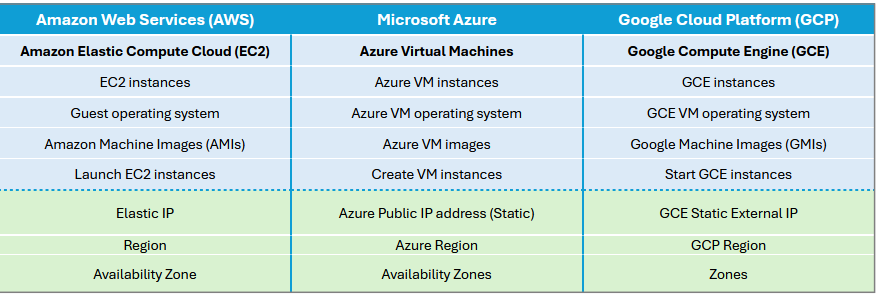

Launching an EC2 instance consists of the following steps:
- Select an AMI or create a new one
- Select an instance type (Example: t3.large, where _t_ is the family name, _3_ is the generation number and _large_ is the size)
    - AWS Graviton CPUs: family of 64-bit ARM-based CPUs, tightly integrated with AWS servers and datacenters
- Identify or create a key pair
- Specify network settings (VPC, subnet, public IP address to be autoamtically assigned?, security groups (least privilege!))
- Configure storage
- Advanced details: User data scripts (runs during first boot of the service)
- Summary
- Launch instance

### 3.2 EC2 lifecycle

- _Pending_: Instance is preparing and booting after launch or when started from a stopped state
- _Running_: Instance is fully booted, deployed and ready for internet connectivity
- _Rebooting_: Advised to do via its console, CLI or SDKs, instance remains on the same host
- _Shutting down_: Transitional state before an instance is terminated
- _Terminated_: Instance is no longer recoverable, instance will disappear after a while
- _Stopping_: EBS-backed instances transitioning to a stopped state
- _Stopped_: No costs for compure resources are incurred and starting again initiates a new pending state

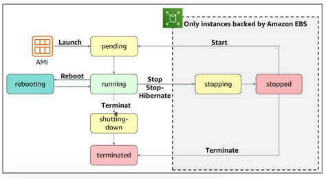

> Consider using an elastic IP addres if you don't want the public IPv4 address and external DNS hostname to change after an instance is stopped and then started again!

---

## 4. Storage
### 4.1 Storage categories

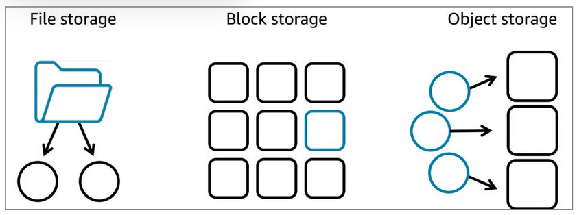

#### 4.1.1 File storage

Data is organized as a **hierarchy of files in directories** and subdirectories (similar to file systems on pc's). It is easy to use and understand. Supports multiple users or applications accessing files simultaneously.
Main uses are:
- Home directories
- Shared corporate documents
- Application workloads that require a shared file system

In AWS:
- Amazon EFS
- Amazon FSx
    - Lustre
    - NetApp ONTAP
    - OpenZFS
    - Windows File Server

#### 4.1.2 Block storage

Data is split into uniformly sized blocks. Data is stored as an independent unit with its own address but without any additional metadata describing its contents. This allows for **very low-latency** operations. Blocks are accessed through a storage area network (SAN), which allows servers to treat blocks almost as if they were local disks.
Main uses are:
- Databases
- Containers
- Virtual machines

In AWS:
- EC2 instance store
    - Temporary storage **physically attached to the host** computer
- Amazon EBS
    - Like external drives (detachable)

#### 4.1.3 Object storage

Data is managed as distinct units called **objects**. Each object includes the data, a variable amount of metadata and a globally unique identifier. They are stored in a **flat environment** with no limits on the number of objects stored (making it highy scalable).
Main uses are:
- Unstructured data (such as photos, videos)
- Backup archives

In AWS:
- Amazon S3 (stores multiple verions of an object = **versioning** for easy recovery)
    - Static website hosting
    - Large file sharing
    - Media hsoting & streaming
    - Big data & analytics
    - Disaster recovery
    - Backup and restore
    - Data archiving

S3 lifecycle:<br>
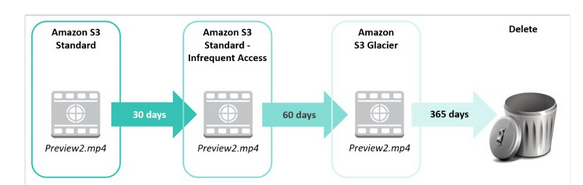

#### 4.1.4 Storage categories overview

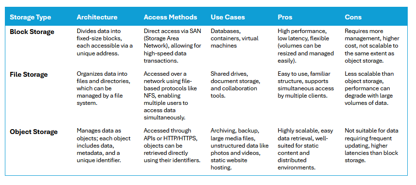

---

## 5. Networking I
### 5.1 VPC concepts & fundamentals

An Amazon VPC enables you to provision a **logically isolated** section of the AWS Cloud where you can launch AWS resources in a virtual network that you define. they are dedicated to your AWS account and belong to a **single AWS region** but can span multiple availability zones. They can be divided into subnets (Range of IP addresses that divide a VPC) that belong to a **single** availability zone and are classified as public or private.

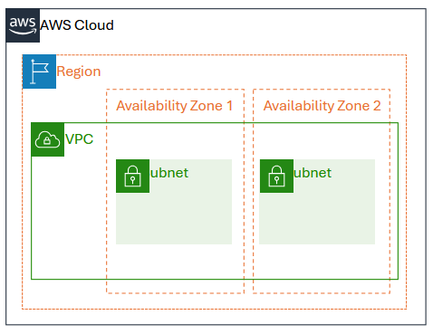

### 5.2 IP addressing

When a VPC is created, it is assigned to an IPv4 CIDR block (a range of private IPv4 addresses), this cannot be changed after creation (largest is /16 and smallest is /28). IPv6 is also supported but with a different block size limit. Subnets cannot overlap!

An example:

A VPC with an IPv4 CIDR block of 10.0.0.0/16 has 65.536 total IP addresses. The VPC has 4 equal sized subnets. Only 251 IP addresses are available to use by each subnet

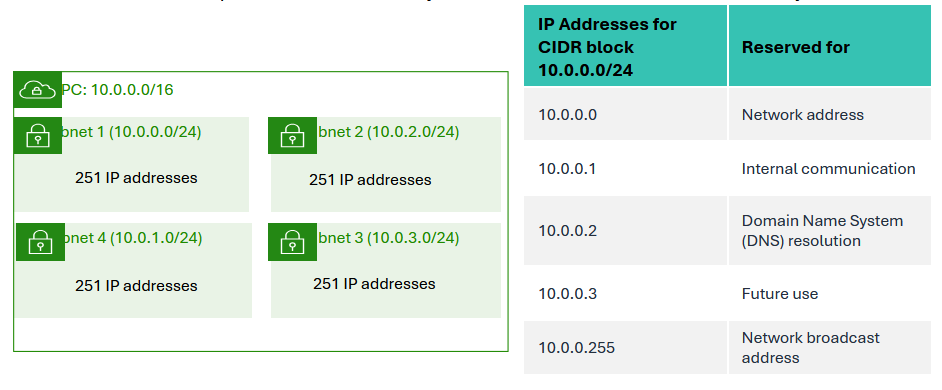

### 5.3 Route rables and routes

A route table contains a set of rules (or routes) that can be configured to direct network traffic from your subnet. Each route has a destination and a target. By default every route table contains a **local route** for communication within the VPC. Each **subnet must be associated with a route table** (at most one).

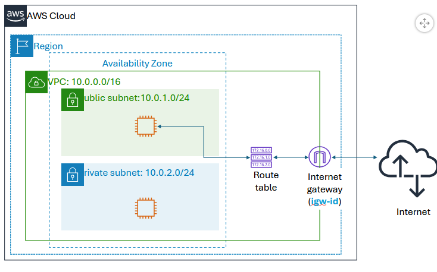

### 5.4 Security groups

Security groups have **rules** that control inbound and outbound instance traffic. Default security groups **deny all inbound** traffic and **allow all outbound** traffic. These are **stateful**.

### 5.5 NAT-gateway

The NAT-gateway allows resources in **a private subnet** to make outbound requests to the internet, but it prevents the internet from initiaiting connections to these private resources.

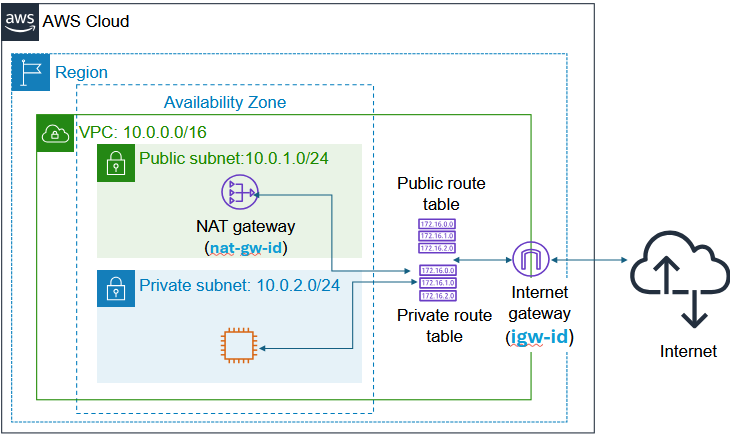

### 5.6 Network access control lists

A network ACL has **separate inbound and outbound rules** and each rule can either **allow or deny traffic**. Default network ACLs **allow** all inbound and outbound IPv4 traffic. These are **stateless**.

## 5.7 Security groups vs. network ACLs

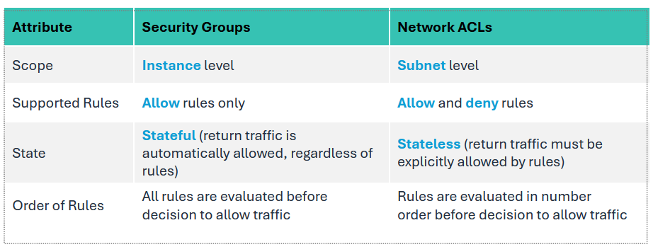

---

## 6. Networking II

### 6.1 What is scaling?

Scaling is a technique used to achieve elasticity. This can be done **horizontally** or **vertically**.

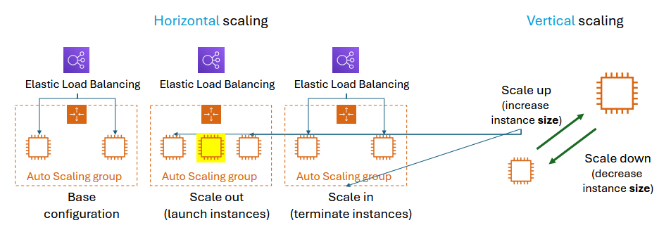

The service **Amazon EC2 Auto Scaling** can do this for us:
- Launches and terminates instances based on specified conditions
- Automatically registers new instances with load balancers when specified
- Can launch across availability zones

### 6.2 Load balancers

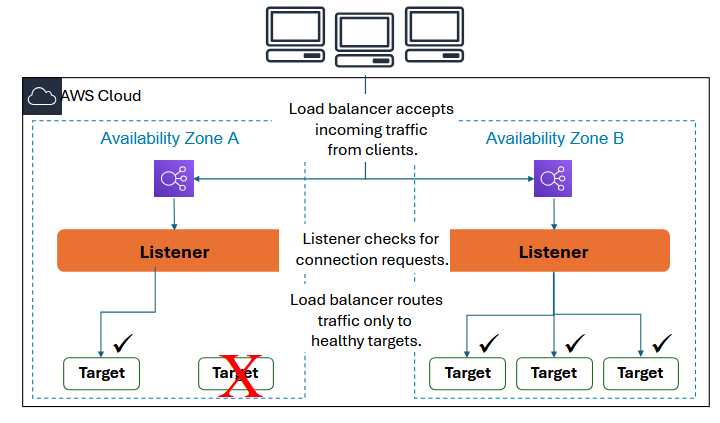
Load balancer performs health checks to monitor health of registered targets. This ensures that request traffic is shifted away from a failed instance.

Listeners define the port and protocal a load balancer must listen on. Each application load balancer needs **at least one listener to accept traffic** and can have up to 50. They define routing rules.

Targets are EC2 instances, ECS containers and IP addresses (accessible within your VPC). EC2 instances can be registered with the same target group using multiple ports and a single target can be registered with multiple target groups.

### 6.3 Types of (cloud) load balancers

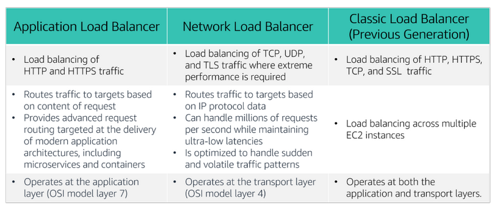
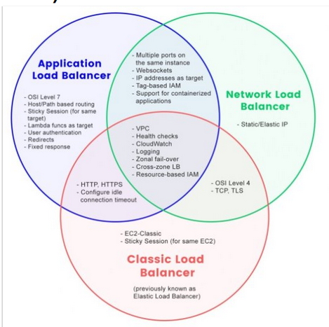

With application load balancers and network load balancers, you register **targets in target groups** and route traffic to the target groups.
With Classic load balancers, you register **instances with the load balancer**.

---

## 7. Databases
### 7.1 Database options

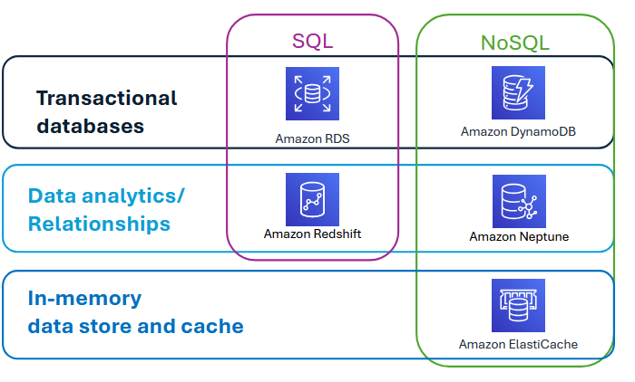

Choose a database service based on: **the purpose and needs of your application**
AWS recommendations:
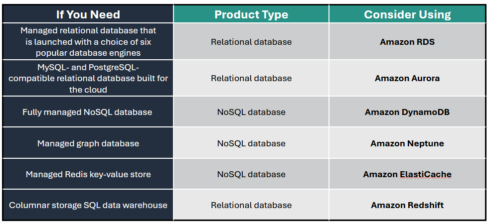

### 7.2 Amazon RDS

Amazon RDS can make use of different DB engines, such as: Amazon aurora, MySQL, SQL Server, PostgreSQL, MariaDB, Oracle. But relational databases have challenges:
- Server maintenance and footprint
- Software installation and patches
- Database backups and high availability
- Limits on scalability
- Data security
- Operating ssytem installation and patches

With Amazon RDS you only manage **Application optimization**, AWS does the rest!
RDS does **replication** accross availability zones, the ensures safety incase of failover and it is possible to scale by changing the instance class or increase storage capacity. Also possible to have **read workloads** utilize read replicas (DB which only allows read access)

### 7.3 Amazon DynamoDB

A fast and highly scalable non-relational database service. Its core components are:
- Tables
- Items
- Attributes<br>
It has support for 2 primary key types:
- Partition key : a single attribute that uniquely identifies an item
- Partition + Sort key : A compound key for grouping items by partition key and distinguishing them with a unique sort key

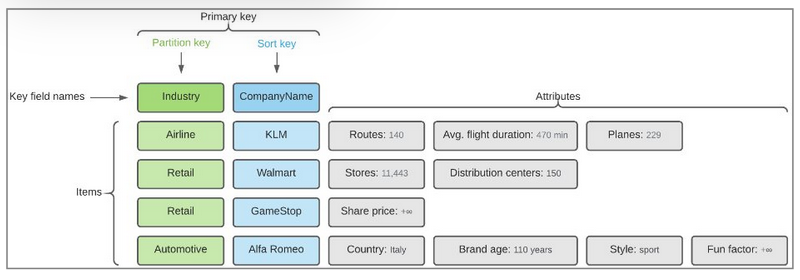

It is also possbile to have **global tables** by having multiple replicas accross regions.

---

## 8. Lambda

Lambda is a **serverless compute** service that can be used to **run code without provisioning** or managing servers and runtime environments.

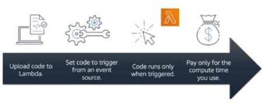

Serverless function are not only a thing on AWS, they are available on different vendors but there is no cross-vendor compatibility!

AWS Lambda can be used for:
- Load balancing
- Autoscaling
- Availablility
- Security isolation
- OS management
- ...

For example:
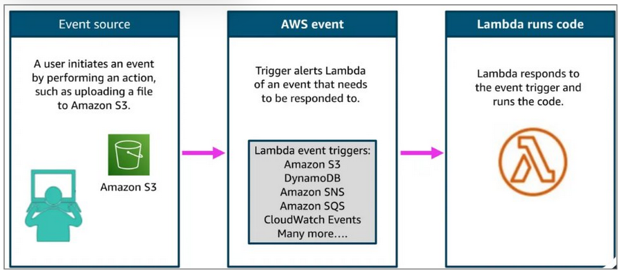

There are limitations! Like Memory allocation per function (10.240mb), function timeout (15 minutes), ...
Lambda supports different _runtimes_ for your code (most used are Python and NodeJS)

### 8.1 creating a lambda function

To create a lambda function you follow these steps:
- Specify a function name, runtime and architecture
- Define an execution role (LabRole)
    - It is possible to define different roles and IAM resource policies (but not for us, student account lmao)
- Write the code or choose from blueprints
- Optionally choose a container image (possible to override ENTRYPOINT, CMD and WORKDIR)

It is possible to test using **test** events and monitoring using the **Amazon Cloudwatch Logs**.

---

## 9. API Gateway
### 9.1 REST(ful) APIs

An API or Application Programming Interface is a software mechanism that simplifies development by doing:
- Abstracting implementation details
- Exposing only objects or actions that a developer needs
- Establishing how an information provider and an information user communicate

For example:
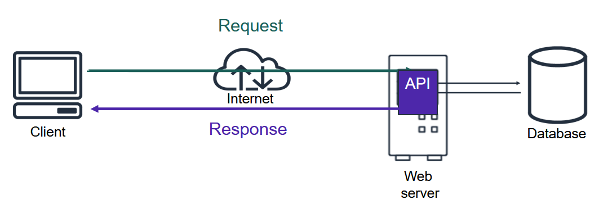

### 9.2 Types of HTTP Gateways

- REST API
    - Gives the developer full control over API requests and responses
    - Supports features that are not yet available in other HTTP APIs
- HTTP API
    - Simplifies the development of APIs that require only API proxy functionality
    - Designed for the lowest cost and latency

### 9.3 Creating an API Gateway

API configuration can be deployed to a stage (different environments like for example: apiV1, dev, beta, ...)
API resources are shown as a tree of nodes, each resource is a new endpoint in the API gateway
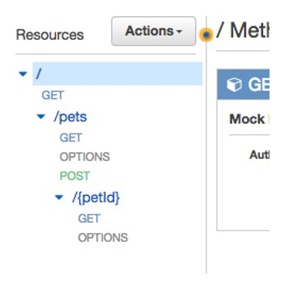

For example:
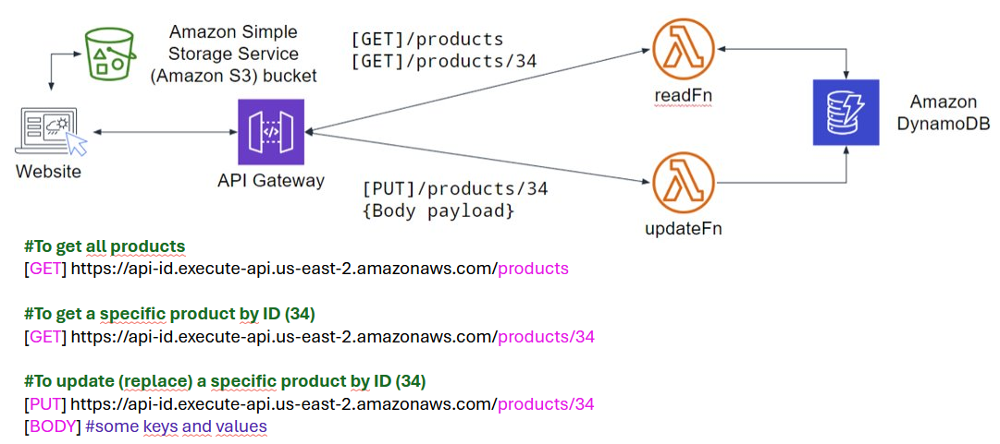

### 9.4 Endpoints

There are different endpoint types:
- **Edge optimized**: when clients are distributed globally
- **Regional endpoint**: when majority of clients are located in the same region as the API
- **Private endpoint**: when the API needs to be accessible only from within your VPC or through a Direct Connect connection

To create an endpoint you follow these steps:
- Choose the request type and URI
- Choose the linked resource (lambda, EC2, ...)
- Multiple request types per URI are possible!
- To transform data before going to your endpoint: enable proxy integration

### 9.5 Controlling access to REST APIs

This can be achieved using IAM resource policies (more on this in: [IAM](#10-iam)): Allow only certain AWS resources to access the API.

AWS Web Application Firewall helps protect APIs from common web exploits (SQL-injection, xSS, ...) or block requests based on origination (geo, IPs, user-agents, ...)

Cross Origin Resource Sharing (CORS) is browser based security that enables Javascripts running in browsers to connect to APIs and other web resources like fonts and stylesheets. It can block requests based on origin, request type or headers.

Rate limiting is also possible: limiting the # of requests per time unit or throttle rates per stage or per method

### 9.6 Authentication on REST APIs

There are different forms of authentication for REST APIs:
- For Open APIs there is no authentication
- IAM authentication
- JWT-based authentication, integrates with identity providers such as Amazon Cognito, OpenId Connect/OAuth2
- Lambda autherizers (seperate function that validates bearer tokens)

### 9.7 Caching

Caching is effective for quick responses and to minimize the load to the backend. This can be set up per stage or per method.

---

## 10. IAM
### 10.1 AWS shared responsibility model

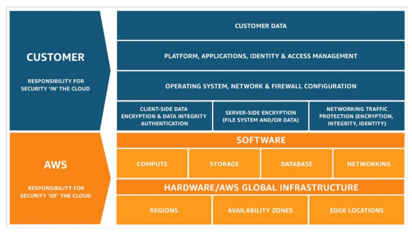

### 10.1.1 AWS Responsibility

Security **of** the cloud:
- Physical security of data centers
- Hardware and software infrastructure
    - Storage decommisioning, OS access logging, auditing
- Network infrastructure
    - Intrusion detection
- Virtualization infrastructure
    - Instance isolation

### 10.1.2 Customer resposibility

Security **in** the cloud:
- Patching and maintenance of EC2 operating system
- Passwords, role-based access etc. in applications
- Security group configuration
- OS or host-based firewalls
    - Intrusion detection/prevention systems
- Network configurations
- Account management
    - Login and permission settings per user

### 10.2 AWS Identity and Access Management (IAM)

Use IAM to manage access to AWS resources (for example: control who can terminate amazon EC2 instances).
Define fine-grained rights:
- **Who** can access the resource
- **Which** resources can be accessed and what can the user do to the resource
- **How** resources can be accessed<br>
IAM is a no-cost AWS account feature

### 10.3 IAM: Essential components
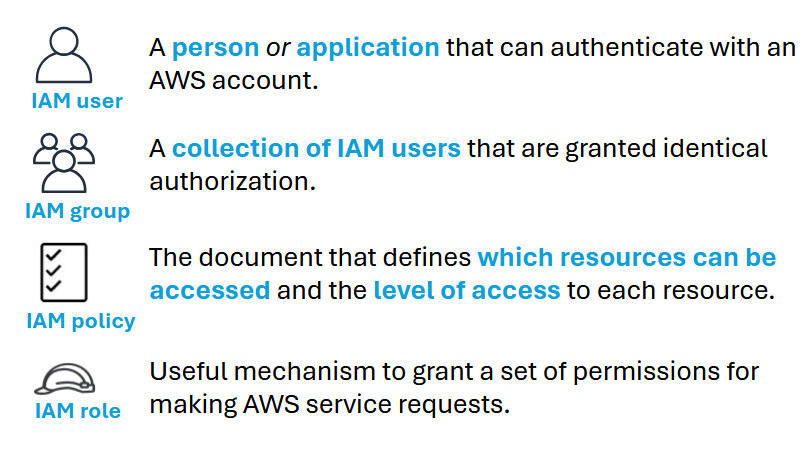

### 10.4 IAM Authorization

When you define an IAM user, you also select what types of access the user is permitted to use.

For example:
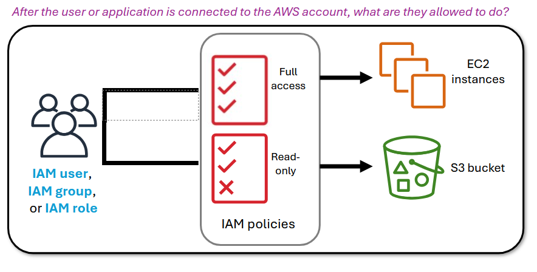

Assign permissions by creating an IAM policy, permissions determine which resources and operations are allowed:
- All permissions are implicitly **denied** by default
- If something is explicitly denied, it is **never** allowed
- Best practive: follow the principle of **least privilege**
- Settings apply across all AWS regions

### 10.5 IAM Policies

An IAM policy is a document that defines permissions (enables fine-grained control). There are 2 types of policies: 
- **identity-based**
    - Attach a policy to any IAM entity (user, group or role)
    - Policies specify: actions that may **or** may not be performed by the entity
    - A single policy can be attached to multiple entities
    - A single entity can have multiple policies attached to it
- **resource-based**
    - attached to a resource (such as an S3 bucket)
    - Specify who has access to the resource and what actions they can perform on it
    - Policies are _inline_ only, not managed
    - Only supported by some AWS services

For example:
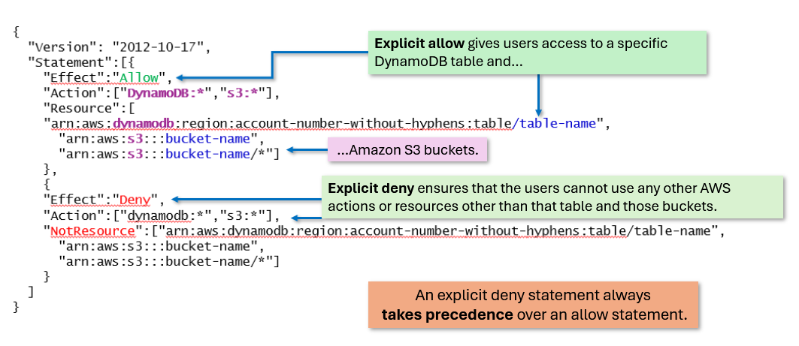

### 10.6 IAM Permissions

How IAM determines permissions:
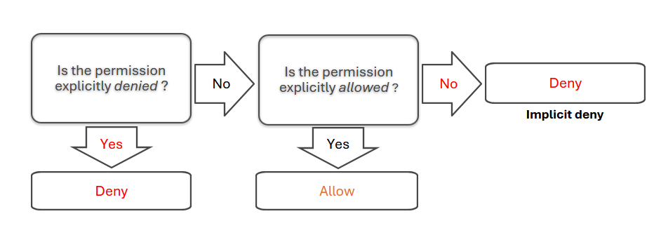

---

## 11. Monitoring and Reporting
### 11.1 Basic monitoring in AWS

Amazon cloudwatch
- monitors:
    - AWS resources
    - Applications that run on AWS
- Collects and tracks:
    - Standard metrics
    - Custom metrics
- Alarms:
    - Sends notifcations to an Amazon SNS topic
    - Performs Amazon EC2 auto scaling or Amazon EC2 actions
- Events:
    - Define rules to match changes in AWS environment and route these events to one or more target functions or streams for processing

For example:
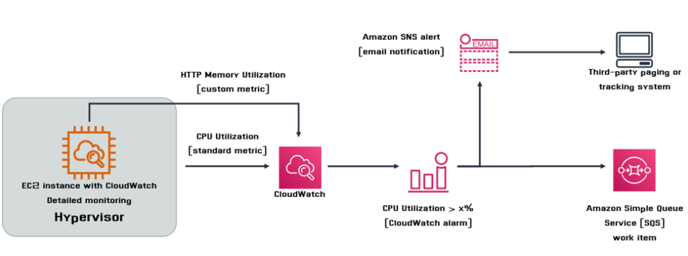

### 11.2 Metrics and metric specifics

|       |  |
| :----------- | :----------- |
| Metric      | Name and value |
| Namespace      | Group related metrics together       |
| Dimensions   | Name-value pairs that further categorize metrics        |
| Period      | Specified time (in seconds) over which metric was collected       |

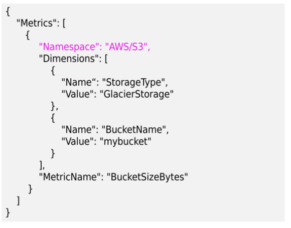

Possible to create custom metrics which get grouped by user-defined namespace and can be published to CloudWatch using AWS CLI, API or Cloudwatch agent.

### 11.3 Cloudwatch alarms

Alarms are based on:
- Static threshold
- Anomaly detection
- Metric math expression

Alarms have 3 possible states: **ok** (threshold _not_ exceeded), **ALARM** (threshold exceeded) and **INSUFFICIENT DATA** (alarm started, metric not available or insufficient data).

For example:
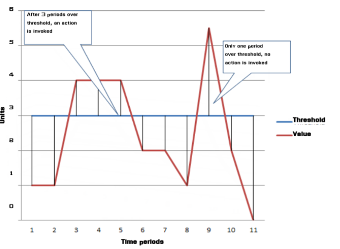

### 11.4 Cloudwatch events

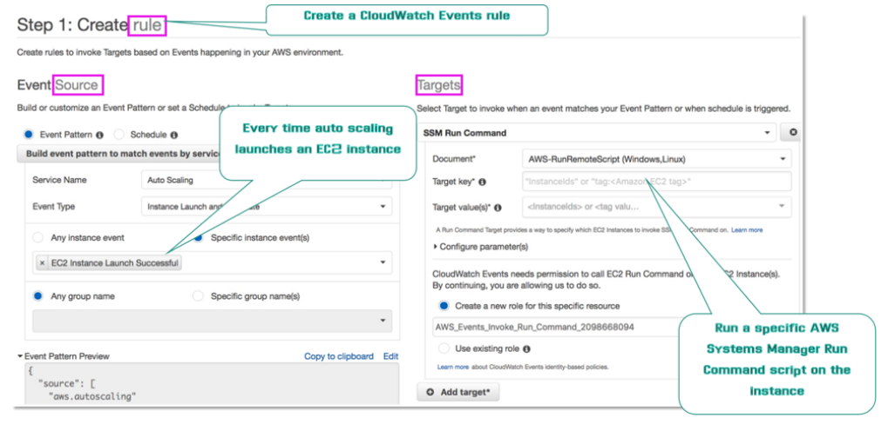

## 11.5 Cloudwatch automatic dashboards

Possible to see surface data about your running AWS ecosystem, can be leveraged by existing monitoring tools

### 11.6 Amazon Cloudwatch Logs

Cloudwatch logs functionality includes:
- Automatically collecting logs
- Aggregating data into log groups
- Having the ability to configure metric filters on a log group:
    - Look for specific string patterns
    - Have each match increment a custom CloudWatch metric
    - Use the metric to create Cloudwatch alarms or send notifications
- Querying logs and creating visualizations with Cloudwatch Logs Insights

### 11.7 AWS Cloudtrail

Cloudtrail is a service that: 
- Logs, continuously monitors and retains account activity related to actions across your AWS infrastructure
- Records API calls for most AWS services (management console and CLI activity are also recorded)
- Is supported for a growing number of AWS services
- Automatically pushes to Amazon S3 after it is configured
- Will not track events within an Amazon EC2 instance (like a manual shutdown)

### 11.8 Autoscaling

Helps maintain application availability and enables you to automatically add or remove instances according to conditions. It also detects impaired instances and replaces them without intervention. Provides several scaling options (manual, scheduled, dynamic/on-demand and predictive)

#### 11.8.1 Auto Scaling groups

A collection of EC2 instances that are treated as a logical grouping for the purposes of automatic scaling and management

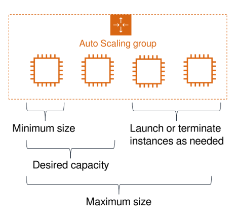

How auto scaling works:
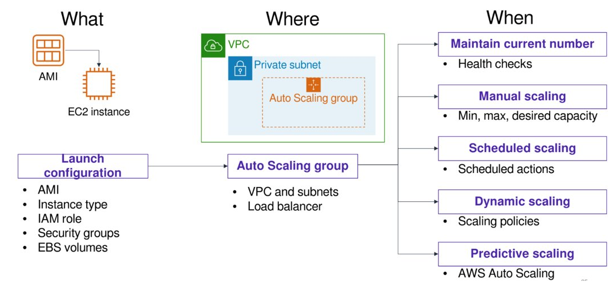

### 11.9 Other monitoring tools

- Datadog
- Solarwinds
- Dynatrace
- Sumo logic
- Splunk
- New relic