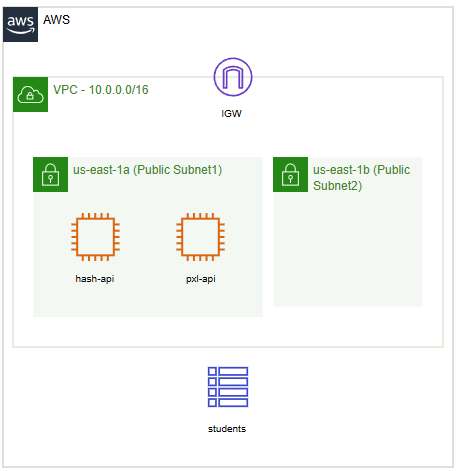

[](https://classroom.github.com/a/KyAuQAAO)
# PE 2 AWS Services
## Overzicht 
Voor de PE opdracht is een aparte AWS Academy learner lab omgeving opgezet op https://awsacademy.instructure.com//courses/148445 

Voor deze PE werk je met de AWS management console of de AWS CLI (versie 2). Onderstaande infrastructuur wordt opgezet. Je beschrijft de oplossingen zoals gevraagd in het bestand `oplossing.md` met de nodige commando's en screenshots. Screenshots kan je embedden in je oplossing bestand met ``.

Indien je gebruik maakt van de management console neem je screenshots van *alle* invulformulieren in de webapplicatie. Bij het gebruik van de CLI toon je screenshots van de gebruikte commando's en output.

**Let goed op de naamgevingen van de elementen die je opzet en de gevraagde tags (key & value). Deze moeten _exact_ overeenkomen om punten te kunnen krijgen op de verschillende onderdelen.**

Het is enkel toegestaan om gebruik te maken van zelfgemaakte notities in `docx` of `pdf` formaat, de officiële AWS (CLI) documentatie op 
[https://docs.aws.amazon.com/index.html](https://docs.aws.amazon.com/index.html), [https://docs.aws.amazon.com/cli/latest/index.html](https://docs.aws.amazon.com/cli/latest/index.html) en [https://docs.aws.amazon.com/cli/index.html](https://docs.aws.amazon.com/cli/index.html). Daarnaast is het toegestaan om de Visual studio Codespaces IDE gebruiken en de webpagina van deze Github repository.
__Veel succes!__

## Voorbereiding
Open deze repository met GitHub Codespaces. Dit doe je door rechts bovenaan op de knop "code" te klikken en daarna op "Create codespace on main".


Dit opent een browser based visual studio code IDE. Je werkt de PE uit in deze IDE. De Codespaces omgeving is voorzien van de AWS CLI via de integrated terminal van de IDE. De credentials file kan je terugvinden in `/home/codespace/.aws/credentials`.

Als voorbereiding stel je de credentials voor de AWS CLI in (ofwel op je lokale machine, ofwel in de Codespaces omgeving). Vervolgens voer je in deze repository het volgende commando uit:
```
aws cloudformation deploy --template-file start.yml --stack-name pe2-cloud --region us-east-1
```
Dit commando zet een deel bestaande infrastuctuur op die je gebruikt doorheen je PE opdracht. Volgende zaken worden opgezet:
- Een VPC
- 2 publieke subnets
- Een EC2 instance met een gekoppelde security group (`ec2 incoming http`) en een werkende API met als naam `hash-api`
- Een EC2 instance met een gekoppelde security group (`ec2 incoming http`) en een werkende API met als naam `pxl-api`
- Een DynamoDB tabel met als naam `students`

Hieronder kan je ook een architectuurschema vinden van de reeds opgezette infrastructuur. 

Voor eventuele SSH verbindingen kan je gebruik maken van de `labsuser` key. Deze zijn gekoppeld aan de bestaande EC2 instances. De EC2 instances gebruiken Amazon linux en hebben een user account `ec2-user`. Security groups mogen aangepast / toegevoegd worden waar nodig.




### A - RDS PostgreSQL (20)
In de bestaande `PE2-VPC` richt je een PostgreSQL relationele database in via Amazon RDS. Deze database instantie krijgt de identifier `pe-db` en draait op een **free-tier eligible** `db.t3.micro` instance type. 

Configureer de database met volgende authenticatiegegevens: gebruikersnaam `postgres` en wachtwoord `HogeschoolPXL`. De database moet enkel toegankelijk zijn binnen het private netwerk en niet via het publieke internet. Configureer de connectiviteit zodat de `pxl-api` EC2 instantie verbinding kan maken. Gebruik password-based authenticatie als login methode.

Zorg dat bij het aanmaken automatisch een initiële database wordt gecreëerd met de naam `pxl`.

Documenteer je commando(s) en/of screenshot(s) in `oplossing.md`.

### B - Database Integratie (20)
De `pxl-api` instantie bevat in de home directory van gebruiker `ec2-user` een docker-compose configuratiebestand. Wijzig hierin de environment variabelen voor de database connectie (`DB_HOST`, `DB_USER`, `DB_PASSWORD`) zodat de applicatie correct kan connecteren met je PostgreSQL RDS instantie. Herstart vervolgens de containerized applicatie met het commando `docker compose up -d`. Test de werking door onderstaande URL te bezoeken:
```
http://pxl-api-instance-ip/api/courses
```
Vervang "pxl-api-instance-ip" door het publieke IP-adres van je EC2 instantie.

Documenteer je commando(s) en/of screenshot(s) in `oplossing.md`.

### C- Application Load Balancer (30)
Implementeer een application load balancer genaamd `pe-alb` binnen je infrastructuur. Aan deze ALB mag je maximaal één security group toewijzen. Configureer een target group met identifier `pe-tg` en registreer hierin je `pxl-api` EC2 instantie als target. Verifieer dat de load balancer correct functioneert door volgend endpoint te testen:
```
http://alb-url/api/courses
```
Vervang "alb-url" door de DNS naam van je application load balancer.

Documenteer je commando(s) en/of screenshot(s) in `oplossing.md`.

### D - Lambda Functie: Data Ophalen (10)
_Voor het ontwikkelen van Lambdas mag je kiezen welke programmeertaal je gebruikt. Je gebruikt de web IDE van de Amazon management console, geen visual studio code_

Creëer een Lambda functie met identifier `getStudents`. Implementeer hiervoor de broncode uit het bestand `index.mjs` dat beschikbaar is in deze repository. Deze functie is verantwoordelijk voor het ophalen van alle records uit de reeds bestaande DynamoDB tabel `students`. De eerste uitvoering zal een lege array retourneren in het `body` attribuut van het response object.

Documenteer je commando(s) en/of screenshot(s) in `oplossing.md`.

### E - Lamba Functie: Data Toevoegen (20)
_Voor het ontwikkelen van Lambdas mag je kiezen welke programmeertaal je gebruikt. Je gebruikt de web IDE van de Amazon management console, geen visual studio code_

Ontwikkel een nieuwe Lambda functie genaamd `postStudents` in een programmeertaal naar jouw voorkeur. Maak hierbij gebruik van de AWS SDK voor interactie met DynamoDB. De functie schrijft data naar de bestaande tabel `students`.

De Lambda functie verwerkt POST requests en persisteert de ontvangen data in DynamoDB. Voor het testen **moet** je onderstaand test event hanteren:
```json
{
  "body": "{\"id\": \"12345\", \"name\": \"John Doe\", \"class\": \"10A\"}"
}

```
**Let op**: Het body attribuut bevat een geserializeerde `json` string. Deze dient je te deserializen met `JSON.parse()` (in JavaScript) om werkbare objecten te verkrijgen.


Het response object van je functie volgt dezelfde structuur als die van `getStudents`. Bijvoorbeeld:
```json
{
  "statusCode": 200,
  "body": "{\"id\":\"abcd\",\"name\":\"dries sw\",\"class\":\"docenten\"}",
  "headers": {
    "Content-Type": "application/json"
  }
}
```

De waarden voor `statusCode` en `headers` mogen statisch gecodeerd worden.

Documenteer je commando(s) en/of screenshot(s) in `oplossing.md`.

### F - API Gateway
Initialiseer een nieuwe **REST** API in Amazon API Gateway met identifier `pe-gateway-student`. 

#### G - Deployment API gateway (10)
Publiceer alle onderstaande resources van de API Gateway naar een deployment stage genaamd `dev`.

Documenteer je commando(s) en/of screenshot(s) in `oplossing.md`.

### H - API Gateway: HTTP Proxy (10)

Definieer een resource met path `/hash` en configureer hierop een `GET` methode. Gebruik als integratietype **HTTP integration** die proxied naar `http://123.123.123.123/api/check`. Vervang het IP-adres door het actuele adres van de `hash-api` EC2 instantie. Activeer CORS ondersteuning voor deze resource.

Na deployment (zie volgend puntje) moet het endpoint `https://apigatewayurl/dev/hash` een response met een `md5Hash` object leveren.


Documenteer je commando(s) en/of screenshot(s) in `oplossing.md`.

### I - API Gateway: Lambda Integratie GET (20)
Bouw voort op de API Gateway uit de voorgaande opdracht.

Voeg een nieuwe resource toe met path `/student` en implementeer een `GET` methode. Integreer deze methode met de `getStudents` Lambda functie. Vergeet niet CORS te activeren.

Het endpoint `https://apigatewayurl/dev/student` moet na deployment een array van `student` objecten retourneren.

Documenteer je commando(s) en/of screenshot(s) in `oplossing.md`.

### J - API Gateway: Lambda Integratie POST (20)
Continueer met dezelfde API Gateway configuratie.

Breid de bestaande `/student` resource uit met een `POST` methode. Koppel deze aan de `postStudents` Lambda functie uit de eerdere opgave "Lambda Functie: Data Toevoegen". Zorg ook hier voor CORS configuratie. 

Een POST request naar `https://apigatewayurl/dev/student` moet het toegevoegde `student` object retourneren. Test dit met onderstaand curl commando:
* Op Windows:
```
curl.exe -X "POST" -H "Content-Type: application/json" -d '{\"id\": \"123\", \"name\": \"Dries Swinnen\", \"class\": \"1TINa\"}' https://GATEWAYURL/dev/student

```
* Op Linux:
```
curl -X "POST" -H "Content-Type: application/json" -d '{\"id\": \"123\", \"name\": \"Dries Swinnen\", \"class\": \"1TINa\"}' https://GATEWAYURL/dev/student
```

Documenteer je commando(s) en/of screenshot(s) in `oplossing.md`.

# Indienen
Volg het stappenplan hieronder om je oplossing in te dienen:
- Controleer of alle nodige documentatie is toegevoegd op Github in `oplossing.md`
- Controleer of alle endpoints van je loadbalancer en API gateway werken.
- Pas de file `creds.txt` aan en voeg je huidige AWS CLI credentials toe aan de variabelen in deze file. **LET OP: PAS DE VARIABEL NAMEN NIET AAN!! Deze zijn hoofdlettergevoelig**
- Doe een commit met als titel "einde examen" en push deze naar Github (`git add . && git commit -m "einde examen" && git push origin main`)
- Controleer nog een laatste keer of alle documentatie op Github staat. Enkel deze documentatie wordt bekeken. Hierna mag je niets meer aan de lab omgeving in AWS academy aanpassen. Alle infrastructuur blijft onaangepast opstaan en moet ten alle tijde overeen komen met de documentatie in `oplossing.md`
- Zowel de `.logs` directory als `audit.md` file moeten aanwezig zijn in de repository om punten te kunnen krijgen. Deze worden automatisch aangemaakt door de codespaces omgeving.