A - RDS PostgreSQL (20)

Aanmaken DB:
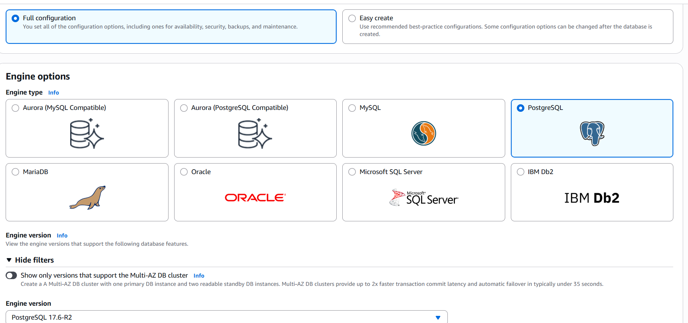
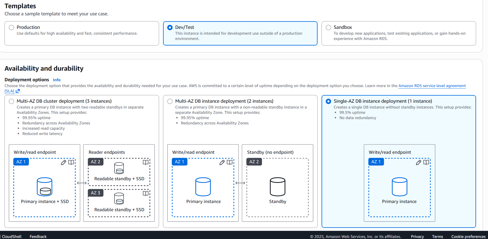
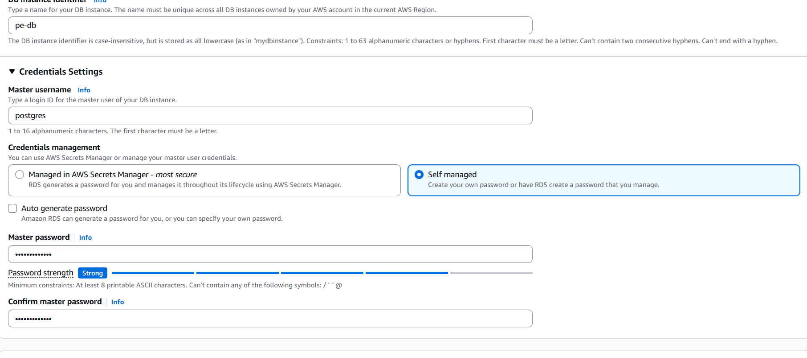
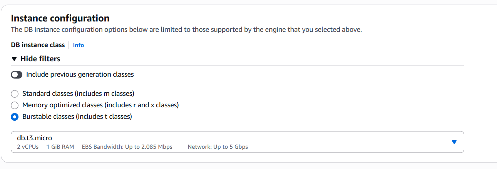
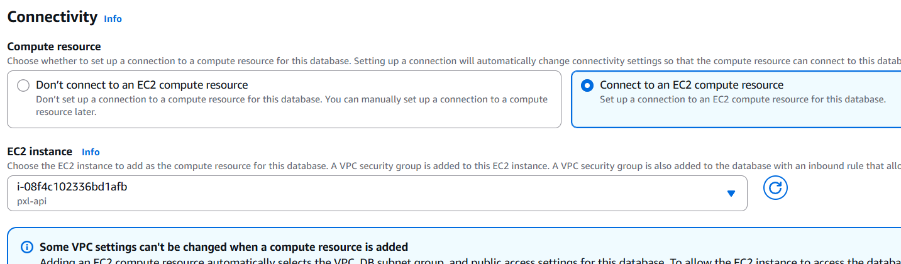
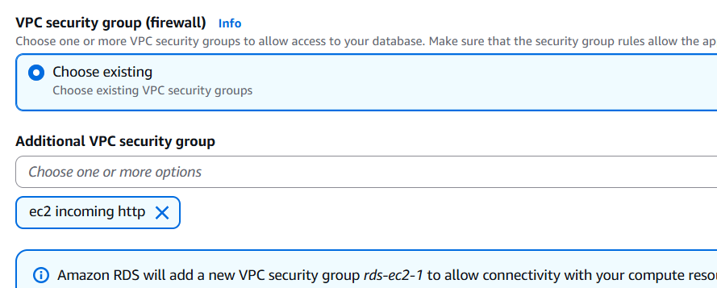
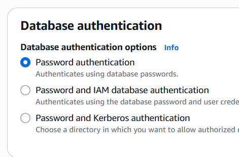
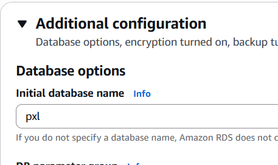

B - Database Integratie (20)
Eerst ssh toelaten naar ec2:
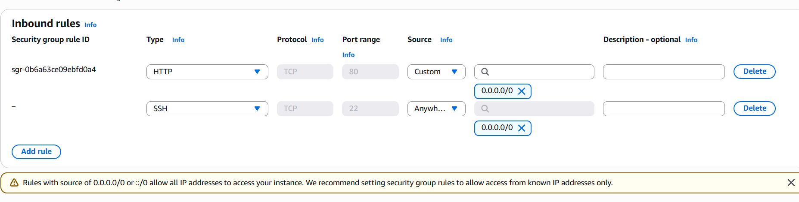
SSH:
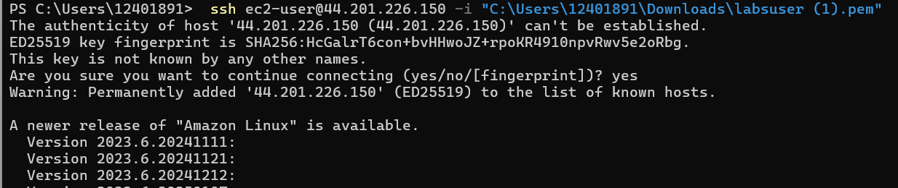
Nano docker compose:
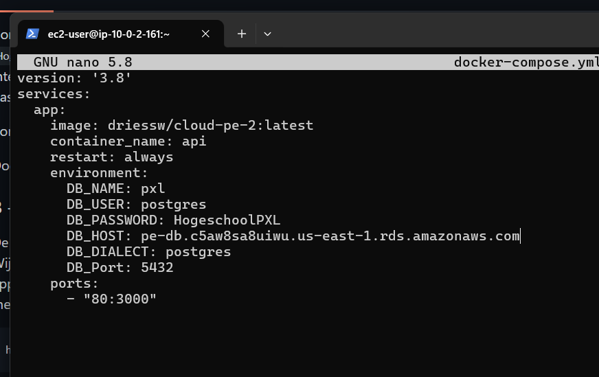
Docker compose up -d:
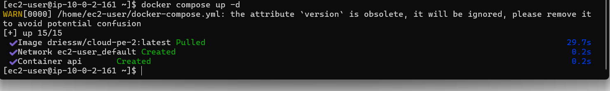
Testing:
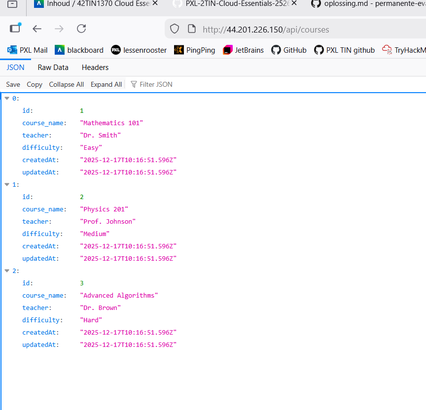

C- Application Load Balancer (30)

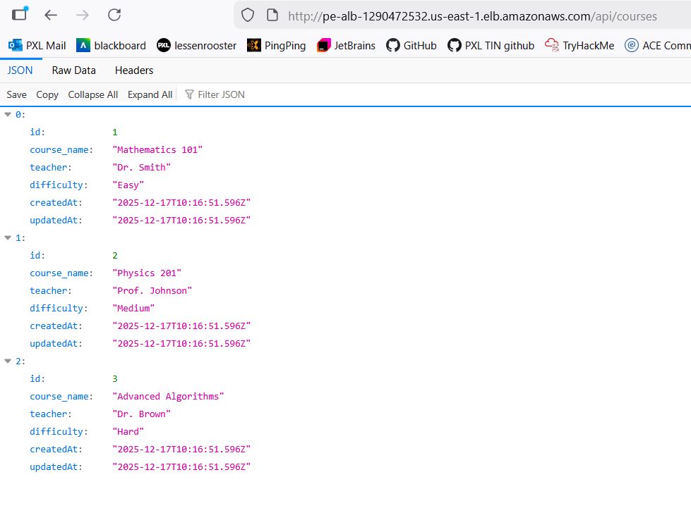

D - Lambda Functie: Data Ophalen (10)

Gewoon copy-paste

E - Lamba Functie: Data Toevoegen (20)

Code:
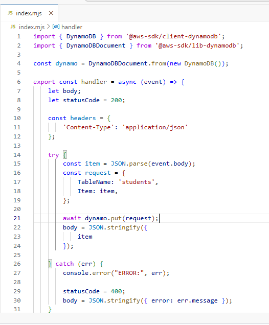
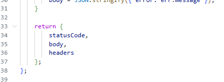
Test response:
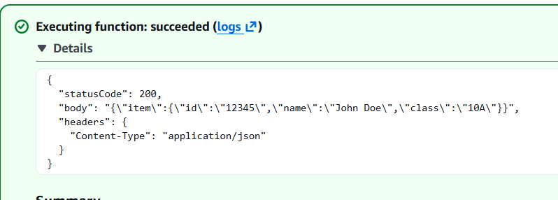

- deze lijkt te falen in het autogradingscript, terwijl mijn output wel hetzelfde is als de opgave als ik deze test:
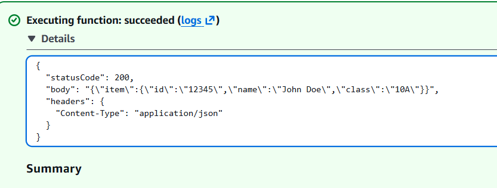

F tem J - API Gateway

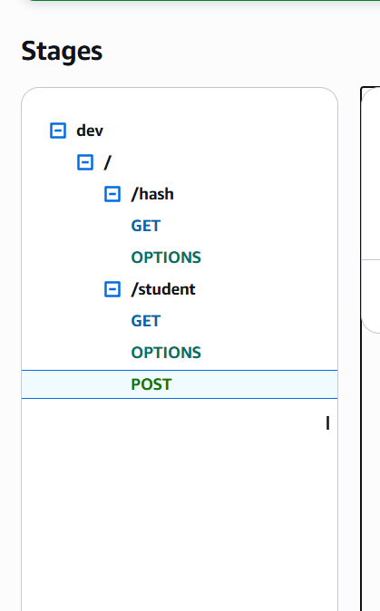

- de gewone POST lijkt te werken na proxy integration aan te zetten, de web test faalt wel nog steeds