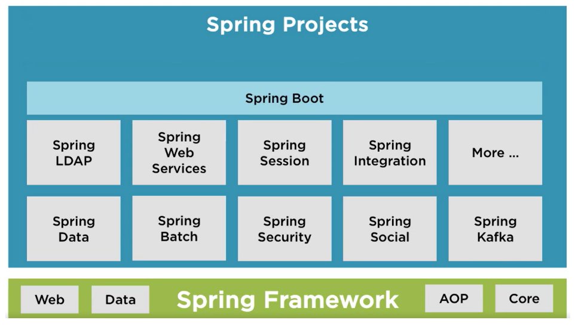
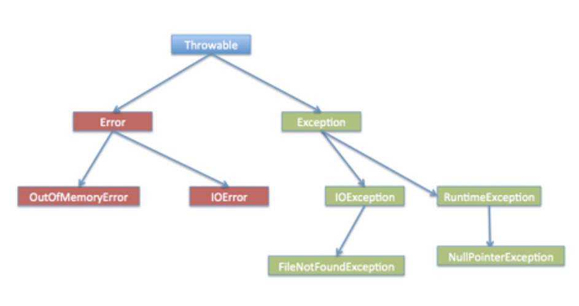
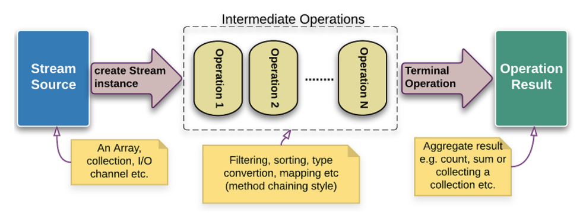
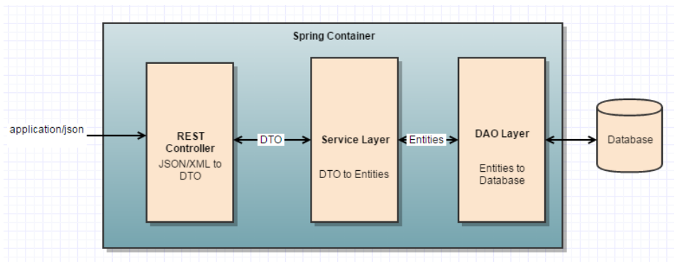
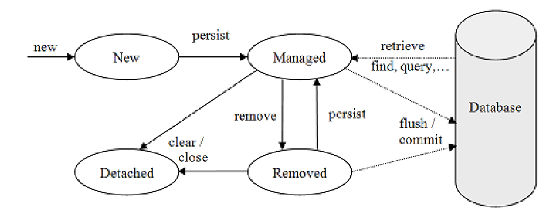
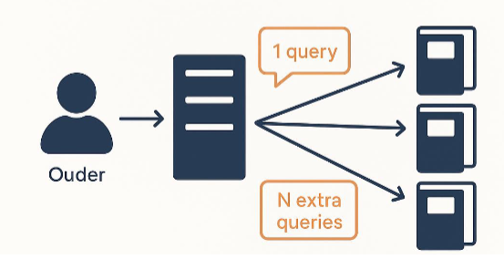

Java Advanced
=============

# Table of Contents

## 1. Spring Boot
- [1.1 Enterprise toepassingen met Java](#11-enterprise-toepassingen-met-java)  
- [1.2 Spring initializer](#12-spring-initializer)  
- [1.3 Het demo-project uitvoeren](#13-het-demo-project-uitvoeren)  
- [1.4 Maven POM-file](#14-maven-pom-file)  
- [1.5 Inversion of Control ioc en dependency injection di](#15-inversion-of-control-ioc-en-dependency-injection-di)

---

## 2. REST
- [2.1 HTTP-verzoekmethoden](#21-http-verzoekmethoden)  
- [2.2 Spring Boot Starter Web](#22-spring-boot-starter-web)  
- [2.3 De RESTController](#23-de-restcontroller)

---

## 3. Collection: Map
- [3.1 Generieke klasse HashMap](#31-generieke-klasse-hashmap)  
- [3.2 De interface Map](#32-de-interface-map)  
- [3.3 Gebruik van HashMap](#33-gebruik-van-hashmap)

---

## 4. Foutafhandeling
- [4.1 Compile-time vs runtime errors](#41-compile-time-vs-runtime-errors)  
- [4.2 First Catch](#42-first-catch)  
- [4.3 Java exception hiërarchie](#43-java-exception-hiërarchie)  
  - [4.3.1 Errors](#431-errors)  
  - [4.3.2 Runtime exceptions](#432-runtime-exceptions)  
  - [4.3.3 Checked exceptions](#433-checked-exceptions)  
- [4.4 Multi-catch blok en finally](#44-multi-catch-blok-en-finally)  
- [4.5 Eigen unchecked exceptions](#45-eigen-unchecked-exceptions)

---

## 5. [Spring validation](#5-spring-validation)

---

## 6. Unit testen met JUnit
- [6.1 JUnit](#61-junit)  
- [6.2 De klasse House](#62-de-klasse-house)  
- [6.3 Klasse met de unit testen](#63-klasse-met-de-unit-testen)  
- [6.4 en 6.5 Unit test voor een constructor / voor een setter](#64-en-65-unit-test-voor-een-constructor--voor-een-setter)  
- [6.6 @BeforeEach](#66-beforeeach)  
- [6.7 en 6.8 Unit testen voor een bekende waarde / Testen van exceptions die gegooid worden](#67-en-68-unit-testen-voor-een-bekende-waarde--testen-van-exceptions-die-gegooid-worden)  
- [6.9 Overzicht van alle testen voor de klasse House (voorbeeld)](#69-overzicht-van-alle-testen-voor-de-klasse-house-voorbeeld)

---

## 7. Lambda expressies en streams
- [7.1 Functionele interfaces](#71-functionele-interfaces)  
  - [7.1.1 De interface StringConverter](#711-de-interface-stringconverter)  
  - [7.1.2 Function&lt;t-r&gt;](#712-functiont-r)  
  - [7.1.3 Consumer&lt;t&gt;](#713-consumert)  
  - [7.1.4 Predicate&lt;t&gt;](#714-predicatet)  
- [7.2 External en internal iterators](#72-external-en-internal-iterators)  
- [7.3 Intermediate en terminal operations](#73-intermediate-en-terminal-operations)  
  - [7.3.1 Terminal operation .toList()](#731-terminal-operation-tolist)  
  - [7.3.2 Intermediate operation .filter()](#732-intermediate-operation-filter)  
  - [7.3.3 Terminal operation .forEach()](#733-terminal-operation-foreach)  
  - [7.3.4 Intermediate operation .map()](#734-intermediate-operation-map)  
  - [7.3.5 Intermediate operation .sorted()](#735-intermediate-operation-sorted)  
  - [7.3.6 Intermediate operation .distinct()](#736-intermediate-operation-distinct)  
  - [7.3.7 Intermediate operation .peek()](#737-intermediate-operation-peek)  
  - [7.3.9 Terminal operation .count()](#739-terminal-operation-count)  
- [7.4 Intstream, Longstream en Doublestream](#74-intstream-longstream-en-doublestream)  
  - [7.4.1 sum()](#741-sum)  
  - [7.4.2 range() en rangeClosed()](#742-range-en-rangeclosed)  
  - [7.4.3 min(), max() en average()](#743-min-max-en-average)  
- [7.5 Method reference](#75-method-reference)  
  - [7.5.1 static methods](#751-static-methods)  
  - [7.5.2 Instance method (unbounded)](#752-instance-method-unbounded)  
  - [7.5.3 Instance method (bounded)](#753-instance-method-bounded)  
  - [7.5.4 Constructor](#754-constructor)

---

## 8. 3-lagen architectuur: introductie van Spring Data JPA
- [8.1 Een voorbeeld toepassing](#81-een-voorbeeld-toepassing)  
- [8.2 Gegevens opslaan en ophalen](#82-gegevens-opslaan-en-ophalen)  
  - [8.2.1 Entiteitsklasse Superhero](#821-entiteitsklasse-superhero)  
  - [8.2.2 Repository](#822-repository)  
  - [8.2.3 Service-layer](#823-service-layer)  
  - [8.2.4 REST-Controller](#824-rest-controller)  
- [8.3 URL context path](#83-url-context-path)  
- [8.4 API documentation](#84-api-documentation)  
  - [8.4.1 H2 in memory database](#841-h2-in-memory-database)  
- [8.5 Frontend](#85-frontend)

---

## 9. Spring Data JPA
- [9.1 Wat is ORM?](#91-wat-is-orm)  
- [9.2 Wat is JPA?](#92-wat-is-jpa)  
- [9.3 Datasource](#93-datasource)  
- [9.4 De entity klasse](#94-de-entity-klasse)  
- [9.5 Repository](#95-repository)  
- [9.6 Entity lifecycle](#96-entity-lifecycle)  
- [9.7 Queries](#97-queries)  
- [9.8 Relationships](#98-relationships)  
- [9.9 Transactions](#99-transactions)

---

## 10. Database relaties met Spring Data JPA
- [10.1 Relationships](#101-relationships)  
  - [10.1.1 One-to-One associatie](#1011-one-to-one-associatie)  
  - [10.1.2 Many-to-one relatie](#1012-many-to-one-relatie)  
  - [10.1.3 Many-to-many relaties](#1013-many-to-many-relaties)  
- [10.2 N + 1 query problem (optioneel)](#102-n--1-query-problem-optioneel)  
- [10.3 Lazy loading en OSIV (optioneel)](#103-lazy-loading-en-osiv-optioneel)

---

### 1. Spring Boot
#### 1.1 Enterprise toepassingen met Java

Een framework voor enterprise toepassingen (Toepassingen om bedrijfsprocessen te ondersteunen) te bouwen met Java

- Schaalbaarheid
- Betrouwbaarheid en hoge beschikbaarheid
- Beveiliging
- Integratie
- Aanpasbaarheid en flexibiliteit
- Lange levenscyclus
- Samenwerking en documentatie
- Gebruikerservaring (UX)

Spring Boot is een open-source Java framework dat gebouwd is boven op het Spring Framework, het biedt alles aan om op een eenvoudige en snelle manier een toepassing te creëren, configureren en uit te voeren.



#### 1.2 Spring initializer

Een webtoepassing om een Spring-Boot project te genereren (https://start.spring.io/) of IntelliJ IDEA Ultimate biedt de Spring Initializr-projectwizard die integreert met de Spring Initializr API om je project rechtstreeks in de IDE te genereren en te importeren

Benodigde configuratie kiezen:
- Buildtool (Maven) : nieuw project krijgt automatisch de typische folder-structuur van Maven
- Programmeertaal
- Versie van Spring Boot
- Java SDK
- Afhankelijkheden

#### 1.3 Het demo-project uitvoeren

Startpunt van een Spring Boot applicatie is de klasse met de main-methode, geannoteerd met _@SpringBootApplication_

Annotaties : beginnen met '@', gekoppeld aan programmeerelementen zoals variabelen, methoden, constructors of klasses. Gelezen door een _annotation processor_

- _@Override_ : methode overschrijft de methode van de superklasse
- _@Deprecated_ : methode is verouderd, moet niet meer gebruikt worden
- ...

#### 1.4 Maven POM-file

POM : Project Object Model

- Bevat alle dependencies (externe module/library)
- spring-boot-starter-parent is het basisproject

#### 1.5 Inversion of Control (IoC) en dependency injection (DI)

Standaard is er nauwe koppeling tussen klasses en de associaties, inversion of control verwijst naar het omkeren hiervan om meer flexibiliteit en eenvoudigere testbaarheid te bekomen (basisprincipe van het Spring Framework)

Het creëren en beheren van objecten wordt de verantwoordelijkheid van een apart onderdeel binnen het programma (container). Binnen Spring Boot is deze container een object van de klasse _ApplicationContext_

- _@Bean_ : Annotation om objecten toe te voegen aan de Spring-container (automatisch)
- _@Component_ : Annotation om beans (objecten) toe te voegen aan de Spring-container dmv een methode (niet automatisch)

_CommandLineRunner_ is een interface die het mogelijk maakt om een stukje code uit te voeren zodra de Spring Boot applicatie geïnitialiseerd is

```java
@Component
public class WelcomeMessage implements CommandLineRunner {

    @Override
    public void run(String... args) throws Exception {
        System.out.println("Welcome to Java Advanced");
    }
}
```

De **Application Context** is een "slimme" doos waarin alle beans, informatie en instellingen voor de Spring Boot-Applicatie worden bewaard. Het "brein" van de applicatie dat alles coördineert en beschikbaar maakt voor de verschillende onderdelen van het programma

1. Application context aanmaken
2. Alle Spring beans laden
3. _run_ methode van de klassen die de _CommandLineRunner_ interface implementeren uitvoeren

_@SpringBootApplication_ zet eigenlijk 3 features van Spring Boot in werking:

1. Activeert het auto-configuratie mechanisme van Spring Boot (_@EnableAutoConfiguration_)
2. Activeert het scannen naar componenten met annotatie _@Component_ (en ook _@Rest-Controller_, _@Service_ en _@Repository_) binnen het package van de Spring Boot applicatie (_@ComponentScan_)
3. Laat toe dat binnen de klasse zelf extra beans worden gedefinieerd die door andere klassen gebruikt kunnen worden. (_@Configuration_)

Het injecteren van objecten door de application context wordt ook __Dependency Injection__ genoemd (maakt IoC mogelijk)

> Loglevel van Spring Boot aanpassen: `logging.level.org.springframework=debug` in _application.properties_
> Beschikbare application properties: https://docs.spring.io/spring-boot/docs/current/reference/html/application-properties.html

---
### 2. REST
#### 2.1 HTTP-verzoekmethoden
**Representational State Transfer** is een gestandaardiseerde manier om communicatie tussen verchillende softwaretoepassingen over het internet mogelijk te maken.
De functionaliteit van de applicatie wordt beschikbaar gesteld als resources die kunnen worden geïdentificeerd door URI's (Uniform Resource Identifiers). Gebruikers/applicaties  kunnen communiceren via standaard HTTP-verzoekmethoden.

| GET | POST | PUT | DELETE |
| :-----------: |:--------------:| :-------------:|:-------------:|
| Gegevens ophalen voor een speciefieke resource | Nieuwe gegevens naar een resource verzenden | Gegevens bijwerken voor een specifieke resource of om een nieuwe resource te maken als deze niet bestaat | een resource verwijderen of te deactiveren |
| Voorbeeld URI: GET /api/products/123 | Voorbeeld URI: POST /api/products | Voorbeeld URI: PUT /api/products/123 | Voorbeeld URI: DELETE /api/products/123 |
| Haalt informatie op over het product met ID 123 | Voegt een nieuw product toe aan de lijst van producten | Bijwerken van informatie van het product met ID 123 | verwijdert het product met ID 123 uit de lijst van producten |

#### 2.2 Spring Boot Starter Web

De verzameling van alle bibliotheken (third party libraries) die we nodig hebben om RESTful web applicaties te bouwen, bestaat uit Spring MVC, REST, Jackson en Tomcat (embedded web server in Spring Boot). Dit is een dependency in _pom.xml_

Poort 8080 is de default poort van de Tomcat webserver (indien de poort al in gebruik is, krijg je een foutmelding)
> Kan aangepast worden in _application.properties_ dmv `server.port=8081`

#### 2.3 De RESTController

Spring Boot heeft een annotatie voorzien voor de Spring bean die verantwoordelijk is voor het afhandelen van HTTP requests (_@RestController_), er bestaat ook een annotatie _@Controller_, maar _@RestController_ zorgt ervoor dat de respons automatisch wordt omgezet naar JSON of XML en wordt teruggestuurd naar de client.

Annotaties:

- @RestController
- @RequestMapping("/basispad")
- @GetMapping("/pad")
- @PostMapping
- @PutMapping
- @DeleteMapping

De component van Spring Boot dat verantwoorderdelijk is dat een HTTP-request door de juiste REST-controller wordt afgehandelt, is de _DispatcherServlet_ (onderdeel van Spring MVC). De _DispatcherServlet_ raadpleegt de _HandelMapping_ (een "kaart" die URL's koppelt aan specifieke controllerklassen en methoden).

---
### 3. Collection: Map

De _Map_ interface is een onderdeel van java collections framework, gebruikt om key-value pairs op te slaan. De belangrijkste implementaties van de _Map_ interface zijn:

- _HashMap_
- _LinkedHashMap_
- _TreeMap_
- _HashTable_

#### 3.1 Generieke klasse HashMap

De interface _Map_ en klasse _HashMap_ zijn generiek (ontworpen om te werken met verschillende datatypes, zonder dit op voorhand vast te leggen)

```Java
HashMap<K, V>
```

**K** staat voor het datatype van de sleutels die je in de HashMap wilt opslaan. **V** staat voor het datatype van de waarden die je in de HashMap wilt opslaan

#### 3.2 De interface 'Map'

| Methode | Uitleg |
| :--------: | :-------- |
| put(K key, V value) | Voegt een sleutel-waarde paar toe aan de map |
| get(Object key) | Geeft de waarde terug die is gekoppeld aan de opgegeven sleutel, of null als de sleutel niet in de map voorkomt |
| containsKey(Object key) | Controleert of de map een specifieke sleutel bevat |
| containsValue(Object value) | Controleert of de map een specifieke waarde bevat |
| remove(Object key) | Verwijdert de opgegeven sleutel met zijn gekoppelde waarde |
| keySet()  | Geeft een set (Set) van alle sleutels in de map terug |
| values()  | Geeft een verzameling (Collection) van alle waarden in de map terug | 

#### 3.3 Gebruik van HashMap

Voorbeeld:

```java
public class HashMapVoorbeeld {
    public static void main(String[] args) {
        // Een HashMap maken met String sleutels en Integer waarden
        Map<String, Integer> scores = new HashMap<>();

        // Sleutel-waarde paren toevoegen
        scores.put("Alice", 25);
        scores.put("Bob", 30);
        scores.put("Charlie", 28);
        scores.put("David", 35);

        // Waarde ophalen op basis van een sleutel
        int scoreVanAlice = scores.get("Alice");
        System.out.println("Score van Alice: " + scoreVanAlice); 
        // Geeft '25' weer

        // Controleren of een sleutel aanwezig is
        boolean bevatSleutel = scores.containsKey("Eve");
        System.out.println("Bevat sleutel 'Eve': " + bevatSleutel); 
        / Geeft 'false' weer

        // Sleutel-waarde paar verwijderen
        scores.remove("Bob");

        // Alle sleutels afdrukken
        System.out.println("Sleutels in de map: " + scores.keySet());
        // geeft [Alice, Charlie, David]

        // Alle waarden afdrukken
        System.out.println("Waarden in de map: " + scores.values());
        // geeft [25, 28, 35]
    }   
}
```
---
### 4. Foutafhandeling
#### 4.1 Compile-time vs runtime errors

Een IDE compileerd code tot bytecode, deze bytecode wordt door de JVM (Java Virtual Machine) geïnterpreteerd tot machinecode instructies die uitgevoerd worden door het computersysteem. Wanneer een Java programma opstart kunnen er dus 2 categorieën van problemen voorkomen:

- Compile-time error : programma compileert niet
- Runtime error (Exception) : programma compileert wel maar er doet zich een fout voor tijdens het uitvoeren van de code

Bij Runtime errors wordt er een exception-object aangemaakt en "opgeworpen", de normale uitvoer van het programma stopt en er wordt geprobeerd om het exception-object keurig af te handelen (indien daar code voor aanwezig is), zoniet zal het programma stoppen

#### 4.2 First Catch

```java
public class DivisionByZero {
    public static void main(String[] args) {
        int a = (1 + 1) % 2;
        int b = 5;
        int c = b / a;
        System.out.println("Het resultaat is " + c);
    }
}
```
Output:
```console
Exception in thread "main" java.lang.ArithmeticException: / by zero
at be.pxl.ja.DivisionByZero.main(DivisionByZero.java:6)<5 internal calls>
```

Java Runtime zal een ArithmeticException opgooien, omdat deze nergens wordt afgehandelt, eindigt het programma (je krijgt wel een stacktrace te zien)

```java
public class DivisionByZero {
    public static void main(String[] args) {
        int a = (1 + 1) % 2;
        int b = 5;
        try {
            int c = b / a;
            System.out.println("Het resultaat is " + c);
        } catch (ArithmeticException e) {
            System.out.println("You should not divide a number by zero.");
        }
    System.out.println("First catch completed!");
    }
}
```

De instructie met de deling is nu in een try-blok geplaatst, Als in het try-blok een exception optreedt, zal de rest van de code in dat blok overgeslagen worden en zal er verdergegaan worden bij het eerstvolgende catch-blok. Je bent verplicht om een try-blok te laten volgen door 1 of meerdere catch-blokken. Na een catchblok zal het programma zijn normale uitvoer verderzetten.

#### 4.3 Java exception hiërarchie



Throwable is de superklasse van alle exceptions met 2 afgeleiden:

- Error
- Exception : verder onderverdeeld in checked exceptions en runtime (unchecked) exceptions

##### 4.3.1 Errors

Problemen die zich voordoen tijdens het uitvoeren van het programma (meestal niet gerelateerd aan het programma zelf). Het is onmogelijk om erop te anticiperen en deze fouten te herstellen. We zullen dus ook nooit code toevoegen om deze fouten af te handelen.

Voorbeelden:
- StackOverflowError (oneindige loop)
- OutOfMemoryError
- ...

##### 4.3.2 Runtime (unchecked) exceptions

Exceptions die vaak veroorzaakt worden door logische fouten in programma's. Vaak moeten ze niet afgehandelt worden maar moet de bug in de code opgelost worden. (goede unit testen helpen hiermee!)

Voorbeelden:
- ArrayIndexOutOfBoundsException
- NullPointerException
- IllegalArgumentException

Gebruikersinput kan ervoor zorgen dat je Runtime exceptions optreden. Hierop moet men anticiperen bij het schrijven van code.

##### 4.3.3 Checked exceptions

Het kan zijn dat java anticipeert op mogelijke problemen en je dwingt om rekening te houden met het scenario dat er iets mis kan gaan (rode squigly), de compileerfout raakt pas opgelost wanneer je het afhandelen van de exception programmeert. Het zit hem in de naam: Java checkt effectief of een mogelijke exception ogevangen zal worden of niet: zoniet zal de code niet compileren.

ResponseEntity is de representatie van de HTTP response (statuscode, headers en body)
Overzicht van de meest voorkomende statuscodes:
- 200 OK
- 201 CREATED
- 204 NO CONTENT
- 400 BAD REQUEST
- 401 UNAUTHERIZED
- 403 FORBIDDEN
- 404 NOT FOUND
- 500 INTERNAL SERVER ERROR

#### 4.4 Multi-catch blok en finally

```java
public class MultiCatchBlockDemo {
    public static void main(String[] args) {
        Scanner scanner = new Scanner(System.in);
        System.out.println("Kies een positie: ");
        int positie = scanner.nextInt();
        System.out.println("Kies een deler: ");
        int deler = scanner.nextInt();
        try {
            int getallen[] = new int[10];
            getallen[positie] = 30 / deler;
        } catch (ArrayIndexOutOfBoundsException e) {
            System.out.println("Je moet een positie kiezen tussen 0 en 9.");
        } catch (Exception e) {
            System.out.println(e.getMessage());
        } finally {
            System.out.println("Je koos positie " + positie);
        }
        System.out.println("Start je het programma nog een keer.");
    }
}
```

Een try-blok kan gevolgd worden door 1 of meerdere catch-blokken. Wanneer een exception optreedt, zal bij het eerste catch-blok gestart worden. Indien onze exception een instantie is van de opgevangen exception (instanceof) dan zal dat catch-blok uitgevoerd worden en worden de volgende catch-blokken niet meer bekeken.
De volgorde is van belang! Eerst supperklasse, dan subklasse: Dit zorgt ervoor dat de subklasse exception onbereikbaar is! (unreachable code)

Het finally-blok zal **altijd** uitgevoerd worden ongeacht of er een exception optreedt of niet.

Je kan ook dezelfde code gebruiken om meerdere exceptions af te handelen:
```java
catch (ArrayIndexOutOfBoundsException | ArithmeticException e) {
    System.out.println(e.getMessage());
}
```
#### 4.5 Eigen unchecked exceptions

Het is mogelijk om zelf (unchecked) exceptions te schrijven, deze erven over van een superklasse

voorbeeld:

```java
public class SongNotFoundException extends RuntimeException {
    public SongNotFoundException() {
    }

    public SongNotFoundException(Throwable cause) {
        super(cause);
    }

    public SongNotFoundException(String message, Throwable cause) {
        super(message, cause);
    }

    public SongNotFoundException(String message) {
        super(message);
    }
}
```
---
### 5. Spring validation

Het is belangrijk om gegevens die meegestuurd worden met een HTTP-verzoek te valideren. om Spring Validation te gebruiken, voeg je de volgende dependency toe aan _pom.xml_
```java
<dependency>
    <groupId>org.springframework.boot</groupId>
    <artifactId>spring-boot-starter-validation</artifactId>
</dependency>
```

Lijst met de meest gebruikte annotaties:

| Annotatie | Uitleg |
| :--------: | :-------- |
| @NotNull | om aan te duiden dat een referentie niet null mag zijn |
| @NotEmpty | om aan te duiden dat een list elementen moet bevatten |
| @NotBlank | om aan te duiden dat een string niet leeg mag zijn |
| @Min and @Max | om aan te duiden dat een numerieke waarde enkel geldig is als de waarde groter of kleiner is dan een gegeven waarde |
| @Size | om de lengte van een string te valideren |
| @Email  | om te controleren of een string een geldig e-mailadres bevat |

Wanneer Spring Boot een argument vindt dat is geannoteerd met _@Valid_, wordt het automatisch gevalideerd.

Voorbeeld:

```java
@PostMapping
public void addSong(@RequestBody @Valid Song song) {
    if (LOGGER.isInfoEnabled()) {
    LOGGER.info("Adding song [" + song.getTitle() + "]");
    }
    musicPlaylistService.addSong(song);
}
```

Wanneer het argument niet voldoet aan de regels, dan gooit Spring Boot een exception van de klasse _MethodArgumentNotValidException_

Zet dit in _application.properties_ voor meer info over exceptions: `server.error.include-message=always`
Voor **nog** meer informatie: `server.error.include-binding-errors=always` (dit kan wel gevoelige informatie lekken!)

Best practice om een _MethodArgumentNotValidException_ af te handelen is met een exception handler hiervoor gebruiken we de annotaties:

- _@RestControllerAdvice_
- _@ExceptionHandler_

Voorbeeld:

```java
@RestControllerAdvice
public class GlobalExceptionHandler {

    @ExceptionHandler(MethodArgumentNotValidException.class)
    public ResponseEntity<List<String>> handleValidationErrors(MethodArgumentNotValidException ex) {
        List<String> errors = new ArrayList<>();
        for (ObjectError error: ex.getBindingResult().getAllErrors()) {
            errors.add(error.getDefaultMessage());
        }
    return new ResponseEntity<>(errors, HttpStatus.BAD_REQUEST);
    }
}
```

_@RestControllerAdvice_ geeft aan dat een klasse verantwoordelijk is voor het afhandelen van exceptions. Alle exceptions worden onderschept en indien er voor het type exception een handler is gedefinieerd, zal de bijhorende code uitgevoerd worden

---
### 6. Unit testen met JUnit

#### 6.1 JUnit

De dependency _spring-boot-starter-test_ wordt altijd toegevoegd aan een Spring Boot project.

```java
<dependency>
    <groupId>org.springframework.boot</groupId>
    <artifactId>spring-boot-starter-test</artifactId>
    <scope>test</scope>
</dependency>
```

De scope "test" is belangrijk en duidt aan dat de dependency niet nodig is voor het normale gebruik van de toepassing. (ze is enkel nodig voor het compileren en uitvoeren van testen)

#### 6.2 De klasse House

Dit was gewoon een gegeven klasse

#### 6.3 Klasse met de unit testen

In een Spring Boot-project met Maven als build-tool worden de klassen met unit testen in een specifieke mappenstructuur geplaatst. Namelijk in **src/test/java** en dan georganiseerd in dezelfde packages als de bronklassen. (src/main/java/api/Song zal src/test/java/api/SongTest worden). De naam van de testklassen heeft dezelfde naam als de te testen klasse met "Test" achteraan.

#### 6.4 en 6.5 Unit test voor een constructor / voor een setter

Bij een methode in een testklasse voeg je de annotatie _@Test_ toe zodat deze herkent en uitgevoerd kan worden. Bij het uitvoeren van een test zijn er 3 mogelijke scenario's:

- Groen : slagen
- Oranje : 1 van de beweringen (asserts) faalt
- Rood : er loopt iets onverwachts fout

Een Unit test wordt steeds opgebouwt volgens hetzelfde patroon (3A): Arrange, Act, Assert

Hier is een overzicht van handige static methoden uit de klasse _org.junit.api.Assertions_:

| Methode | Betekenis |
| :--------: | :-------- |
| assertEquals() | Evalueert de gelijkheid van 2 waarden. De test slaagt als beide waarden gelijk (equal) zijn |
| assertFalse()  | Evaluatie van een booleaanse uitdrukking. De test slaagt indien de uitdrukking false is |
| assertTrue() | Evaluatie van een booleaanse uitdrukking. De test slaagt indien de uitdrukking true is |
| assertNotNull( ) | Vergelijkt een object referentie met null. De test slaagt indien de object referentie niet null is |
| assertSame( ) | Vergelijkt het geheugenadres van twee object referenties (gebruik maken van == operator). De test slaagt indien beide object referenties naar hetzelfde object verwijzen |
| fail() | Zorgt ervoor dat de test zal falen |

#### 6.6 @BeforeEach

De annotatie _@BeforeEach_ wordt gebruikt om een methode aan te duiden die voor élke testmethode in de testklasse wordt uitgevoerd. Bijvoorbeeld voor herhaalbare initialisatiecode (verminderd duplicate code). Deze methode heeft **geen parameters** en **geen returnwaarde**.

#### 6.7 en 6.8 Unit testen voor een bekende waarde / Testen van exceptions die gegooid worden

Niks nuttigs, gewoon gegeven testklasses die terugkomen in **6.9**

#### 6.9 Overzicht van alle testen voor de klasse House (voorbeeld)

```java
public class HouseTest {
    private House house;

    @BeforeEach
    public void setUp() {
        house = new House("ABC123", "3-bedroom house", 150, EPCScore.GOOD);
    }

    @Test
    public void testConstructor() {
        House house = new House("XYZ789", "2-bedroom apartment", 100, EPCScore.B);
        assertEquals("XYZ789", house.getCode());
        assertEquals("2-bedroom apartment", house.getDescription());
        assertEquals(100, house.getArea());
        assertEquals(EPCScore.B, house.getEpcScore());
        assertEquals(Status.FOR_SALE, house.getStatus());
        assertNull(house.getCity()); // City is not set initially
    }

    @Test
    public void testSetDescription() {
        house.setDescription("4-bedroom house");
        assertEquals("4-bedroom house", house.getDescription());
    }

    @Test
    public void testSetEpcScore() {
        house.setEpcScore(EPCScore.D);
        assertEquals(EPCScore.D, house.getEpcScore());
    }

    @Test
    public void testSetArea() {
        house.setArea(200);
        assertEquals(200, house.getArea());
    }

    @Test
    public void testGetCity() {
        house.setCity("Dilsen-Stokkem");
        assertEquals("Dilsen-Stokkem", house.getCity());
    }

    @Test
    public void testMarkAsSold() {
        house.markAsSold();
        assertEquals(Status.SOLD, house.getStatus());
    }

    @Test
    public void testMarkAsSoldWhenAlreadySold() {
        house.markAsSold();
        assertThrows(IllegalStateException.class, () -> house.markAsSold());
    }

    @Test
    public void testGetPrice() {
        house.setArea(150);
        double expectedPrice = 150 *House.BASE_PRICE * EPCScore.B.getPercentage();
        assertEquals(expectedPrice, house.getPrice(), 0.001);
    }

    @Test
    public void testGetPriceWithCity() {
        house.setCity("Hasselt");
        double expectedPrice = 150 * House. BASE_PRICE * EPCScore.B.getPercentage() * 1.25;
        assertEquals(expectedPrice, house.getPrice(), 0.001);
    }
}
```
---
### 7. Lambda expressies en streams
#### 7.1 Functionele interfaces 
##### 7.1.1 De interface StringConverter

```java
@FunctionalInterface
public interface StringConverter {
    String convert(String original);
}
```
Een functionele interface is een interface met precies 1 abstracte methode, de annotatie _@FunctionalInterface_ is optioneel (maar is wel aanbevolen)

We maken nu de klasse UpperCaseConverter:

```java
public class UpperCaseConverter implements StringConverter{
    @Override
    public String convert(String original) {
        return original.toUpperCase();
    }
}
```
```java
public class Demo {
    public static void main(String[] args) {
        StringConverter upperCaseConverter = new UpperCaseConverter();
        System.out.println(upperCaseConverter.convert("LuchtHavenPerSOneeL"));
    }
}
```

Stel dat we nu ook een LowerCaseConverter, een ReverseConverter, ... willen maken, dan zouden we voor iedere functionaliteit die we nodig hebben een nieuwe klasse moeten maken, veel werk! Dit kan eenvoudiger.
We definiëren en implementeren direct een instatie van een klasse zonder de klasse expliciet te benoemen.

```java
public class Demo {
    public static void main(String[] args) {

        StringConverter upperCaseConverter = new StringConverter() {
        @Override
        public String convert(String original) {
            return original.toUpperCase();
        }
    };

        StringConverter reverseConverter = new StringConverter() {
        @Override
            public String convert(String original) {
            StringBuilder temporary = new StringBuilder(original);
            return temporary.reverse().toString();
        }
    };
    System.out.println(upperCaseConverter.convert("LuchtHavenPerSOneeL"));
    System.out.println(reverseConverter.convert("LuchtHavenPerSOneeL"));
    }
}
```
We kunnen voor iedere interface of abstracte klasse een anonieme inner klasse gebruiken. We kunnen zelfs een stap verdergaan en gebruik maken van **lambda expressies**:

```java
public class Demo {
    public static void main(String[] args) {
        StringConverter upperCaseConverter = (original) -> original.toUpperCase();
        StringConverter reverseConverter = (original) -> {
            StringBuilder temporary = new StringBuilder(original);
            return temporary.reverse().toString();
        };
        System.out.println(upperCaseConverter.convert("LuchtHavenPerSOneeL"));
        System.out.println(reverseConverter.convert("LuchtHavenPerSOneeL"));
    }
}
```
In bovenstaande code hebben we de anonieme inner klassen vervangen door Lambda expressies, deze hebben de volgende onderdelen:

- de lijst met parameters - in dit geval (original), maar kan ook leeg zijn () of meerdere parameters bevatten
- -> scheidt de parameters van de expressie
- de expressie

##### 7.1.2 Function<T, R>

De generieke functionele interface Function voorziet een functie _apply_ die een argument aanneemt en een resultaat produceert:
- T : type van het argument
- R : type van het resultaat

Voorbeeld:

```java
public class FunctionExample {
    public static void main(String[] args) {
        // Define a Function that converts a String to its length (an Integer)
        Function<String, Integer> stringLengthFunction = str -> str.length();

        // Apply the function to a String
        String inputString = "Hello, Function!";
        int length = stringLengthFunction.apply(inputString);

        System.out.println("Length of the string: " + length);
    }
}
```
##### 7.1.3 Consumer< T >

De generieke functionele interface Consumer< T > bevat een functie _accept_ die 1 argument aanneemt en **geen** resultaat teruggeeft.

```java
public class ConsumerExample {
    public static void main(String[] args) {
        List<String> names = new ArrayList<>();
        names.add("Alice");
        names.add("Bob");
        names add("Charlie");

        // Define a Consumer to print names
        Consumer<String> printName = name -> System.out.println("Name: " + name);
        // Iterate through the list and apply the Consumer using forEach
        names.forEach(printName);
    }
}
```

##### 7.1.4 Predicate< T >

Veelgebruikte functionele interface die een functie _test_ voorziet met 1 parameter met datatype T die een booleanwaarde teruggeeft. Naast de abstracte methode _test_ zijn er ook nog een aantal default functies voorzien om Predicates te combineren met _and_, _or_ en _negate_ (not).

Default functies:
- boolean `test(T t)`
- default `Predicate<T> and(Predicate<? super T> other)`
- default `Predicate<T> or(Predicate<? super T> other)`
- default `Predicate<T> negate()`

Voorbeeld:
```java
public class PredicateExample {
    public static void main(String[] args) {
        List<String> names = new ArrayList<>();
        names.add("Alice");
        names.add("Bob");
        names.add("Charlie");
        names.add("Anna");

        Predicate<String> startsWithA = name -> name.startsWith("A");
        Predicate<String> endsWithe = name -> name.endsWith("e");
        Predicate<String> startsWithAAndEndsWithe = startsWithA.and(endsWithe);

        System.out.println(startsWithA.test("Alice"));
        System.out.println(startsWithAAndEndsWithe.test("Alice"));
        printElements(names, startsWithA);
    }

    public static void printElements(List<String> list, Predicate<String> predicate) {
        for (String item : list) {
            if (predicate.test(item)) {
                System.out.println(item);
            }
        }
    }
}
```

#### 7.2 External en internal iterators

```java
@Service
public class MusicPlaylistService {
    private List<Song> playlist = new ArrayList<>();

    ...

    public List<Song> getSongsByGenre(Genre genre) {
        List<Song> result = new ArrayList<>();
        for (Song song: playlist) {
            if (song.getGenre() == genre) {
                result.add(song);
            }
        }
        return result;
    }
}
```

Een stream maakt het mogelijk om op een functionele manier complexe bewerkingen uit te voeren op een verzameling. Als we dit toepassen op bovenstaande code zal onze external iterator verdwijnen en krijgen we een internal iterator in de plaats:

```java
public List<Song> getSongsByGenre(Genre genre) {
    return playlist.stream().filter(song -> song.getGenre() == genre).toList();
}
```

Een stream bestaat uit 3 delen:
- Een (data) bron
- Intermediate operations
- Een terminal operation

In het gegeven voorbeeld is de playlist de _bron_, vervolgens hebben we een _operation_ filter en tenslotte een _terminal_ toList().



De intermediate operators verwerken de elementen van de stream 1 voor 1. Deze zijn **lui** : ze worden alleen uitgevoerd als de stream wordt afgesloten door een terminal operation (zoals in .Net)

#### 7.3 Intermediate en terminal operations
##### 7.3.1 Terminal operation .toList()

Een stream is geen datastructuur of verzameling, je moet het zien als een reeks objecten. 1 van de manieren om zo een reeks of stream te bouwen is met de static methode _of_ van de interface Stream.

```java
public class DemoCollect {
    public static void main(String[] args) {
        List<String> theBeatles =
            Stream.of("John Lennon", "Paul McCartney", "George Harrison", "Ringo Starr")
            .toList();
        System.out.println(theBeatles);
    }
}
```

Merk op: we sluiten de stream af met een Terminal operation (toList()), anders zou er niks uitgevoerd worden.

##### 7.3.2 Intermediate operation .filter()

Aan de hand van een Predicate wordt beslist welke elementen geselecteerd worden.

Voorbeeld:
```java
List<String> animals = Stream.of("zebra", "dog", "dolphine")
        .filter(a -> a.contains("o"))
        .toList();

assertEquals(Arrays.asList("dog", "dolphine"), animals);
```
Alle String-objecten die een “o” bevatten mogen in de stream aanwezig blijven. Merk op dat de functie filter() een intermediate operation is. De bewerking heeft als return-type Stream. We bouwen als het ware een pipeline. De filter()-operation is ook lazy en zal pas effectief uitgevoerd worden als er een terminal-operation aanwezig is.

Daarnaast kan je ook gebruikmaken van methodes als “or”, “and” en “negate” uit de
interface Predicate.
```java
Predicate<Participant> over100Points = p -> p.getPoints() > 100;
Predicate<Participant> startingWithS = p -> p.getName().startsWith("S");
List<Participant> selection = participants.stream()
    .filter(over100Points.and(startingWithS))
    .toList();
assertEquals(Collections.singletonList(sarah), selection);
```

##### 7.3.3 Terminal operation .forEach()

De methode .forEach() is een terminal operation en aanvaardt een implementatie van de functionele interface Consumer als parameter. Deze Consumer beschrijft een actie die met ieder element van de verzameling uitgevoerd zal worden.

Voorbeeld:
```java
public class DemoForEach {
    public static void main(String[] args) {
        Participant john = new Participant("John P.", 15);
        Participant sarah = new Participant("Sarah M.", 200);
        Participant charles = new Participant("Charles B.", 150);
        Participant mary = new Participant("Mary T.", 1);
        List<Participant> participants = Arrays.asList(john, sarah, charles, mary);

        participants.stream()
            .filter(p -> p.getPoints() >= 200)
            .forEach(System.out::println);

        System.out.println("* All participants *");
        participants.forEach(System.out::println);
    }
}
```

Iedere Collection biedt via de interface _Iterable_ ook een forEach methode aan. Met beide forEach functies kan je hetzelfde resultaat bereiken:

```java
participants.forEach(System.out::println);
participants.stream().forEach(System.out::println);
```
Toch gaat in dit geval onze voorkeur uit naar de eerste optie. Omdat we hier itereren over alle elementen is de stream overbodig.

##### 7.3.4 Intermediate operation .map()

Als je een functie hebt om objecten van één datatype te transformeren naar een ander datatype, dan kan je met de bewerking .map(), deze functie loslaten op alle objecten van een stream.

Hier volgen een twee voorbeelden. In het eerste voorbeeld wijzigt het datatype van de elementen van de stream niet. In het tweede voorbeeld wordt ieder String-object in de stream vervangen door een Integer-waarde.

```java
List<String> animals = Stream.of("zebra", "dog", "dolphine")
    .map(String::toUpperCase)
    .toList();

assertEquals(Arrays.asList("ZEBRA", "DOG", "DOLPHINE"), animals);
//------------------------------------------------------------------------
List<Integer> lengths = Stream.of("zebra", "dog", "dolphine")
    .map(String::length)
    .toList();

assertEquals(Arrays.asList(5, 3, 8), lengths);
```

##### 7.3.5 Intermediate operation .sorted()

Sorteerd de elementen in een stream. Zonder parameter zal sorted() de natuurlijke sortering gebruiken. Voor objecten van een zelfgeschreven klasse zorg je er dus voor dat de interface Comparable geïmplementeerd wordt.

Voorbeelden:
```java
List<String> sortedList = Stream.of("zebra", "dog", "dolphine")
    .sorted()
    .toList();

assertEquals(Arrays.asList("dog", "dolphine", "zebra"), sortedList);
//---------------------------------------------------------------------------
List<String> sortedList = Stream.of("zebra", "dog", "dolphine")
    .sorted((x, y) -> y.length() - x.length())
    .toList();

assertEquals(Arrays.asList("dolphine", "zebra", "dog"), sortedList);
// De lijst is gesorteerd op basis van de lengte van de woorden.
```

##### 7.3.6 Intermediate operation .distinct()

De operation .distinct() zorgt ervoor dat de elementen in de stream uniek zijn. Het is de implementatie van de equals() methode (en dus ook hashCode()) van een klasse die beslist of de elementen uniek zijn of niet.

Voorbeeld:
```java
List<String> withoutDoubles = Stream.of("zebra", "dog", "zebra", "dolphine")
    .distinct()
    .toList();

assertEquals(3, withoutDoubles.size());
```

##### 7.3.7 Intermediate operation .peek()

Kan gebruikt worden om je pipeline te debuggen, om te controleren welke elementen op een bepaald moment in de pipeline zitten, voeg je _peek_ toe (zal niet uitgevoerd worden zolang er geen terminal operation toegevoegd is).

Voorbeeld:
```java
Stream.of("one", "two", "three", "four")
    .filter(e -> e.length() > 3)
    .peek(e -> System.out.println("Filtered value: " + e))
    .map(String::toUpperCase)
    .peek(e -> System.out.println("Mapped value: " + e))
    .toList();
```

Kan ook gebruikt worden om de elementen in je stream aan te passen:

```java
Stream<User> userStream = Stream.of(new User("Alice"), new User("Bob"), new User("Chuck"));
userStream.peek(u -> u.setName(u.getName().toLowerCase()))
    .forEach(System.out::println);
```

##### 7.3.9 Terminal operation .count()

De terminal operation count gebruik je om het aantal elementen in de stream te tellen.

Voorbeeld:
```java
long over100Points = participants.stream().filter(p -> p.getPoints() > 100).count();
assertEquals(2, over100Points);
```

Indien je geen gebruik maakt van intermediate operations gebruik je de methode size() van je collection om het aantal elementen te achterhalen: `System.out.println("Number of participants: " + participants.size());`

#### 7.4 Intstream, Longstream en Doublestream

Er zijn ook een aantal afgeleide interfaces van de interface stream, deze bieden extra functionaliteit aan:

- Intstream : streams met gehele getallen
- Doublestream : streams met doubles
- Longstream : streams met longs

Al deze interfaces bevatten de methoden sum(), min(), max() en average()

##### 7.4.1 sum()

Som berekenen van de elementen in een stream:
```java
long totalPoints = participants.stream().mapToInt(Participant::getPoints).sum();
assertEquals(366, totalPoints)
```

##### 7.4.2 range() en rangeClosed()

Beschikbaar in de interfaces java.util.stream.IntStream en java.util.stream.LongStream. Je kan ze gebruiken om een stream te creëren met gehele getallen vanaf een initële waarde tot een stop waarde.

Voorbeeld:
```java
long count = IntStream.rangeClosed(10, 20).count();
assertEquals(11, count);
```

##### 7.4.3 min(), max() en average()

Self explanatory but with one caveat, deze iterators geven een _OptionalInt_ terug (min() en max()) en _OptionalDouble (average()), om de uiteindelijke waarde te krijgen, gebruiken we _.getAsInt()_ en _.getAsDouble()_. Dit is gedaan om ervoor te zorgen dat er geen exceptions gegooid worden wanneer een stream leeg is en we 1 van deze methoden zouden gebruiken.

```Java
Random random = new Random();
List<Integer> randomNumbers = random.ints(15, 0, 100).boxed().toList();
int max = randomNumbers.stream().mapToInt(x -> x).max().getAsInt();
int min = randomNumbers.stream().mapToInt(x -> x).min().getAsInt();
double average = randomNumbers.stream().mapToInt(x -> x).average().getAsDouble();

assertTrue(min <= average);
assertTrue(max >= average);

IntSummaryStatistics intSummaryStatistics = random.ints(15, 0, 100).summaryStatistics();
assertTrue(intSummaryStatistics.getMax() >= intSummaryStatistics.getMin());
```

#### 7.5 Method reference

Een speciaal type lambda expressies, gebruikt om de expressies te vereenvoudigen door te verwijzen naar een bestaande methode, zonder dat je expliciet de parameters moet invullen.

Er zijn 4 soorten methodes in Java:
- static methods
- constructors
- instance methods (bounded en unbounded)

##### 7.5.1 static methods

Syntax:
ClassName::staticMethod
```java
IntBinaryOperator min = (x, y) -> Math.min(x, y);
IntBinaryOperator max = Math::max;
System.out.println(min.applyAsInt(-3, 17));
System.out.println(max.applyAsInt(-3, 17));
```

##### 7.5.2 Instance method (unbounded)

Syntax:
ClassName::instanceMethod
```java
Function<String, String> toUpperCase = s -> s.toUpperCase();
Function<String, String> toLowerCase = String::toLowerCase;
System.out.println(toUpperCase.apply("abcdef"));
System.out.println(toLowerCase.apply("ABCDEF"));
```

##### 7.5.3 Instance method (bounded)

Syntax:
instance::instanceMethod
```java
Random random = new Random();
IntSupplier randomInt = random::nextInt;
IntUnaryOperator randomIntWithBound = random::nextInt;
System.out.println(randomInt.getAsInt());
System.out.println(randomIntWithBound.applyAsInt(12));
```
De klasse Random voorziet 2 versies van de methode nextInt(): 1 zonder parameter en 1 met één parameter, de bovengrens. (methode overloading). Aan de hand van de functionele interface die je implementeert, kan je nu de gewenste methode als een lambda functie schrijven.

##### 7.5.4 Constructor

Syntax:
ClassName::new
```java
System.out.println("Constructor");
Supplier<Random> randomCreator = Random::new;
Random random = randomCreator.get();
```

```java
public class ConstructorMethodReferenceExample {
    public static void main(String[] args) {
        // Using a constructor method reference to create a new Person object
        Supplier<Person> personSupplier = Person::new;
        Person person = personSupplier.get();
        System.out.println("Name: " + person.getName()); // Outputs: Name: Unknown

        // Using a constructor method reference to create a new Person object with a name
        Function<String, Person> personFunction = Person::new;
        Person person2 = personFunction.apply("Alice");
        System.out.println("Name: " + person2.getName()); // Outputs: Name: Alice
    }
}
```
---
### 8. 3-lagen architectuur: introductie van Spring Data JPA

Tot nu toe hebben we maar 2 lagen gebruikt in onze Spring Boot applicaties: De REST-controller uit de API-laag  gebruikt de business-logica of functionaliteit uit de servicelaag, nu gaan we een derde laag toevoegen: de persistence-laag (verantwoordelijk voor het ophalen en wegschrijven van gegevens naar de database).

- Router- of API-laag : afhandelen en verwerken van HTTP-verzoeken en vertalen van JSON-parameters naar objecten, authenticatie van gebruikers en beschermen van gegevens
- Servicelaag : bevat de business-logica, kernfunctionaliteit (berekeningen, beslissingen, gegevensverwerking, ...)
- Data- of persistence-laag : verantwoordelijk voor de interactie met de database (opslaan en ophalen van gegevens)

Annotaties:

- _@Component_ : generieke annotatie voor alle componenten beheerd door Spring
- _@RestController_ : voor de componenten in de API-laag
- _@Service_ : voor de componenten in de service-laag
- _@Repository_ : voor de componenten in de persistence-laag


- REST-controller in API-laag biedt REST-endpoints aan
- API-laag communiceert via DTO's (data transfer objects) met de servicelaag
- Servicelaag implementeerd alle business-logica
- DTO's worden omgevormd naar entiteiten (objecten uit het domein dat we persisteren in de database)
- Entiteiten worden doorgegeven aan de persistence-laag (verantwoordelijk voor het opslaan daarvan in de database)

De Spring container zorgt ervoor dat objecten van klassen geanotteerd met _@Service_, _@Repository_, ... beschikbaar zijn wanneer nodig.

#### 8.1 Een voorbeeld toepassing

Gewoon een oefening op het toevoegen van een repository en wat daar allemaal bij komt kijken.

#### 8.2 Gegevens opslaan en ophalen
##### 8.2.1 Entiteitsklasse Superhero

Om objecten op te slaan in de database hebben we een klasse nodig die geannoteerd is met _@Entity_ (wordt gemapt naar een tabel in de database). Elke instantie van deze klasse komt overeen met een rij in deze tabel, waardoor de eigenschappen van het object worden opgeslagen als kolommen.

Voorbeeld:
```java
@Entity
@Table(name="superheroes")
public class Superhero {
    @Id
    @GeneratedValue(strategy = GenerationType.IDENTITY)
    private Long id;
    private String firstName;
    private String lastName;
    private String superheroName;

    public Superhero() {
        // JPA only
    }

    public Superhero(String firstName, String lastName, String superheroName) {
        this.firstName = firstName;
        this.lastName = lastName;
        this.superheroName = superheroName;
    }
    // Overige getters en setters, eventueel een @Override voor een toString()
}
```
Bemerk de verschillende toegevoegde annotaties: 
- _@Entity_ : Geeft aan dat de klasse een entiteitsklasse is
- _@Table_ : Zorgt ervoor dat Spring automatisch de databasetabel 'superheroes' aanmaakt
- _@Id_ : Primary key
- _@GeneratedValue_ : Primary keys moeten niet zelf toegewezen worden aan objecten (de database is verantwoordelijk voor het genereren en het toewijzen hiervan)

##### 8.2.2 Repository

Om queries in de database uit te voeren hebben we een interface (repository) nodig. Spring kan automatisch databasequeries genereren. Eenvoudige queries zoals save, findById, ... zijn al beschikbaar wanneer je de interface _JpaRepository_ uitbreidt. Het hoeft alleen te weten wat de naam van de entiteitsklasse is en het type van de primary key.

Voorbeeld:
```java
@Repository
public interface SuperheroRepository extends JpaRepository<Superhero, Long> {
}
```

##### 8.2.3 Service-layer

Verantwoordelijk voor de implementatie van de businesslogica, klassen in deze laag zullen gebruik maken van repositories en andere service-klassen.
- Goed idee om voor elke klasse in de servicelaag een interface te voorzien
- Mogen **nooit** entiteitsobjecten retourneren: we gebruiken hier DTO's voor om gegevens uit de servicelaag naar de API-laag te sturen

Voorbeeld:
```java
package be.pxl.superhero.service;

public interface SuperheroService {
    List<SuperheroDTO> findAllSuperheroes();
    SuperheroDTO findSuperheroById(Long superheroId);
    Long createSuperhero(SuperheroRequest superheroRequest);
    SuperheroDTO updateSuperhero(Long superheroId, SuperheroRequest superheroRequest);
    boolean deleteSuperhero(Long superheroId);
}
```
DTO SuperheroDTO:
```java
package be.pxl.superhero.api;

public class SuperheroDTO {
    private final Long id;
    private final String firstName;
    private final String lastName;
    private final String superheroName;

    public SuperheroDTO(Superhero superhero) {
        this.id = superhero.getId();
        this.firstName = superhero.getFirstName();
        this.lastName = superhero.getLastName();
        this.superheroName = superhero.getSuperheroName();
    }
    // Getters (geen setters want dit is een DTO)
}
```
Request-object SuperheroRequest:
```java
package be.pxl.superhero.api;

public class SuperheroRequest {
    private String firstName;
    private String lastName;
    private String superheroName;
    public SuperheroRequest(String firstName, String lastName, String superheroName) {
        this.firstName = firstName;
        this.lastName = lastName;
        this.superheroName = superheroName;
    }
    // Overige getters en setters
}
```
Klasse SuperheroServiceImpl, geannoteerd met @Service:
- Biedt alle CRUD (create, read, update, delete) operaties aan
- Implementeerd alle bedrijfslogica
- Heeft toegang tot de SuperheroRepository dankzij _@Autowired_
```java
package be.pxl.superhero.service.impl;

@Service
public class SuperheroServiceImpl implements SuperheroService {
    private final SuperheroRepository superheroRepository;

    @Autowired
    public SuperheroServiceImpl(SuperheroRepository superheroRepository) {
        this.superheroRepository = superheroRepository;
    }

    public List<SuperheroDTO> findAllSuperheroes() {
        return superheroRepository.findAll()
            .stream().map(SuperheroDTO::new)
            .toList();
    }

    public SuperheroDTO findSuperheroById(Long superheroId) {
        return superheroRepository.findById(superheroId)
            .map(SuperheroDTO::new)
            .orElseThrow(() -> new ResourceNotFoundException("Superhero", "ID", superheroId));
    }

    public Long createSuperhero(SuperheroRequest superheroRequest) {
        Superhero superhero = new Superhero();
        superhero.setFirstName(superheroRequest.getFirstName());
        superhero.setLastName(superheroRequest.getLastName());
        superhero.setSuperheroName(superheroRequest.getSuperheroName());
        Superhero newSuperhero = superheroRepository.save(superhero);
        return newSuperhero.getId();
    }

    public SuperheroDTO updateSuperhero(Long superheroId, SuperheroRequest superheroRequest) {
        return superheroRepository.findById(superheroId).map(superhero -> {
            superhero.setFirstName(superheroRequest.getFirstName());
            superhero.setLastName(superheroRequest.getLastName());
            superhero.setSuperheroName(superheroRequest.getSuperheroName());
            return new SuperheroDTO(superheroRepository.save(superhero));
        }).orElseThrow(() -> new ResourceNotFoundException("Superhero", "id", superheroId));
    }

    public boolean deleteSuperhero(Long superheroId) {
        return superheroRepository.findById(superheroId)
            .map(superhero -> {
                superheroRepository.delete(superhero);
                return true;
            }).orElseThrow(() -> new ResourceNotFoundException("Superhero", "id", superheroId));
    }
}
```
Uitzonderingsklasse ResourceNotFoundException:
```java
package be.pxl.superhero.exception;

@ResponseStatus(HttpStatus.NOT_FOUND)
public class ResourceNotFoundException extends RuntimeException {
    public ResourceNotFoundException(String resource, String field, String value) {
        super("Not found: " + resource + " with " + field + "=" + value);
    }

    public ResourceNotFoundException(String resource, String field, long value) {
        this(resource, field, Long.toString(value));
    }
}
```

##### 8.2.4 REST-Controller

Klasse met de REST-endpoints:
```java
package be.pxl.superhero.api;

@RestController
@RequestMapping("/superheroes")
public class SuperheroController {
    private final SuperheroService superheroService;

    public SuperheroController(SuperheroService superheroService) {
        this.superheroService = superheroService;
    }

    @GetMapping
    public List<SuperheroDTO> getSuperheroes() {
        return superheroService.findAllSuperheroes();
    }

    @GetMapping("/{superheroId}")
    public SuperheroDTO getSuperheroById(@PathVariable Long superheroId) {
        return superheroService.findSuperheroById(superheroId);
    }

    @PostMapping
    public ResponseEntity<Long> createSuperhero(@RequestBody SuperheroRequest superheroRequest) {
        return new ResponseEntity<>(superheroService.createSuperhero(superheroRequest), HttpStatus.CREATED);
    }

    @PutMapping("/{superheroId}")
    public SuperheroDTO updateSuperhero(@PathVariable Long superheroId, @RequestBody SuperheroRequest superheroRequest) {
        return superheroService.updateSuperhero(superheroId, superheroRequest);
    }

    @DeleteMapping("/{superheroId}")
    public ResponseEntity<Void> deleteSuperhero(@PathVariable Long superheroId) {
        boolean deleted = superheroService.deleteSuperhero(superheroId);
        return deleted? new ResponseEntity<>(HttpStatus.OK) : new ResponseEntity<>(HttpStatus.BAD_REQUEST);
    }   
}
```

JSON-formaat om een superhero aan te maken:
```JSON
{
    "firstName": "Clark",
    "lastName": "Kent",
    "superheroName": "Superman"
}
```

#### 8.3 URL context path

Om een voorvoegsel (prefix) bijvoorbeeld _/api_ aan alle URL's van de applicatie wilt toevoegen dan kan dat door `server.servlet.context-path=/api` aan _application.properties_ toe te voegen.

#### 8.4 API documentation

Door een dependency toe te voegen in _POM.xml_ kan je handige documentatie zien als je surft naar http://localhost:8080/api/swagger-ui.html, hier kan je zelfs je eigen API testen (poort voor jouw applicatie kan anders zien indien zo geconfigureert).

```java
<dependency>
    <groupId>org.springdoc</groupId>
    <artifactId>springdoc-openapi-starter-webmvc-ui</artifactId>
    <version>2.2.0</version>
</dependency>
```
Het is ook mogelijk om nog extra bijkomende swagger documentatie toe te voegen in je eigen RESTcontrollers maar dit is buiten scope voor deze cursus (zelf op te zoeken indien gewenst).

##### 8.4.1 H2 in memory database

De H2 in-memory database verdwijnt wanneer je de applicatie afsluit en alle data gaat verloren. Als je de data ervan wilt bekijken voeg je dit toe in _application.properties_ : `spring.h2.console.enabled=true` 

Als je de Spring Boot applicatie opstart, krijg je de unieke naam van de database:
`H2 console available at '/h2-console'. Database available at 'jdbc:h2:mem:f5f92e54-3aff-4986-9d00-a0028b0eb6ed'`

Als je dan de URL : http://localhost:8080/api/h2-console in een browser ingeeft, de unieke naam van de database en username 'sa' en blanco paswoord ingeeft dan is de database zichtbaar.

#### 8.5 Frontend

Frontend voor de superhero oefening te vinden op : https://github.com/custersnele/superhero-frontend.git
Voeg CORS-ondersteuning toe aan de Spring Boot applicatie en voeg de configuratie toe in de 'config' package.

---
### 9 Spring Data JPA
#### 9.1 Wat is ORM?

Object-Relational Mapping is een techniek om gegevens uit een relationele database kan opvragen en manipuleren met behulp van een objectgeoriënteerde programmeertaal.

#### 9.2 Wat is JPA?

Java-Persistence API (officieel Jakarta Persistence API) is een specificatie die definieert hoe gegevens gepersisteerd worden in een java-applicatie.

Bestaat uit implementatie richtlijnen voor de java ORM-laag (alleen geleverd via interfaces, zonder eigenlijke implementatie)
We gebruiken _Hibernate_ als implementatie van de JPA-specificatie.

#### 9.3 Datasource

De datasource of gegevensbron is de configuratie die gebruikt wordt om verbinding te maken met een database of andere exterene gegevensopslag (bevat informatie zoals : database-URL, gebruikersnaam, wachtwoord en andere instellingen die nodig zijn)
Wordt gespecifieerd in _application.properties_ :
|  Eigenschap | Uitleg |
| :--------: | :-------- |
| spring.datasource.url | JDBC URL van de database |
| spring.datasource.username | Gebruikersnaam voor de database |
| spring.datasource.password | Paswoord voor de database |
| spring.jpa.show-sql | Logging van de SQL statements. Default:false |
| spring.jpa.hibernate.ddl-auto | Automatisch genereren van tabellen, Mogelijke waarden: none (production), create,create-drop, validate and update |

Je kan ook gebruik maken van andere database die niet in-memory zijn (zoals bv. MySQL, PostgreSQL, ...), hiervoor zal je een dependency moeten toevoegen in _POM.xml_ en configuratie in _application.properties_. Ook zal je de database moeten hosten, bijvoorbeeld via docker

#### 9.4 De entity klasse

```java
package be.pxl.superhero.domain;

@Entity
@Table(name="superheroes")
public class Superhero {
    private static final Logger LOGGER = LogManager.getLogger(Superhero.class);
    @Id
    @GeneratedValue(strategy = GenerationType.IDENTITY)
    private Long id;
    private String firstName;
    private String lastName;
    @Column(unique = true)
    private String superheroName;
    @Column(name="notes")
    private String description;

// overige contructors, getters, setters, ...
}
```

Een JPA-entityklasse is een POJO (Plain Old Java Object) klasse die gebruikt wordt om objecten in de database te vertegenwoordigen.

- _@Id_ duidt de primary key aan
- _@Column wordt gebruikt om details van de kolom te specificeren, de volgende attributen zijn mogelijk:
    - name : specificeer de naam van de kolom
    - length : specificeer de grootte van de kolom, met name voor een String-waarde
    - nullable : markeer de kolom als NOT NULL wanneer het databaseschema wordt gegenereerd
    - unique: specificeer de kolom om alleen unieke waarden te bevatten

#### 9.5 Repository

De JpaRepository interface is een uitbreiding op de CrudRepository. JpaRepository breidt PagingAndSortingRepository uit, dat op zijn beurt CrudRepository uitbreidt.

- CrudRepository biedt voornamelijk CRUD-functies
- PagingAndSortingRepository biedt methoden voor paginering en het sorteren van records
- JpaRepository biedt enkele JPA-gerelateerde methoden, zoals het flushen van de persistentiecontext en het verwijderen van records in batches

#### 9.6 Entity lifecycle

**PersistencyContext** is één van de belangrijkste concepten in JPA. Het is de verzameling van alle entiteitsobjecten die momenteel of recentelijk gebruikt worden/zijn. (kan beschouwt worden als een soort first-level cache)
Elk entiteitsobject heeft 1 van de volgende 4 statussen:
- New
- Managed
- Removed
- Detached



#### 9.7 Queries

Met Spring Data JPA is het mogelijk om query-methoden te maken om records uit databases te selecteren zonder SQL-queries te schrijven. Spring Data JPA kan de query afleiden uit de naam van de query-methode:

In een UserRepository kan je bijvoorbeeld een query-methode hebben met de naam findByEmailAddressAndLastname().

```java
public interface UserRepository extends JpaRepository<User, Long> {
    List<User> findByEmailAddressAndLastname(String emailAddress, String lastname);
}
```
Spring Data JPA genereert achter de schermen een query die vertaald wordt naar JPQL (Java Persistence Query Language, een dialect van SQL)

#### 9.8 Relationships

Vanuit een databaseperspectief hebben we de volgende relaties tussen tabellen
- one-to-many
- one-to-one
- many-to-many<br>
JPA biedt annotaties aan om deze relaties in de code te weerspiegelen

Voorbeeld:
```java
@ManyToMany(mappedBy = "missions")
private List<Superhero> superheroes = new ArrayList<>();
```

#### 9.9 Transactions

Voorbeeld:
```java
@Transactional
public void addSuperheroToMission(Long superheroId, Long missionId) {
Superhero superhero = superheroRepository.findById(superheroId).orElseThrow(() -> new ResourceNotFoundException("Superhero", "ID", superheroId));
Mission mission = missionRepository.findById(missionId).orElseThrow(() -> new ResourceNotFoundException("Mission", "ID", missionId));
superhero.addMission(mission);
}
```
Omdat we de annotatie _@Transactional_ hebben toegevoegt zal alles uitgevoerd worden in 1 transactie (soms **moet** dit zelfs voor bepaalde queries/bewerkingen)

---
### 10 Database relaties met Spring Data JPA
#### 10.1 Relationships

Spring Data JPA ondersteund verschillende relationele database associaties : zie [9.8 Relationships](#98-relationships)  

##### 10.1.1 One-to-One associatie

In een één-op-één-relatie is één record in een tabel geassocieerd met slechts één record in een andere tabel. Dit resulteert in een foreign key in de tabel die eigenaar (owner) is van de associatie. gebruik _@OneToOne_, de naam van de kolom met de foreign key kan je aanpassen met de annotatie _@JoinColumn_<br>
Voorbeeld:
```java
@OneToOne(cascade = CascadeType.ALL)
private ContactInformation contactInformation;
```
CascadeType.ALL beteknt dat de persistentiecontext alle EntityManageroperaties (PERSIST, REMOVE, REFRESH, MERGE, DETACH) zal doorgeven (cas-caden) naar de gerelateerde entiteiten. Dit betekent dat wanneer een operatie wordt uitgevoerd op de hoofdentiteit, deze operatie automatisch ook wordt toegepast op alle gerelateerde entiteiten.

##### 10.1.2 Many-to-one relatie

De meest voorkomende optie om een enum-waarde in JPA te mappen naar en vanuit zijn database-representatie is het gebruik van de @Enumerated annotatie. Op deze manier zal de JPA-provider de enum-waarde omzetten naar de ordinale waarde of String-waarde. Wanneer we de String-waarde gebruiken, kunnen we veilig nieuwe enum-waarden toevoegen of de volgorde van onze enum-waarden wijzigen. Het hernoemen van een enum-waarde zal echter nog steeds de databasedata breken.

Voorbeeld:
```java
@Enumerated(value= EnumType.STRING)
private ProjectPhase projectPhase;
```
Om een many-to-one relatie te creëren, voegen we de annotatie _@ManyToOne_ toe.

Voorbeeld:
```java
@ManyToOne
private Project project;
```

Zie ook: https://vladmihalcea.com/%20the-best-way-to-map-a-onetomany-association-with-jpa-and-hibernate/

##### 10.1.3 Many-to-many relaties

om een many-to-many relatie te creëren, voegen we de annotatie _@ManyToMany_ toe.

Voorbeeld:
```java
// klasse Researcher
@ManyToMany
private List<Project> projects = new ArrayList<>();

// klasse Project
@ManyToMany(mappedBy = "projects")
private List<Researcher> researchers = new ArrayList<>();
```

Nu zal er een koppeltabel aangemaakt worden waar wordt bijgehouden welke onderzoekers werken aan welke projecten (in dit voorbeeld).

#### 10.2 N + 1 query problem (optioneel)

Doordat je een query uitvoert om ouder-entiteiten op te halen, voert hibernate een extra query uit om gerelateerde kind-entiteiten op te halen. Je krijgt dus als het ware 1 + N queries, wat lineair groeit en performance zal schaden.
<br>
Dit is iets wat vaak voorkomt bij ORMs zoals _Hibernate_ wanneer lazy loading onbedoeld gebruikt wordt.

Je kan de annotatie _@EntityGraph_ gebruiken om efficiënter queries uit te voeren (bv. als je findAll() zou gebruiken)

```java
public interface PostCommentRepository extends JpaRepository<PostComment, Long> {
    @Override
    @EntityGraph(
        type = EntityGraph.EntityGraphType.FETCH,
        attributePaths = {
            "post"
        }
    )
    List<PostComment> findAll();
}
```
Meer info: https://tech.asimio.net/2020/11/06/Preventing-N-plus-1-select-problem-using-Spring-Data-JPA-EntityGraph.html

#### 10.3 Lazy loading en OSIV (optioneel)

De entiteiten in een @OneToMany en @ManyToMany relatie worden op een ’lazy’ manier geladen. Het laden van de data gebeurt enkel wanneer het nodig is, dit zorgt voor betere performantie. Je hebt echter een transactie (of sessie)nodig om de geassocieerde data uit de database op te halen. Spring Boot schakelt echter standaard een mechanisme in dat OSIV (Open Session in View) wordt genoemd. In Spring Boot applicaties die JPA gebruiken, worden transacties gecreëerd voordat requests bij de REST-controller aankomen (zelfs als het verzoek geen dataverwerkingen uit zou voeren). De OpenSessionInViewInterceptor klasse beheert deze sessies. OSIV is een slecht idee vanuit een prestatie- en schaalbaarheidsperspectief.<br>
Je kan dit uitzetten door : `spring.jpa.open-in-view=false` in _application.properties_ maar als je dan een endpoint probeert aan te roepen zal je een LazyIntializationException krijgen om dit op te lossen zou je de relatie als EAGER ipv LAZY kunnen definiëren, maar dit is zelden een goede oplossing, een betere oplossing is om de servicemethoden te annoteren met _@Transactional_.<br>
Meer info: https://www.baeldung.com/spring-open-session-in-view en https://techiemanas.wordpress.com/2020/12/01/spring-open-session-in-view-osiv/