Project Management
==================

# Table of contents

- [1. Wat is projectmanagement?](#1-wat-is-projectmanagement)
  - [1.1 Historische wortels](#11-historische-wortels)
    - [1.1.1 Definitie van projectmanagement](#111-definitie-van-projectmanagement)
  - [1.2 Definitie van een project](#12-definitie-van-een-project)
    - [1.2.1 Projectjargon](#121-projectjargon)
    - [1.2.2 Projectstructuur](#122-projectstructuur)
    - [1.2.3 De duiveldriehoek](#123-de-duiveldriehoek)
  - [1.3 De scope van een project](#13-de-scope-van-een-project)
    - [1.3.1 Product- vs projectscope](#131-product--vs-projectscope)
    - [1.3.2 Product vs project levenscyclus](#132-product-vs-project-levenscyclus)
    - [1.3.3 Productportfolio](#133-productportfolio)
  - [1.4 Verzamelen van klantenbehoeften](#14-verzamelen-van-klantenbehoeften)
  - [1.5 Plan van aanpak](#15-plan-van-aanpak)
  - [1.6 Work breakdown structure](#16-work-breakdown-structure)
    - [1.6.1 RACI matrix](#161-raci-matrix)
  - [1.7 Projectmanagement en taken van een projectmanager](#17-projectmanagement-en-taken-van-een-projectmanager)
    - [1.7.1 Projectmanagement](#171-projectmanagement)
    - [1.7.2 Wat doet een projectmanager?](#172-wat-doet-een-projectmanager)
    - [1.7.3 Competenties van een projectmanager](#173-over-welke-competenties-moet-een-projectmanager-beschikken)
  - [1.8 Project Life Cycle](#18-wat-is-een-project-life-cycle-en-wat-zijn-de-karakteristieken)
    - [1.8.1 Karakteristieken](#181-karakteristieken-van-de-project-life-cycle)
    - [1.8.2 Generieke kenmerken](#182-generieke-kenmerken-van-de-levenscyclusstructuur)
  - [1.9 Procesgroepen](#19-de-projectmanagement-procesgroepen)

- [2. Projectplanning](#2-projectplanning)
  - [2.1 PERT](#21-pert)
    - [2.1.1 Hoofdbegrippen](#211-hoofdbegrippen)
    - [2.1.2 Tijdsfactor](#212-tijdsfactor)
    - [2.1.3 Verwachte tijdstippen](#213-verwachte-tijdstippen)
    - [2.1.4 Speling](#214-speling)
    - [2.1.5 Kritieke pad](#215-kritieke-pad)
  - [2.2 Gantt-grafiek](#22-gantt-grafiek)
    - [2.2.1 Tijdschaalvoorstelling](#221-gantt-chart--tijdschaal-voorstelling)
    - [2.2.2 Lay-out](#222-lay-out)
    - [2.2.3 Toewijzing van hulpmiddelen](#223-toewijzing-van-hulpmiddelen)
    - [2.2.4 Projectkosten](#224-projectkosten)
    - [2.2.5 Voortgangscontrole](#225-voortgangscontrole)

- [3. Extra Oefeningen Projectmanagement](#3-extra-oefeningen-projectmanagement)

- [4. Kwaliteitsmanagement](#4-kwaliteitsmanagement)
  - [4.1 Belang van kwaliteit](#41-belang-van-kwaliteit)
  - [4.2 Kwaliteitsdoelen](#42-het-belang-van-goed-kwaliteitsdoelen)
    - [4.2.1 KSF en KPI](#421-kritische-succesfactoren-ksfen-en-kritische-prestatie-indicatoren-kpis)
    - [4.2.2 Kwaliteitsbegrippen](#422-kwaliteitsbegrippen--belangrijke-terminologie-lingo)
    - [4.2.3 Kosten van kwaliteit](#423-kosten-van-kwaliteit)
    - [4.2.4 Kwaliteit waarborgen](#424-kwaliteit-waarborgen)
  - [4.3 Plannen van kwaliteit](#43-plannen-van-kwaliteit)
    - [4.3.1 Kwaliteitsmanagementplan](#431-kwaliteitsmanagementplan)
    - [4.3.2 Dataverzamelingstechnieken](#432-technieken-voor-het-verzamelen-van-data-of-projectgegevens)
      - [4.3.2.1 Benchmark](#4321-benchmark)
      - [4.3.2.2 Brainstorm](#4322-brainstorm)
      - [4.3.2.3 Interview](#4323-interview)
    - [4.3.3 Voorstellen van gegevens](#433-voorstellen-van-gegevens)
    - [4.3.4 In- en outputs](#434-conclusie-plannen-van-kwaliteit-in--en-outputs)
  - [4.4 Uitvoeren van kwaliteit](#44-uitvoeren-van-kwaliteit)
    - [4.4.1 Invloeden](#441-invloeden-van-het-in-werking-stellen-van-het-kwaliteitsmanagementplan)
    - [4.4.2 Incident- & Problem management](#442-incident--problem-management)
    - [4.4.3 Visualiseren van kwaliteitsgegevens](#443-visualiseren-van-kwaliteitsgegevens)
      - [4.4.3.1 Affinity diagram](#4431-affinity-diagram)
      - [4.4.3.2 Visgraatdiagram](#4432-visgraatdiagram)
      - [4.4.3.3 Flowcharts](#4433-flowcharts)
      - [4.4.3.4 Correlatiediagram](#4434-correlatiediagram-spreidingsdiagram-puntenwolk)

- [5. Kosten- en batenanalyse](#5-kosten--en-batenanalyse)
  - [5.1 Kosten- en opbrengstenstructuur](#51-kosten--en-opbrengstenstructuur)
    - [5.1.1 Kostenstructuur](#511-kostenstructuur)
    - [5.1.2 Opbrengstenstructuur](#512-opbrengstenstructuur)
    - [5.1.3 Besparingen en opbrengsten](#513-besparingen-en-opbrengsten)
    - [5.1.4 Moeilijk te kwantificeren opbrengsten](#514-moeilijk-te-kwantificeren-opbrengsten)
    - [5.1.5 Tijdswaarde van geld](#515-tijdswaarde-van-geld)
    - [5.1.6 Terugverdientijd](#516-de-terugverdientijd)
    - [5.1.7 Netto constante waarde](#517-de-netto-constante-waarde)
    - [5.1.8 Interne rentabiliteit](#518-interne-rentabiliteit)
    - [5.1.9 Kritiek op terugverdientijd](#519-kritiek-op-terugverdientijd)

- [6. Risicomanagement](#6-risicomanagement)
  - [6.1 Doel van een risicoanalyse](#61-doel-van-een-risicoanalyse)
  - [6.2 Positieve en negatieve risico’s](#62-positieve-en-negatieve-risicos)
    - [6.2.1 Positieve risico’s](#621-positieve-risicos-kansen)
    - [6.2.2 Negatieve risico’s](#622-negatieve-risicos-bedreigingen)
  - [6.3 Product- en projectrisico’s](#63-product--en-projectrisicos)
    - [6.3.1 Productrisico’s](#631-productrisicos)
    - [6.3.2 Projectrisico’s](#632-projectrisicos)
  - [6.4 Maturiteit van een organisatie](#64-maturiteit-van-een-organisatie)
  - [6.5 Risicoanalyse technieken](#65-risicoanalyse-technieken)
    - [6.5.1 Riskmatrix](#651-riskmatrix)
    - [6.5.2 Risicoregister](#652-risicoregister)
    - [6.5.3 Fault tree analyse](#653-fault-tree-analyse)

- [7. Agile Projectmanagement](#7-agile-projectmanagement)
  - [7.1 Wat betekent Agile?](#71-wat-betekent-agile)
  - [7.2 Incrementele ontwikkeling](#72-incrementele-ontwikkeling)
  - [7.3 Iteratieve ontwikkeling](#73-iteratieve-ontwikkeling)
  - [7.4 Scrum](#74-scrum)
    - [7.4.1 Empirische procescontrole](#741-empirische-procescontrole)
  - [7.5 Scrum waarden](#75-scrum-waarden)
  - [7.6 Product backlog](#76-product-backlog)
  - [7.7 De drie rollen in Scrum](#77-de-drie-rollen-in-scrum)
    - [7.7.1 Product owner](#771-product-owner)
    - [7.7.2 Scrum master](#772-scrum-master)
    - [7.7.3 Developers](#773-de-developers)
  - [7.8 De 5 Scrum events](#78-overzicht-van-de-5-scrum-events)
    - [7.8.1 Sprints](#781-sprints)
    - [7.8.2 Sprint planning](#782-sprint-planning)
      - [7.8.2.1 User stories en epics](#7821-user-stories-en-epics)
      - [7.8.2.2 Acceptatiecriteria](#7822-acceptatie-criteria)
      - [7.8.2.3 Product backlog item](#7823-product-backlog-item)
      - [7.8.2.4 Sprint doel](#7824-sprint-doel)
      - [7.8.2.5 Sprint backlog](#7825-sprint-backlog)
    - [7.8.3 Daily standups](#783-daily-standups)
    - [7.8.4 Sprint review](#784-sprint-review)
      - [7.8.4.1 Stakeholders](#7841-stakeholders)
    - [7.8.5 Sprint retrospective](#785-sprint-retrospective)
    - [7.8.6 Product backlog refinement](#786-product-backlog-refinement)
  - [7.9 Scrum artefacten](#79-scrum-artefacten)
  - [7.10 Hulpmiddelen en tools](#710-hulpmiddelen-en-tools-tijdens-de-sprint)
    - [7.10.1 Storypunten](#7101-storypunten)
    - [7.10.2 Burndown chart](#7102-de-burndown-chart)
    - [7.10.3 Velocity](#7103-velocity)
    - [7.10.4 Definition of done](#7104-definition-of-done)
    - [7.10.5 Scrum bord](#7105-scrum-bord)

- [8. Oefeningen Agile Projectmanagement](#8-oefeningen-agile-projectmanagement)

- [9. Informatiemanagement](#9-informatiemanagement)
  - [9.1 Wat is informatiemanagement?](#91-wat-is-informatiemanagement)
  - [9.2 Wat zijn informatievoorzieningen?](#92-wat-zijn-informatievoorzieningen)
  - [9.3 Informatiemanager](#93-informatiemanager)
  - [9.4 Het 9-vlaksmodel](#94-het-9-vlaksmodel)
    - [9.4.1 Relatie 9-vlaksmodel en besturingsframe](#941-relatie-9-vlaksmodel-en-het-besturingsframe)
    - [9.4.2 Informatiemanagementprocessen: ICT-regie](#942-informatiemanagementprocessen--ict-regie)
  - [9.5 Business information services library (BiSl)](#95-business-information-services-library-bisl)
    - [9.5.1 BiSL framework in detail](#951-bisl-framework-in-detail)
      - [9.5.1.1 Leveranciersmanagement](#9511-leveranciersmanagement)
      - [9.5.1.2 Relatiemanagement gebruikersorganisatie](#9512-relatiemanagement-gebruikersorganisatie)
      - [9.5.1.3 Ketenpartners management](#9513-ketenpartners-management)
      - [9.5.1.4 Strategie inrichting IV-functie](#9514-strategie-inrichting-iv-functie)
    - [9.5.2 De positie van BiSl](#952-de-positie-van-bisl)
    - [9.5.3 Indeling](#953-indeling)

- [10. Methodologiën](#10-methodologiën)
  - [10.1 Watervalmodel](#101-watervalmodel)
  - [10.2 Watervalmodel: V-model](#102-watervalmodel-v-model)
  - [10.3 Spiral model](#103-spiral-model)
  - [10.4 Rational Unified Process](#104-rational-unified-process)
  - [10.5 Rapid Application Development](#105-rapid-application-development)
  - [10.6 Open Unified Process](#106-open-unified-process)
  - [10.7 Agile-Scrum](#107-agile-scrum)
  - [10.8 Extreme programming](#108-extreme-programming)
  - [10.9 LEAN](#109-lean)
  - [10.9 Kanban](#109-kanban)
  - [10.10 Feature Driven Development](#1010-feature-driven-development-agile)
  - [10.11 Overzicht](#1011-overzicht)


---

## 1. Wat is projectmanagement?
### 1.1 Historische wortels

Doordat in verschillende sectoren complexe en grootschalige projecten georganiseerd moesten worden ontstond projectmanagement om chaos te vermijden en resultaten te garanderen binnen tijd en budget. Een paar van de belangrijkste sectoren waren:
- **Bouw en civiele techniek**: plannen van grote bouwprojecten (budgettering, tijdschema's, risicobeheer en kwaliteitscontrole)
- **Defensie en ruimtevaart**: cruciale rol in militaire projecten en ruimtevaartprogramma's
- **Productie en techniek**: Ontwikkelen van nieuwe producten, verbeteren van productieprocessen en het beheren van complexe technische projecten
- **Onderzoek en ontwikkeling (R&D)**: organisatie van onderzoeksprojecten, ontwikkeling van nieuwe technologieën, ...
- **IT**: Dankzij de groei van IT werd projectmanagement essentieel voor softwareontwikkeling, netwerkinstallaties en systemintegratis

Vandaag wordt het in bijna elke sector toegepast:
- **IT-sector**: Ontwikkeling van apps, websites, softwarepakketten
- **Gezondheidszorg**: Implementatie van elektronische patiëntendossiers
- **Financiële dienstverlening**: Lancering van nieuwe betaalplatforms
- **Onderwijs**: Digitalisering van lesmaterialen
- **Marketing**: Rebranding campagnes en productlanceringen
- **Energie**: Implementatie van hernieuwbare energie-oplossingen
- **Retail**: Implementatie van nieuwe e-commerce platformen

#### 1.1.1 Definitie van projectmanagement

> Projectmanagement is het planmatig beheren van één of meerdere projecten. Het is de toepassing van processen, methoden, vaardigheden, kennis en ervaring om specifieke projectdoelstellingen te bereiken binnen vooraf bepaalde criteria.

### 1.2 Definitie van een project

> Een project is een **tijdelijke** opdracht waarbij we een uniek **product** of **dienst** leveren. We houden rekening met beschikbare **materialen, budget, tijd en gewenste kwaliteit**. Het doel is iets **nieuws** te realiseren voor een duidelijke opdrachtgever binnen **vaste kaders**. Dit doen we met een team van **verschillende specialisten**. Een project omvat activiteiten die **buiten de normale bedrijfsvoering** vallen.

Praktijkvoorbeelden:
- Webapplicatie ontwikkelen
- Mobile app
- Cybersecurity implementatie
- ...

#### 1.2.1 Projectjargon

Belangrijke begrippen:
- **Fase**: Tijdvak waarin specifieke activiteiten worden uitgevoerd
- **Mijlpaal**: Belangrijk controlepunt aan het einde van een fase
- **Oplevering/Deliverable**: Concreet eindproduct van een projectfase
- **Contingentie**: Reserve budget en plan voor onverwachte situaties
- **Iteratie**: Herhaalde cycli van ontwikkeling en verbetering
- **Methodiek**: Gestructureerde aanpak voor projectuitvoering
- **Resultaat**: Het gewenste eindproduct van het project
- **Risico**: Onzekerheden die het project kunnen beïnvloeden
- **Reikwijdte/Scope**: Wat wel en niet binnen het project valt

#### 1.2.2 Projectstructuur

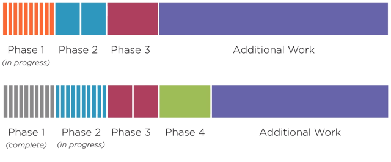

Een project bestaat uit meerdere componenten, elk component realiseert een specifiek eindproduct (**deliverable**). De plannning wordt opgedeeld in tijdvakken (**fasen**). Aan het einde van elke fase wordt een **mijlpaal** bereikt (geeft aan dat 1 of meer opleveringen voltooid zijn). Na elke fase overlegt de projectleider met de opdrachtgever of het project volgens plan kan voortgezet worden (soms moet een fase herhaalt worden). Dit proces wordt **iteratie** genoemd. Om ervoor te zorgen dat de kosten efficiënt beheert worden, schat men meestal op voorhand de mogelijke risico's in. Een specifiek budget om dergelijke risico's op te vangen en de bijhorende strategie staan beschreven in een **contingentie-plan**. Veel organisatie maken gebruik van een bepaalde methodiek, deze beschrijft wat er in welke fase moet gebeuren en aan welke dingen gedacht moet worden.

#### 1.2.3 De duiveldriehoek

> De duiveldriehoek toont hoe de 3 belangrijkste projectvariabelen zich verhouden: **tijd, geld en kwaliteit**. Het managen van projecten gaat dus om het managen van deze 3 variabelen.

In de praktijk staat de opdracht (**scope**) van een project zelden vast vanaf het begin. Veranderingen in de projectomgeving beïnvloeden de andere 3 variabelen enorm. Kan leiden tot **scope creep** en dit brengt hogere kosten, vertragingen, ... met zich mee.

Hierdoor heeft men de originele driehoek uitgebreidt tot een vierkant:

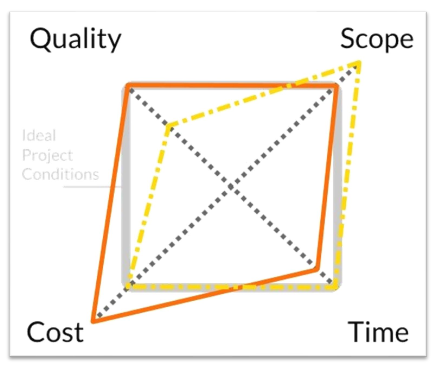

### 1.3 De scope van een project
#### 1.3.1 Product- vs projectscope

> **Productscope**: De functies en kenmerken die een product of dienst definiëren
> **Projectscope**: Het werk dat moet worden gedaan om een product te leveren volgens de productscope (vereiste functies en kenmerken)

#### 1.3.2 Product vs project levenscyclus

**Producten** hebben een levenscyclus met meerdere fasen:
- Idee
- Ontwikkeling
- Introductie en beheer op de markt
- Buiten gebruikstelling wanneer behoefte afneemt

**Een project** is een **tijdelijke** constructie die wordt uitgevoerd om een **uniek product of dienst** te creëren. Het heeft een duidelijke definitie van wat er op bepaalde data moet worden opgeleverd.

**Een product** kan alleen ontwikkeld worden binnen **een project**. Maar tijdens de **levenscylcus van een product** kunnen **meerdere projecten** plaatsvinden.

#### 1.3.3 Productportfolio

**Het productportfolio** omvat alle producten en diensten die een bedrijf aan de doelmarkt aanbiedt

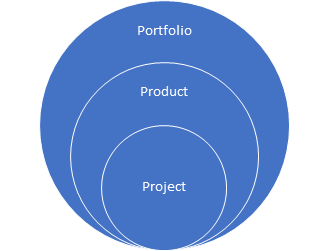

### 1.4 Verzamelen van klantenbehoeften

Voor het verzamelen van de vereisten bestaan verschillende technieken (zie **Software analyse**):
- Interviews met eindgebruikers
- Workshops met stakeholders
- Vragenlijsten voor grote groepen
- Observatie van bestaande werkwijzen
- Prototyping en feedback sessies

### 1.5 Plan van aanpak

De eerste belangrijke deliverable die helpt bij het omlijnen van de projectscope. Dit document begint met de bestaansreden van het project en geeft een beschrijving van het product en de deliverables.

> Een **plan van aanpak**, ook bekend als projectplan of project scope statement, beschrijft de voorwaarden waaronder het project wordt uitgevoerd. Dit document komt voor het eerst aan bod in de initiatie van een project en vormt de basis voor de andere projectfasen.

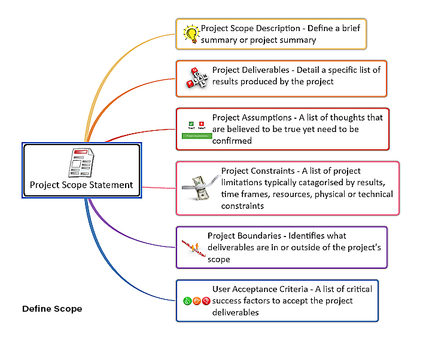

Doelstelling: SMART! (**S**pecifiek, **M**eetbaar, **A**cceptabel, **R**ealistisch, **T**ijdsgebonden)

### 1.6 Work breakdown structure

In het plan van aanpak worden de belangrijkse deliverables op het hoogste niveau beschreven, het opsplitsen in detail wordt ook wel _Decomposition_ genoemd. De **work breakdown structure (WBS)** is hier een grafische implementatie van, vaak in de vorm van een boomstructuur, het laagste niveau van een WBS heet _werkpakketten_ en kan eventueel aangevuld worden met een WBS-dictionary.

Voorbeeld:
```
Website Project
├── Analyse
│   ├── Requirements gathering
│   ├── Technische analyse
│   └── Risicoanalyse
├── Design
│   ├── UI/UX design
│   ├── Database design
│   └── Architectuur design
├── Ontwikkeling
│   ├── Frontend development
│   ├── Backend development
│   └── Database implementatie
├── Testing
│   ├── Unit testing
│   ├── Integratie testing
│   └── User acceptance testing
└── Deployment
    ├── Server configuratie
    ├── Go-live
    └── Training eindgebruikers
```

#### 1.6.1 RACI matrix

Een WBS kan uitgebreid worden met een **RACI-matrix**, op de horizontale as staan namen van personen of functionele rollen en op de verticale as staan de op te leveren resultaten, betrokken processen of activiteiten.

RACI: (**R**esponsible, **A**ccountable, **C**onsulted, **I**nformed)

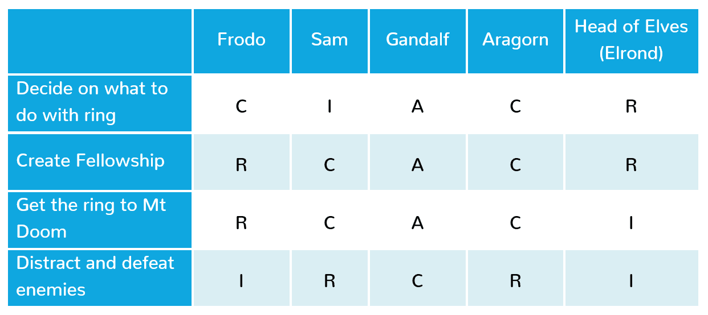

Richtlijnen:
- Er is precies 1 **A** per rij (deze persoon moet ook de autoriteit hebben om beslissingen te nemen)
- Er is/zijn 1 of enkele **R** per rij
- **A** en **C** hebben impliciet ook **I**
- Minimaliseer het aantal **C** en **I**

### 1.7 Projectmanagement en taken van een projectmanager
#### 1.7.1 Projectmanagement

Projectmanagement is het wikken en wegen van middelen, kwaliteit, inzet, risico's, kosten en baten, informatie en organisatie om te komen tot een gewenst eindproduct.

Kernprincipes:
- **Duidelijke planning**: Het organiseren van alle aspecten van een project
- **Duidelijke doelstellingen**: Wat is het doel van het project?
- **Goede organisatie**: Wie heeft welke rol/verantwoordelijkheden?
- **Goed projectteam samenstellen**: mensen die specifieke taken kunnen uitvoeren zijn essentieel (experts)

Analyse van het project:
- **Fasering**: Uit welke fasen bestaat het project?
- **Tijd**: Wanneer moet elke fase afgerond zijn? Wanneer moet het project af zijn? ...
- **Geld**: Welk budget is er? Wanneer is het geld nodig? ...
- **Informatie**: Hoe/wanneer wordt gerapporteerd over de voortgang van het project/eventuele knelpunten?

#### 1.7.2 Wat doet een projectmanager?

Je bent verantwoordelijk voor de dagelijkse leiding van het project. Doel is om binnen een bepaalde periode een specifiek resultaat te behalen. Je bent nauw betrokken bij de dagelijkse gang van zaken en kunt meestal niet terugvallen op routine (improvisatie is dus vaak nodig).

Kern verantwoordelijkheden:
- Afspraken maken over doelstelling en randvoorwaarden
- Een projectontwerp maken
- Het project starten
- Het beheersen van de voortgang

Rollen van een projectmanager:
- **Ontwerper**: je ontwerpt een projectplan
- **Controleur**: je houdt in de gaten of de planning gehaald wordt
- **Spreker**: je zit vergaderingen voor en geeft presentaties (bvb. aan de stuurgroep)
- **Coach**: je motiveert mensen en geeft tips
- **Expert**: je bent deskundig op het vakgebied van het project
- **Risicomanager**: je houdt risico’s in de gaten en bedenkt alternatieve oplossingen als dingen mis gaan

Waar werk je als projectmanager?
- Vaste dienst bij bedrijven
- Uitzending/detachering
- Freelance
- Verschillende sectoren

Positie in de organisatie:<br>
Je hebt een **opdrachtgever of baas** boven je, je geeft de leiding aan 1 of meerdere mensen (**je team**), het kan zijn dat je team vrij klein is en dat vooral op **horizontaal** niveau werkt (met mensen van andere afdelingen). Alsook met externe partijen zolas leveranciers.

#### 1.7.3 Over welke competenties moet een projectmanager beschikken?

- Algemene managementvaardigheden
- Systematisch en resultaatgericht werken
- Deskundigheid
- Stressbestendigheid
- Inzicht hebben in de belangen van alle partijen

### 1.8 Wat is een Project Life Cycle en wat zijn de karakteristieken?

> Een reeks opeenvolgende fasen die een project doorloopt van start tot finish. Volgorde en aantal hangen af van het management, de behoeften van de betrokken organisatie, de aard/reikwijdte van het project. Iedere fase heeft een duidelijk begin- en eindpunt, evenals controlepunten en is tijdsgebonden.

#### 1.8.1 Karakteristieken van de Project Life Cycle

- **Initiatiefase**: _de start_, definiëren en goedkeuren van het project, verzamelen informatie en projectcharter/plan van aanpak opstellen
- **Planningsfase**: _voorbereiden_, ontwikkelen van een gedetailleerd plan, heldere strategie creëren
- **Uitvoeringsfase**: _implementeren_, plan wordt werkelijkheid, projectmanager houdt oogje in het zeil
- **Monitoringsfase**: _controleren en bijsturen_, voortdurende controle en evaluatie, projectmanager gebruikt prestatie-indicatoren en rapportages om de voortgang te volgen en indien nodig bij te sturen
- **Beïndigingsfase**: _het slot_, officiële afronding, resultaten evalueren, documenten afronden, zorgen voor soepele overdacht

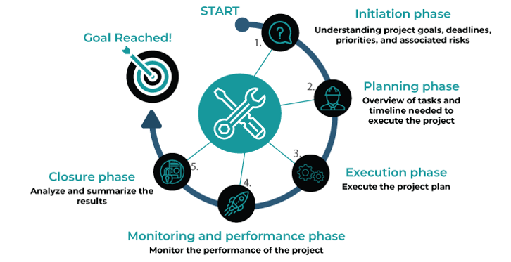

#### 1.8.2 Generieke kenmerken van de levenscyclusstructuur

Kosten en personeelsbestand is laag in het begin en bereikt een hoogtepunt tijdens de uitvoering. Riscio's en onzekerheid zijn op hun hoogtepunt aan het begin van het project. 

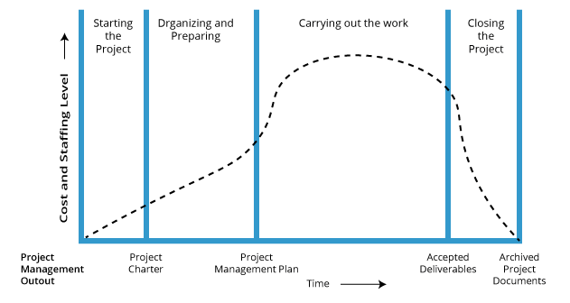

Het vermogen om het eindproduct te beïnvloeden zonder ervoor te zorgen dat dit de kosten drastisch zal beïnvloden is het hoogst aan het begin van project en neemt af naarmate het project vordert.

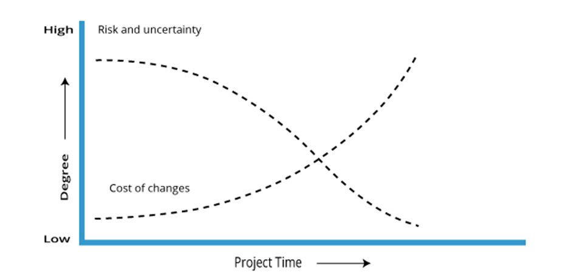
**Praktische implicatie**: Wijzigingen zijn aan het begin goedkoop en gemakkelijk, maar worden steeds duurder en complexer naarmate het project vordert.

### 1.9 De projectmanagement procesgroepen

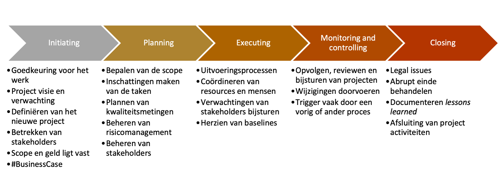

---

## 2. Projectplanning

> Een projectplanning is een hulpmiddel om de voortgang en de resultaten van een project te bewaken en te sturen. Een projectplanning is niet hetzelfde als een projectplan, dat de scope en de doelstellingen van het project bepaalt.

### 2.1 PERT

> PERT (Program Evaluation and Review Technique) is een hulpmiddel voor de bedrijfsleiding bij de analyse en planning van projecten. Hierbij wordt gebruik gemaakt van een grafische voorstelling, het netwerk, om de samenhang tussen de verschillende werkzaamheden aan te geven.

De PERT methode is uitgevonden door de United States Department of Defense’s US Navy Special Projects Office in 1958 als een onderdeel van het Polaris project en lijkt sterk op de kritieke pad methode.

#### 2.1.1 Hoofdbegrippen

Knooppunt:
- Gebeurtenis
- Aanvang of einde van een taak, werkzaamheid of bewerking
- Neemt geen tijd, arbeid of grondstoffen in beslag
- Voorgesteld door een cirkel

Activiteit:
- Uitvoering van een taak
- Er zijn mensen, materialen, hulpmiddelen en tijd voor nodig
- Voorgesteld door een pijl met willekeurige lengte tussen twee knooppunten

Netwerk:
- Brengt de logische opeenvolging van de activiteiten in beeld
- Welke activiteiten gaan vooraf of volgen of verlopen simultaan

Schijnactiviteit:
- Een technisch noodzakelijke wachttijd veroorzaakt door een natuurlijk proces of een noodzakelijke wachttijd veroorzaakt door afspraken met derden
- Neemt alleen tijd, geen mankracht of hulpmiddelen in beslag

Relatielijn (of 0-lijn):
- Geeft een noodzakelijk verband aan
- Neemt geen tijd in beslag, geen mankracht en geen hulpmiddelen
- Voorgesteld met een stippellijn tussen twee knooppunten met een 0
- Handige oplossing voor tekenproblemen

Handig referentieschema:
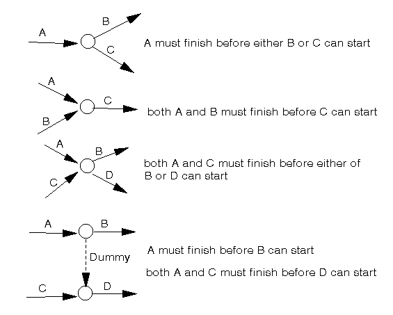

Afstemmingslijn:
- Geeft een gewenst verband weer
- Voorgesteld door een stippellijn met een A

#### 2.1.2 Tijdsfactor

Zodra een netwerk opgesteld is moet men bepalen hoeveel tijd elk van de activiteiten in beslag neemt. Voor het berekenen van de verwachte tijd van een activiteit gebruiken we 3 schattingen:

- $t_o$​ = optimistische schatting (most optimistic time)
- $t_l$ = gemiddelde schatting (most likely time)
- $t_p$​ = pessimistische schatting (most pessimistic time)

De formule voor de verwachte tijd:

$t_e = \frac{t_0 + 4t_1 + t_p}{6}$

#### 2.1.3 Verwachte tijdstippen

Zodra alle activiteiten en knooppunten getekend zijn, gaan we het netwerk analyseren.

$T_E$ = Earliest expected time

**Voorwaarts**: Het vroegst mogelijke begin waarop een bepaald knooppunt bereikt kan worden. Berekent door de som te nemen van de $T_E$'s van de activiteiten op dat pad, de **grootste** som wordt de $T_E$ van het beschouwde knooppunt.

$T_L$ = Latest allowable time

**Achterwaarts**: Het laatst toelaatbaar eindtijdstip, als een activiteit niet voltooid is op dit tijdstip wordt de globale duur van het project overschreden. Berekent door te beginnen vanaf het laatste knooppunt van het project. De $T_L$ van een bepaald knooppunt is dan gelijk aan de $T_L$ van het volgende knooppunt, min de duurtijd van de activiteit die de 2 knooppunten verbindt, zijn er meerdere activiteiten die vertrekken vanuit een bepaald knooppunt dan wordt de berekening gemaakt langs alle paden en zal het **kleinste** getal als $T_L$ gebruikt worden.

#### 2.1.4 Speling

Speling of "slack" is de maximale vertraging die een bepaalde activiteit mag oplopen, zonder dat dit het hele project zal vertragen.

$Slack = T_L - T_E$

De speling kan positief, negatief of nul zijn.

#### 2.1.5 Kritieke pad

In een PERT-diagram, het pad dat de grootste tijdsduur vraagt om te doorlopen is het kritieke pad, een vertraging op dit pad zorgt voor een vertraging op het hele project.

### 2.2 Gantt-grafiek
#### 2.2.1 Gantt-chart = tijdschaal voorstelling

De activiteiten worden op verschillende horizontale lijnen voorgesteld als stroken op basis van een tijdschaal. Onder elke activiteit kan de werkelijke voortgang aangeduid worden door een gearceerde strook

#### 2.2.2 Lay-out

Een Gantt-grafiek bestaat uit een aantal rijen die ieder een module of taak (blauwe balken) binnen het project vertegenwoordigen (de eerste staan meestal bovenaan). Op de horizontale as staat de tijd die nodig is voor het totale project. Milestones (ruiten) en relaties/condities (pijlen) tusen modules zijn eveneens mogelijk.

#### 2.2.3 Toewijzing van hulpmiddelen

Hulpmiddelen kunnen aan een activiteit toegewezen worden. Over- en onderbezetting kunnen ook weggewerkt worden maar indien de capaciteit nog steeds overschreden is (na het spreiden van activiteiten) zijn er 2 mogelijkheden:

- Ofwel gaat men de doorlooptijd behouden en gaat men extra kosten doen om de capaciteit te verhogen (extra computers aankopen, externe mensen inhuren, …)
- Ofwel mag men geen bijkomende kosten doen, zodat de speling voor sommige activiteiten wordt overschreden en de einddatum van het project uitgesteld wordt

#### 2.2.4 Projectkosten

De projectkosten worden veroorzaakt door het gebruik (mensen, computers, …) of verbruik (papier, elektriciteit, …) van hulpmiddelen. Deze kosten worden per activiteit berekend.

#### 2.2.5 Voortgangscontrole

Uitgebeeld als een gearceerde strook boven de strook die de geschatte duurtijd voorstelt van de handeling. Op regelmatige tijdstippen wordt dit bekeken en kan men vaststellen dat de werken vooruit of achteruit lopen op de geplande tijden. In het laatste geval kan men 2 dingen doen:

- Terugkoppelen: men gaat de werken versnellen door de productiviteit van de hulpmiddelen (personeel, computers, …) te verhogen of door hun aantal te vermeerderen, om toch nog de geschatte duurtijd te respecteren
- Vooruitkoppelen: men gaat op basis van de werkelijke productie, de geschatte tijden herzien en een nieuwe planning uitwerken

Gewoonlijk worden beide acties samen ondernomen. Moeilijk wel om dan de nieuwe tijden en kosten aan de directie en klant mee te delen. Als de werken vooruit lopen kan men eveneens terugkoppelen door hulpmiddelen vrij te maken voor andere handelingen en vooruitkoppelen door de geschatte tijden te verminderen.

---

## 3. Extra Oefeningen Projectmanagement

Zie aparte documenten voor afgewerkte oefeningen.

## 4. Kwaliteitsmanagement

- Sturen op verbetering van kwaliteit, verbinden van verschillende bedrijfsonderdelen die output leveren aan het uiteindelijk resultaat
- **Kwaliteitsmanager** houdt de organisatie 'scherp', stelt klant en bedrijfsprocessen centraal
    - Continu op zoek naar verbeteracties, gericht op innovaties en implementeren ervan
- Kwaliteitsmanagement is geen onderdeel op zichzelf maar een geïntegreerd geheel in totale bedrijsvoering

Kwaliteitsmanagement is gerelateerd aan:
- Processmanagement (vereiste om continu verbetering te garanderen)
- Verandermanagement (omslag naar kwaliteitsdenken is ook nodig bij mensen in de organisatie zelf: op cultureel en operationeel vlak)

### 4.1 Belang van kwaliteit

Kwaliteit is 1 van de 7 principes van Prince2 en verweven in alle processen en aspecten van een project.

Door kwaliteitsborging wordt ervoor gezorgd dat het eindproduct voldoet aan de vereisten van de klant (verhoogt klanttevredenheid). Door te focussen op kwaliteit en het implementeren van kwaliteitscontroles, kunnen risico's worden verminderd en beheerd. Hoogwaardige producten zorgen voor vertrouwen in het projectteam en vergroot de kans op succes. Kwaliteitsborging zorgt ervoor dat het werk binnen het project effectief en efficiënt wordt uitgevoerd en minimialiseert verspilling.

Het aanmoedigen van een cultuur van continue verbetering is belangrijk voor het managen van kwaliteit. Kwaliteit is niet een doel op zich, maar ook een middel om succes van projecten te waarborgen, risico's te beheersen en de tevredenheid van belanghebbenden te vergroten.

### 4.2 Het belang van goed kwaliteitsdoelen

Goede kwaliteitsdoelen gelinkt aan een product zijn van cruciaal belang: het bepaalt de normen waaraan het product moet voldoen. Deze doelen dienen als referentiepunten tijdens het ontwerp, de ontwikkeling en de productie van het product.

Om kwaliteitsdoelen te bepalen, stel je jezelf enkele vragen:
- Kan je kwaliteit garanderen binnen scope van het budget en planning?
- Welke omgevingsvariabelen zijn van kracht?
- Dien je rekening te houden met bepaalden processen en procedures in de omgeving waarin je werkt?
- Hoe garandeer je kwaliteit a.d.h.v. continual improvement initiatieven om te waken over je doelen?
(SMART!)

#### 4.2.1 Kritische Succesfactoren (KSF’en) en Kritische Prestatie-Indicatoren (KPI’s)

> Kritische succesfactoren (KSF'en): goed werkende elementen binnen een onderneming om hun bedrijfsdoelen te bereiken

> Kritische prestatie indicatoren (KPI's): manieren waarop we meten of de KFS'en werken

Voorbeeld:
|KSF|	KPI|	Doel|
| :---- | :---- | :----|
Marktaandeel	|% aandeel van klanten binnen een straal van 5 km	|10%|
Klantentevredenheid|	% klanten dat tevreden is|	95%|
Kwaliteit van het eten|	% maaltijden teruggestuurd wegens ondermaatse kwaliteit|	2%|

#### 4.2.2 Kwaliteitsbegrippen & belangrijke terminologie (Lingo)

> **Kwaliteit** drukt uit hoe nauwkeurig een oplevering de verwachtingen en de te leveren functionaliteiten inlost. Het is noodzakelijk te bekijken of er mogelijke gebreken of prestatieproblemen zijn.

> **Uitwerking** categoriseert de gewenste kenmerken of karakteristieken van een oplevering. Men kan het zien als een maatstaf van wat een klant waardevol vind in een product.

4 mogelijkheden:
- Hoge kwaliteit, hoge uitwerking (Hamburger in sterrenrestaurant)
- Hoge kwaliteit, lage uitwerking (fastfoodhamburger)
- Lage kwaliteit, hoge uitwerking (luxe burger met alle toppings uit goed restaurant maar is aangebrand)
- Lage kwaliteit, lage uitwerking (nachtmerrie: fastfoodburger aangebrand op een droog broodje zonder groenten/saus/toppings)

> **Nauwkeurigheid** of accuratesse is de graad van overeenstemming van een gemeten of berekende hoeveelheid met haar daadwerkelijke (ware) waarde. Hoe groter de nauwkeurigheid, hoe kleiner de totale fout.

> **Precisie**, Reproduceerbaarheid of herhaalnauwkeurigheid van een meting geeft aan, bij gelijke omstandigheden, hoe goed eenzelfde uitkomst wordt gehaald. Bij afstandmeetsystemen wordt de maximale afwijking in mm aangegeven, waarmee een meting onder gelijke omstandigheden kan afwijken. Reproduceerbaarheid is dus niet te verwarren met absolute nauwkeurigheid.

Voorbeeld:
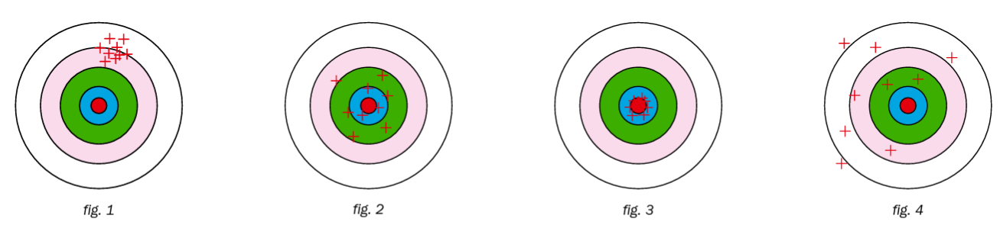

- In figuur 1 is de nauwkeurigheid klein, maar de precisie groot
- In figuur 2 is nauwkeurigheid goed (alle schoten in het groene vlak), maar de precisie klein
- In figuur 3 zijn de nauwkeurigheid en precisie groot
- In figuur 4 is zowel de nauwkeurigheid als de precisie klein

#### 4.2.3 Kosten van kwaliteit

De kosten van kwaliteit zijn de uitgaven die organisaties maken om goede producten en diensten te leveren. Investeren in kwaliteit kost op korte termijn meer, maar zorgt op lange termijn voor minder fouten, lagere kosten en tevreden klanten. Te veel besparen op kwaliteit kan leiden tot klachten en problemen.

Organisaties moeten een goede balans vinden tussen kosten en kwaliteit. Automatisering en Poka-Yoke (techniek die menselijke fouten voorkomt en bijdraagt aan het streven naar zero-defects, bijvoorbeeld een checklist) helpen fouten te voorkomen. ISO-standaarden, zoals ISO 9001, ondersteunen organisaties bij het opzetten van een kwaliteitsmanagementsysteem en stimuleren voortdurende verbetering.

#### 4.2.4 Kwaliteit waarborgen

De kwaliteiscirkel van Deming:
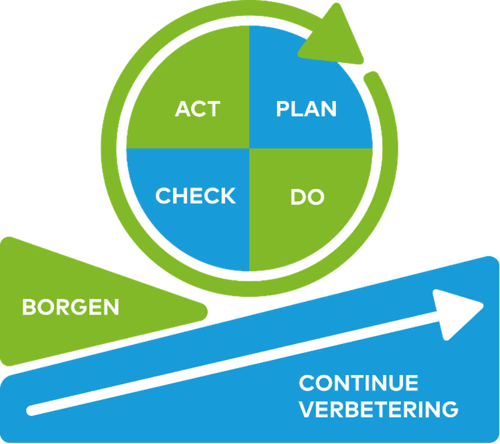

|Activiteit|	Actie|
| :---- | :---- |
|Plan|	Kijk naar huidige werkzaamheden en ontwerp een plan voor de verbetering van deze werkzaamheden. Stel voor deze verbetering doelstellingen vast|
|Do	|Voer de geplande verbetering uit in een gecontroleerde proefopstelling|
|Check|	Meet het resultaat van de verbetering en vergelijk deze met de oorspronkelijke situatie en toets deze aan de vastgestelde doelstellingen|
|Act|	Bijstellen aan de hand van de gevonden resultaten bij CHECK|

Er bestaan nog enkele andere systemen ten voordele van kwaliteit en risicobeheersing:
- Total Quality Management: Verdere uitbreiding van dit hoofdstuk
- Six Sigma: Reduceren van defecten door effectief problemen op te lossen
- Lean: Reduceren van verspilling door stroomlijnen proces
- Lean Six Sigma: Problemen oplossen en processen verbeteren

### 4.3 Plannen van kwaliteit
#### 4.3.1 Kwaliteitsmanagementplan

Een document dat de aanpak van een organisatie beschrijft om kwaliteit te waarborgen in haar producten, diensten of processen. Zorgt voor een gestructureerde benadering om kwaliteitsdoelen te bereiken en beheersen. Kan een simpel, laag prio document zijn maar ook een complex formeel document (meestal formeel). 

#### 4.3.2 Technieken voor het verzamelen van data of projectgegevens
##### 4.3.2.1 Benchmark

Deze techniek omvat het vergelijken van de prestaties, processen en praktijken van de eigen organisatie met die van een andere organisaties die als leiders worden beschouwd in de branche. Kan inzicht bieden in best practices en gebieden identificeren waar verbetering nodig is.

##### 4.3.2.2 Brainstorm

Creatieve techniek om ideeën of oplossingen te genereren voor een specifiek probleem of vraagstuk. Door een open en ondersteunende omgeving kunnen teamleden vrij ideeën delen en combineren (bv in de vorm van een mindmap).

##### 4.3.2.3 Interview

Omvat het voeren van gestructureerde of ongestructureerde gesprekken met individuen of groepen om informatie te verzamelen over specifieke onderwerpen, ervaringen of meningen.

#### 4.3.3 Voorstellen van gegevens

Gegevens verzamelen kost geld zoals besproken in hoofdstuk [4.2.3 Kosten van kwaliteit](#423-Kosten-van-kwaliteit). Goede analyses kosten geld maar zorgen ook voor betere kwaliteit. Maakt werk zoveel mogelijk inzichtelijk, zoals bijvoorbeeld de mindmap bij de brainstorm techniek. Of visualiseer je resultaten bij meerdere interviews.

#### 4.3.4 Conclusie plannen van kwaliteit: in- en outputs

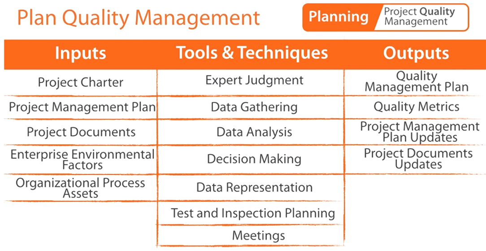

### 4.4 Uitvoeren van kwaliteit
#### 4.4.1 Invloeden van het in werking stellen van het kwaliteitsmanagementplan

**Quality assurance (QA)** is verantwoordelijk voor het waarborgen van naleving van de vastgestelde kwaliteitsnormen en -procedures gedurende de uitvoering van het project. QA voert regelmatig controles en audits uit, verder identificeren zij potentiële risico's en afwijkingen van de kwaliteitsstandaarden en werkt samen met het projectteam om corrigerende maatregelen te implementeren en verbeteringen aan te brengen.

**Het beheer van processen** omvat het plannen, implementeren, bewaken en verbeteren van de operationele processen om kwaliteit van producten en diensten te waarborgen. Door continue processverbetering worden inefficiënties geïdentificeerd en worden optimalisaties doorgevoerd.

De uitvoeringsfase van het kwaliteitsmanagementplan kan ook een directe **impact** hebben op **andere lopenede projecten** binnen de organisatie:
- Best practices van geleerde lessen uit het plan kunnen prestaties van andere projecten verbeteren
- Veranderingen of verbeteringen in andere projecten kunnen van postieve of negatieve invloed zijn op het plan

#### 4.4.2 Incident- & Problem management

> **Incident management** richt zich op het snel en effectief reageren op onverwachte gebeurtenissen die de normale gang van zaken verstoren. Het doel is om de dienstverlening zo snel mogelijk te herstellen en de impact op de gebruikers te minimaliseren.

> **Probleem management** richt zich op het onderzoeken van de onderliggende oorzaken van herhaalde incidenten en het implementeren van oplossingen om ze structureel te voorkomen. Het doel is om de root cause van problemen te identificeren en te elimineren, waardoor toekomstige incidenten worden voorkomen. (why? why? why? why? why?)

#### 4.4.3 Visualiseren van kwaliteitsgegevens
##### 4.4.3.1 Affinity diagram

Het doel van een affiniteitsdiagram is een complexe set van gegevens te groeperen zodat je verbanden kunt leggen en patronen kan identificeren. Daarna geeft men de gedefinieerde groepen een naam. Deze groepering noemt men thema’s of gemeenschappelijke groepen. De officiële termen die men daarbij hanteert zijn affiniteitssets of affiniteitsgroepen.

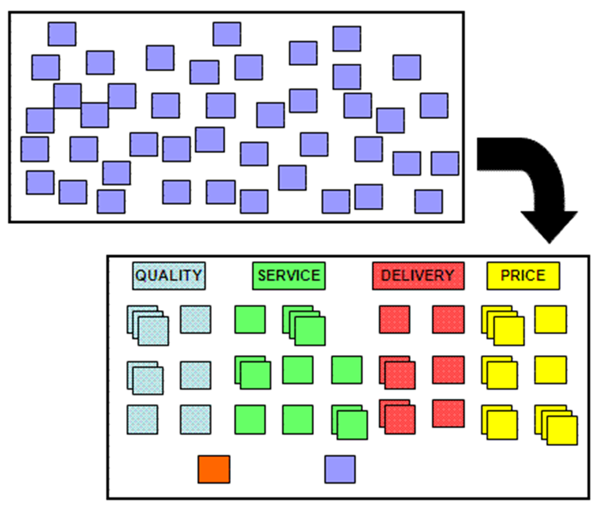

##### 4.4.3.2 Visgraatdiagram

Het Ishikawa-diagram (ook wel bekend als visgraatdiagram) is een hulpmiddel dat bedoeld is om mogelijke oorzaken van problemen in kaart te brengen.

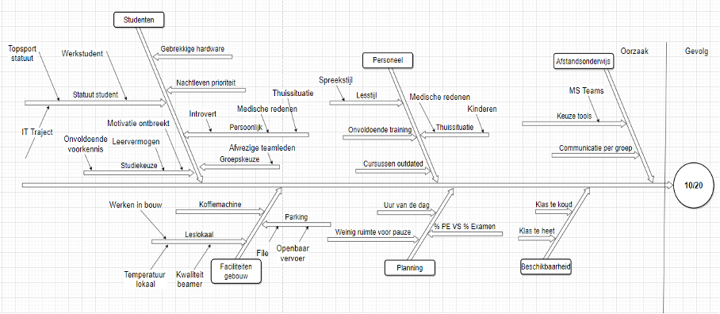

##### 4.4.3.3 Flowcharts

Een stroomdiagram kan worden gebruikt om de invulling van verschillende deelprocessen en processtappen inzichtelijk te maken. Stroomdiagrammen worden toegepast om te bepalen welke deelprocessen moeten worden gemonitord, fouten/afwijkingen in deelprocessen te identificeren of veranderingen te standaardiseren.

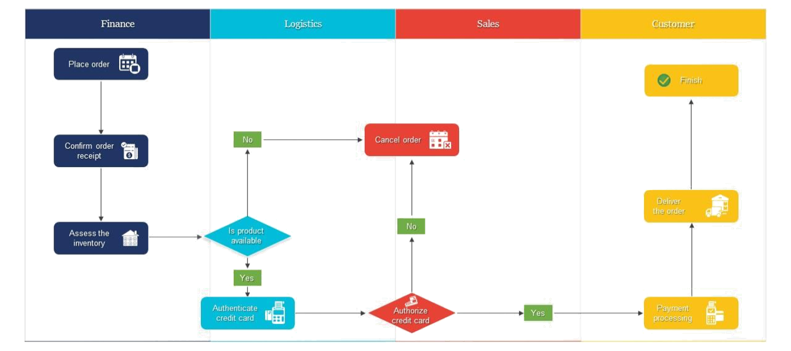

##### 4.4.3.4 Correlatiediagram (spreidingsdiagram, Puntenwolk)

Een correlatiediagram (of puntenwolk, spreidingsdiagram) geeft aan of er een relatie bestaat tussen twee variabelen. Deze relatie is lineair (rechtlijnig) of ‘curve lineair’ (paraboolvormig). Een correlatiediagram geeft niet aan of er een causaal verband bestaat tussen de beide variabelen! Wel geldt: hoe sterker de relatie, hoe groter de kans dat verandering van de ene variabele de andere beïnvloedt.

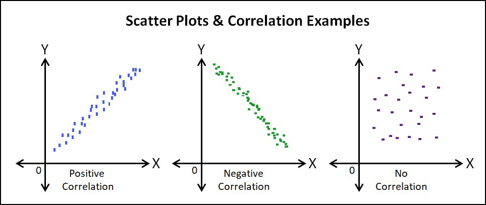

Alle correlaties hebben twee eigenschappen: richting en sterkte. De richting wordt bepaald door het feit of de correlatie positief of negatief is. De sterkte van de correlatie is bepaald door de numerieke waarden.

> **Positieve correlatie**: Beide variabelen bewegen in dezelfde richting. In andere woorden, als de ene variabele toeneemt, doet de andere variabele dat ook.

> **Negatieve correlatie**: De variabelen bewegen in tegengestelde richtingen. Als de ene variabele toeneemt, gaat de andere afnemen. Als de ene variabele afneemt, neemt de andere toe.

---

## 5. Kosten- en batenanalyse
### 5.1 Kosten- en opbrengstenstructuur

Bij automatiseringsprojecten wordt vooraf bekeken of de investering rendabel is. Dit gebeurt met een kosten- en batenanalyse.

#### 5.1.1 Kostenstructuur

Twee soorten kosten:
- Systeemontwikkelingskosten (eenmalig) : Dit zijn kosten voor het ontwerpen, bouwen en invoeren van het systeem, zoals:
    - Personeel (analisten, programmeurs, management, administratie)
    - Apparatuur en software
    - Materiaal (papier, formulieren)
    - Externe kosten (advies, opleidingen)
    - Installatie- en conversiekosten
    - ...
- Werkingskosten (doorlopend) : Dit zijn kosten tijdens het gebruik van het systeem:
    - Hardwaregebruik en onderhoud
    - Personeelskosten
    - Materiaalverbruik
    - Vaste kosten (energie, administratie)
    - Externe kosten
    - Kosten door storingen
    - ...

#### 5.1.2 Opbrengstenstructuur

Opbrengsten zijn de baten van het systeem.

Winst = Opbrengsten – Kosten

Er zijn twee soorten baten:
- **Tactische baten**:
    - Kostenbesparing
    - Efficiënter werken
    - Minder personeel of onderhoud
- **Strategische baten**:
    - Nieuwe mogelijkheden
    - Innovatie
    - Concurrentievoordeel

#### 5.1.3 Besparingen en opbrengsten

**Besparing werkingskosten**:
$K = Ko – Kn$
(Oude kosten – Nieuwe kosten)

**Opbrengsten**:
$O = On – Oo$
(Nieuwe opbrengst – Oude opbrengst)

**Netto-opbrengst**:
$Z = (Ko – Kn) + (On – Oo)$

#### 5.1.4 Moeilijk te kwantificeren opbrengsten

Sommige voordelen zijn lastig in cijfers uit te drukken, zoals:
- Geen extra personeel nodig
- Snellere informatie
- Betere beslissingen
- Hogere efficiëntie

Deze worden vaak op basis van inschatting meegenomen.

#### 5.1.5 Tijdswaarde van Geld

Geld nu is meer waard dan geld later. Daarom worden toekomstige bedragen “contant gemaakt”.

**Samengestelde interest**:
$Pn = P0(1 + i)ⁿ$

**Contante waarde**:
$P0 = Pn / (1 + i)ⁿ$
Hierbij is i de rente en n het aantal jaren.

**Cumulatieve Contante Waarde (CCW)**: Dit is de optelsom van alle contante waarden over de jaren. Het laat zien wanneer de investering is terugverdiend.

#### 5.1.6 De terugverdientijd

> De terugverdientijd (TVT) is de tijd die het duurt voor een investering is terugverdiend en zichzelf daarmee heeft uitbetaald.

#### 5.1.7 De netto constante waarde

NCW = Totale contante opbrengst – Investering

\[
\text{NCW} = \sum_{n=1}^{N} \frac{Z_n}{(1 + \text{IRR})^n} - C
\]

- $Zn$​ = Netto-opbrengsten van het project in jaar n
- C = het kapitaal geïnvesteerd op tijdstip 0
- N = de levensduur van het project
- IRR = de discontovoet.

#### 5.1.8 Interne rentabiliteit

De interne rentabiliteit (IRR) is het percentage dat ervoor zorgt dat de NCW van een project nul wordt. Het is dus het rendement dat je daadwerkelijk behaalt met je investering als alle cashflows worden herbelegd tegen dit percentage.

\[
\text{O} =\text{NCW} = \sum_{n=1}^{N} \frac{Z_n}{(1 + \text{IRR})^n} - C
\]

- $Zn$​ = Netto-opbrengsten van het project in jaar n
- C = het kapitaal geïnvesteerd op tijdstip 0
- N = de levensduur van het project
- IRR = de discontovoet

#### 5.1.9 Kritiek op terugverdientijd

Terugverdientijd methode heeft verschillende nadelen:
- Negeert winst na terugverdienmoment
- Houdt geen rekening met rendement

Daarom moet TVT altijd samen met NCW en IRR worden gebruikt.

---

## 6. Risicomanagement

> Risico = Kans x Gevolg

De risicoanalyse is de eerste stap binnen het risicomanagementproces

### 6.1 Doel van een risicoanalyse

Een risicoanalyse benoemt bedreigingen en brengt ze in kaart. Per bedreiging wordt de kands van het optreden ervan bepaald en wordt berekend wat als gevolg de schade is die zou kunnen optreden. Op basis hiervan kan je de volgende maatregelen nemen:
- **Preventie**: voorkomen
- **Repressie**: beperken
- **Correctie**: instellen van maatregelen om het effect (deels) terug te draaien
- **Acceptatie**: geen maatregelen, accepteren van de kans en het mogelijke gevolg
- **Manipulatie**: wijzigen van parameters om tot een gewenst resultaat te komen

### 6.2 Positieve en negatieve risico's
#### 6.2.1 Positieve risico's (kansen)

Onvoorziene gebeurtenissen of omstandigheden die een gunstig effect op de projectdoelen of bedrijfsdoelstellingen hebben.

Voorbeelden:
- Marktkansen: Een bedrijf zou kunnen ontdekken dat er een aanzienlijke vraag is naar een van zijn bijproducten, wat een nieuwe bron van inkomsten kan worden.
- Technologische vooruitgang: Een nieuw softwareplatform kan onverwachts toelaten om processen te verbeteren en daardoor kosten te besparen.
- Project versnelling: Tijdens de bouw van een nieuwe faciliteit wordt een effectievere bouwmethode gevonden die de voltooiing van het project zou kunnen versnellen en dat zou kunnen leiden tot een eerder dan verwachte marktintroductie.

Risicostrategie voor positieve effecten:
- Exploiteren
- Verbeteren
- Accepteren
- Delen

#### 6.2.2 Negatieve risico's (bedreigingen)

Gebeurtenissen of onstandigheden die schadelijk zouden zijn voor de projectdoelen of bedrijfsdoelstellingen.

Voorbeelden:
- Marktveranderingen: Veranderingen in consumentenvoorkeuren of nieuwe concurrentie kunnen leiden tot dalende verkoop en winst.
- Juridische kwesties: Nieuwe regelgeving kan beperkingen opleggen waardoor de bedrijfsactiviteiten worden beperkt of extra kosten vereist zijn.
- Projectvertraging: Tijdens de bouw van een nieuw kantoor kan er een vertraging optreden door een gebrek aan materialen, wat leidt tot kostenoverschrijdingen en gemiste deadlines.

Risicostrategie voor negatieve effecten:
- Vermijden
- Accepteren
- Verzekeren (letterlijk, met een verzekeringsmaatschappij)
- Overdragen aan een ander

### 6.3 Product- en projectrisico's
#### 6.3.1 Productrisico's

Productrisico’s zijn gerelateerd aan de kwaliteit en uitvoering van het uiteindelijke product of de dienst die wordt geleverd. Deze risico’s hebben direct invloed op de bruikbaarheid, veiligheid en klanttevredenheid van het product of de dienst.

Voorbeelden:
- Technische defecten: Een nieuw ontworpen smartphone kan serieuze hardwareproblemen kennen die tot veel garantieclaims leiden.
- Niet-voldoen aan normen: Een voedselproduct dat niet voldoet aan de wettelijke gezondheids- en veiligheidsnormen, kan leiden tot recalls en gezondheidswaarschuwingen.
- Verouderdheid: Software die niet regelmatig wordt geüpdatet kan snel verouderen en zijn waarde voor gebruikers verliezen.

#### 6.3.2 Projectrisico's

Projectrisico’s hebben betrekking op de planning en uitvoering van een project en kunnen van invloed zijn op de oplevering, het budget, de scope en de tijdslijnen. Deze risico’s kunnen de succesvolle voltooiing van een project in de weg staan.

Voorbeelden:
- Resource tekort: Onvoldoende gekwalificeerde medewerkers kunnen ertoe leiden dat het project vertraging oploopt of dat het eindproduct niet aan de kwaliteitseisen voldoet.
- Budgetoverschrijding: Kostenstijgingen voor materialen of arbeid kunnen het voorgestelde budget overschrijden, waardoor financiële middelen tekortschieten.
- Planning en tijdslijnen: Onverwachte vertragingen, zoals slecht weer bij een bouwproject, kunnen leiden tot gemiste deadlines en contractuele boetes.

### 6.4 Maturiteit van een organisatie

De mate waarin het risicomanagement voldoet aan de doelstellingen van de organisatie over de levenscycli van hun producten. (niet altijd passend om het hoogste niveau na te streven)

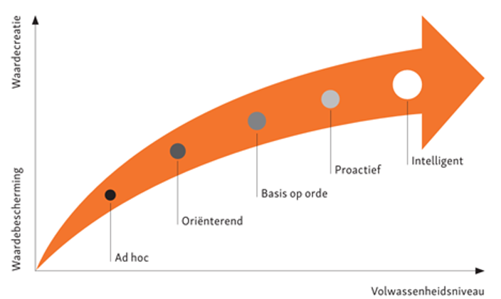

### 6.5 Risicoanalyse technieken
#### 6.5.1 Riskmatrix

Een riskmatrix is een tabel waarin risico’s worden ingedeeld volgens:

- Kans (waarschijnlijkheid) → Hoe groot is de kans dat het risico optreedt?
- Impact (gevolg) → Hoe ernstig zijn de gevolgen als het gebeurt?

Door deze twee te combineren, zie je hoe ernstig een risico is.

De matrix is meestal een raster met de kans en de impact op de assen (laag, middel, hoog), gebruik makend van kleuren laten we zien hoe ernstig een risico is.

#### 6.5.2 Risicoregister

Een belangrijk onderdeel van elk succesvol risicomanagementproces, helpt mogelijke vertragingen te vermijden die zich bij een project kunnen voordoen.

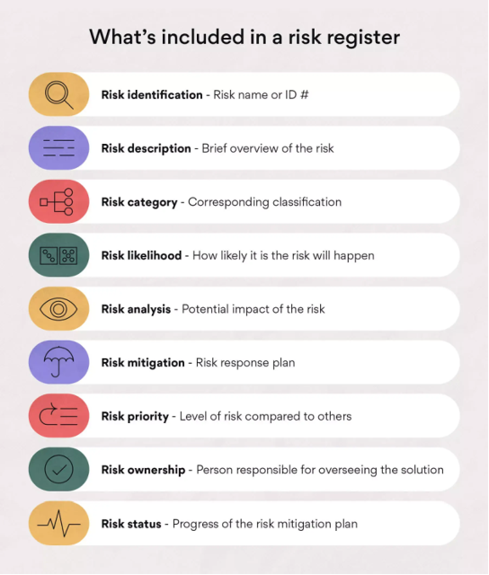

#### 6.5.3 Fault tree analyse

De foutenboomanalyse (Fault Tree Analysis, FTA) is een methode om diepgaand te onderzoeken wat er fout kan gaan met de dienstverlening, het proces of het product. Bij elke faalvorm wordt de vraag gesteld: wat is de oorzaak?

Doel en belang: 
Brengt visueel in kaart wat fout kan gaan met het product, zo wordt een (omgekeerde) boom bekomen, die naar beneden toe de (achterliggende) grondoorzaken van het product toont.

Hoe een foutenboom opstellen?
- Plaats bovenaan de boom een mogelijk defect.
- Geef alle mogelijke oorzaken van het defect aan de hand van logische structuren (EN, OF,…) aan.
- Diep dit uit tot op een niveau dat het probleem duidelijk zichtbaar is. In de volgende stappen wordt bekeken wat het gevolg en de ernst van het probleem is, en worden naar oplossingen gezocht.

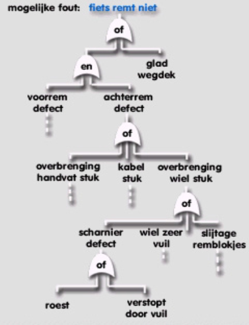

---

## 7. Agile Projectmanagement
### 7.1 Wat betekent Agile?

Agile is een manier van projectmanagement die zich toespitst op het verdelen van taken in korte werkfases, met veelvuldige reviews (controles) van het project en mogelijke aanpassingen tijdens het uitvoeren. Een Agile aanpak is flexibel en minder strak dan sommige andere manieren van projectmanagement.

### 7.2 Incrementele ontwikkeling

Incrementele ontwikkeling is een praktijk waar een product stap voor stap wordt gedesignd, gedeployd en getest, totdat het project is afgerond. Telkens wordt er een klein beetje meer toegevoegd. Elke stap bouwt verder op de vorige door extra functionaliteiten toe te voegen.

### 7.3 Iteratieve ontwikkeling

Iteratieve ontwikkeling slaat op de ontwikkeling van producten door herhaalde cyclussen. Elk van deze cyclussen voltooit een of ander minimum bruikbaar product (vert. Engels: minimum viable product).

Bijvoorbeeld:
- 1e iteratie: Maak een simpele homepagina
- 2e iteratie: Voeg de mogelijkheid voor een gebruiker toe om een account te maken en in te loggen
- 3e iteratie: Voeg de mogelijkheid toe om je wachtwoord te veranderen
- 4e iteratie: Voeg een pagina toe die accountinformatie toont
- enz

### 7.4 Scrum

1 van de moelijk uitvoeringen van Agile. Komt van een uitdrukking uit de rugbysport. Hoewel het oorspronkelijk is bedacht voor softwareontwikkeling, wordt het in vele andere sectoren toegepast: gezondheidszorg, marketing, rechtshandhaving, productontwikkeling, publieke sector, ...

Agile is een _methodologie_, Scrum is een _framework_.

#### 7.4.1 Empirische procescontrole

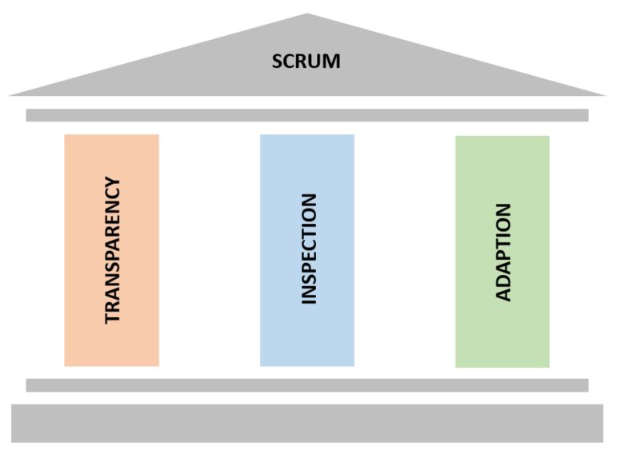
Leren door te doen te te observeren.

In Scrum gebruiken we de drie empirische principes om dit in de praktijk te brengen:

- Transparantie: Iedereen ziet wat er gebeurt
    - We zijn eerlijk over hoe het werk vordert
    - We verbergen geen problemen of uitdagingen
    - Iedereen in het team weet wat er gaande is
- Inspectie: We kijken regelmatig hoe het gaat
    - We checken vaak of we op de goede weg zijn
    - We laten anderen (zoals de klant) zien wat we gemaakt hebben
    - We vragen om feedback om te leren en te verbeteren
- Aanpassing: We passen ons aan als dat nodig is
    - Als iets niet werkt, veranderen we onze aanpak
    - We zijn flexibel en bereid om nieuwe ideeën te proberen
    - We verbeteren continu onze manier van werken

### 7.5 Scrum waarden

> Scrum Waarden: vijf kernwaarden waar Scrum op steunt: commitment, focus, openheid (‘openness’), respect en moed (‘courage’).

Scrum is gebaseerd op vijf kernwaarden die essentieel zijn voor een goede samenwerking:
- Commitment (Toewijding)
    - We zetten ons volledig in voor ons werk en onze doelen.
    - We committeren ons aan het team en de Sprintdoelen, niet aan specifieke oplossingen.
    - We streven naar kwaliteit en blijven leren.
    - We zijn toegewijd aan continue verbetering.
- Focus
    - We concentreren ons op wat nu het belangrijkst is voor de Sprint en productdoelen.
    - We werken aan een beperkt aantal taken tegelijk om effectiever te zijn.
    - We minimaliseren afleidingen en houden ons aan de Scrum-processen.
- Openheid
    - We zijn transparant over ons werk, voortgang en uitdagingen.
    - We delen informatie actief, ook als het niet zo goed gaat.
    - We staan open voor nieuwe ideeën, feedback en veranderingen.
    - We creëren een omgeving waar iedereen zich vrij voelt om te spreken.
- Respect
    - We waarderen elkaars meningen, vaardigheden en achtergronden.
    - We respecteren elkaar als bekwame, autonome mensen.
    - We respecteren de Scrum-regels, -rollen en de belangen van stakeholders.
     -We tonen respect door effectief samen te werken en elkaar te ondersteunen.
- Moed
    - We durven moeilijke beslissingen te nemen en problemen aan te kaarten.
    - We zijn eerlijk over vooruitgang en schattingen.
    - We experimenteren met nieuwe aanpakken om te verbeteren.
    - We erkennen fouten en leren ervan, in plaats van ze te verbergen.

Deze waarden versterken elkaar en zijn cruciaal voor het succes van Scrum. Ze helpen teams om:
- Vertrouwen op te bouwen en betere samenwerking te bevorderen.
- Transparanter en effectiever te communiceren.
- Flexibeler te reageren op veranderingen en uitdagingen.
- Een cultuur van continue verbetering te creëren.
- Hoogwaardige producten te leveren die echte waarde bieden aan klanten.

### 7.6 Product backlog

> **Product Backlog**: het openstaande werk. Elke taak die nog verondersteld wordt te gebeuren, beschouwen we als backlog. Het slaat op het aankomend werk dat nog niet aan een persoon toegewezen is of waarvan de afwerkingsdatum nog niet is vastgelegd.

### 7.7 De drie rollen in Scrum

De drie hoofdrollen in Scrum zijn:
- Product Owner
- Scrum Master
- Developers

#### 7.7.1 Product owner

> **Product Owner**: De Product Owner in Scrum is verantwoordelijk voor het bepalen van wat het team moet bouwen, de taken te prioriteren volgens belangrijkheid en waarde, en te zorgen dat het team altijd duidelijke richtlijnen heeft om het juiste product te ontwikkelen.

#### 7.7.2 Scrum master

> **Scrum Master**: de hoeder van het Scrum-proces, een facilitator voor het team, en een brug naar de rest van de organisatie. Hun werk zorgt ervoor dat Scrum effectief wordt toegepast, wat leidt tot betere samenwerking, hogere productiviteit en uiteindelijk betere resultaten voor het project.

'Taken' van de Scrum master:
- Dagelijkse betrokkenheid
- Fasciliteren van Scrum-events
- Coaching en training
- Relatiebeheer
- Ondersteunende rol (geen traditionele "manager")

#### 7.7.3 De developers

De Developers hebben enkele kenmerken:
- Het team is zelforganiserend. Niemand vertelt het team hoe de geselecteerde Product Backlog items uit te voeren, zelfs de Scrum Master niet.
- Er is een grote mate van persoonlijk leiderschap.
- Het team is cross-functioneel. De leden van het team bezitten samen minimaal 80% van de vaardigheden om de taken uit te voeren.
- Het team is één. Het is niet toegestaan subteams te maken; het team blijft altijd bij elkaar.
- Het team is samen verantwoordelijk. Als iemand binnen het team omwille van benodigde vaardigheden bepaalde taken uitvoert, is het team alsnog gezamenlijk verantwoordelijk voor het eindresultaat.

Over het algemeen geldt dat een team moet bestaan uit 3 tot 10 leden.<br>
**De Product Owner en de Scrum Master horen niet tot de Developers, behalve als ze taken uit de Product Backlog uitvoeren**

### 7.8 Overzicht van de 5 Scrum events

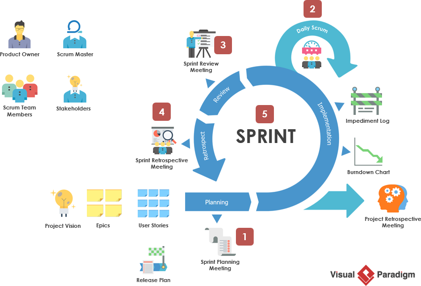

> De 5 Scrum events zijn:
> - De Sprint Planning-meeting
> - De Daily Scrums (of “Daily Standups”)
> - De Sprint Review-meeting
> - De Sprint Retrospective-meeting
> - De Sprint

De **Sprint** begint met de **Sprint Planning** waarin we plannen wat we gaan maken, we hebben de dagelijkse **Daily Scrums** waarin we mogelijke obstakels zo vlug mogelijk oplossen. Op het eind van een Sprint wordt getoond wat er gemaakt werd tijdens de **Sprint Review** en ten slotte gaat het team tijdens de **Sprint Retrospective** terugblikken naar de voorbije Sprint om te bepalen hoe hun werkwijzen nog te verbeteren.

#### 7.8.1 Sprints

De hartslag van Agile, een vaste periode (meestal 1, 2 of 4 weken) waarin een specifieke hoeveelheid werk wordt uitgevoerd. Zodra een sprint eindigt, begint meteen een nieuwe (iteratie!).

#### 7.8.2 Sprint planning

Bij de start van elke sprint is er een planningssessie binnen het team. De **sprint backlog** wordt gepland (het team gaat bepalen welke items ze aanpakt tijdens de volgende sprint). Nemen items uit de **product backlog** en plaatsen ze in de **sprint backlog**.

> **Sprint Planning**: het event dat het begin van een Sprint uitmaakt, met een tijdsbeperking van acht uur of minder. Tijdens dit event bepaalt het Scrum Team welke selectie van de Product Backlog in een Sprint wordt opgenomen en identificeert het Sprint Doel en de ontwikkelactiviteiten ervoor.

Niet alleen de **Sprint Backlog** wordt tijdens de Sprint Planning bepaald, er wordt tevens een duidelijk **Sprint Doel** vastgelegd.

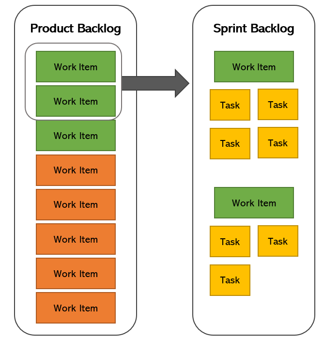

##### 7.8.2.1 User stories en epics

Een User Story is een Agile en Scrum werkinstrument dat als doel heeft producten (“software”) te beschrijven vanuit het standpunt van een eindgebruiker.

> “als (type gebruiker), wil ik (een bepaald doel) zo dat (een bepaalde reden)”

##### 7.8.2.2 Acceptatie criteria

Acceptatie criteria geven een duidelijke beschrijving van wat men verstaat onder “done” (gedaan) in de terminologie van User Stories. Ze beschrijven de standaarden waartegen iets wordt beoordeeld, de requirements.

##### 7.8.2.3 Product backlog item

Een “Product Backlog item” (PBI, Backlog item of item genoemd) is een eenduidige taak die je moet afronden.
User Stories, Epics, Taken, Bugs of Change Requirements zijn voorbeelden van Product Backlog items.

##### 7.8.2.4 Sprint doel

Het Sprint Doel (of de Sprint Goal) is een korte zin van een of twee regels die beschrijft wat het Team wil bereiken in deze Sprint. Deze zin wordt door de **Product Owner** en het Team gezamenlijk opgesteld.

##### 7.8.2.5 Sprint backlog

Een “Sprint Backlog” is de taak (of de taken) die een team hoopt af te ronden tijdens een bepaalde Sprint.

Een Sprint Backlog is een lijst met User Stories die tijdens een Sprint moeten worden voltooid. Het team schat de User Stories in met storypunten en werkt eraan om ze allemaal af te ronden.

> **Sprint Backlog**: De Sprint Backlog is samengesteld uit het Sprint Doel (waarom), de set van Product Backlog items geselecteerd voor de Sprint (wat) en een uitvoerbaar plan voor het opleveren van het Increment (hoe).

#### 7.8.3 Daily standups

De dagelijkse meetings voor de werknemers die aan een project samenwerken noemen we de “Daily Standups”. De bedoeling is dat deze maar 5 tot 15 minuten duren. Gebruikelijk staan alle aanwezigen recht. Dit heeft als doel de deelnemers aan te moedigen de vergadering niet nodeloos te rekken. De duurtijd van 15 minuten is een maximum!

> **Daily Standup**: Een dagelijkse meeting van maximum 15 minuten waar elke deelnemer de groep de antwoorden op de volgende 3 vragen vertelt:
> - Wat heb ik gisteren bereikt?
> - Wat ga ik vandaag doen?
> - Welke mogelijke obstakels belemmeren mijn vooruitgang?

#### 7.8.4 Sprint review

De Sprint Review is bedoeld als het officiële moment tijdens elke Sprint waarin het Scrum Team aan de Stakeholders het gemaakte (deel)product toont. De Stakeholders geven hun terugkoppeling op het (deel)product dat gedemonstreerd is.

> **Sprint Review**: het event dat het einde van de ontwikkelactiviteiten van een Sprint uitmaakt, met een tijdsbeperking van vier uur of minder. Tijdens dit event bespreken het Scrum Team en uitgenodigde belanghebbenden de resultaten van de Sprint, de huidige inhoud van de Product Backlog en de voortgang op productniveau. Het doel is om potentieel belangrijk werk voor de nabije, of verdere, toekomst te identificeren. Het resultaat is een bijgewerkte Product Backlog.

##### 7.8.4.1 Stakeholders

> **Stakeholder**: een persoon van buiten het Scrum Team met een specifiek belang in het product of kennis ervan die noodzakelijk is voor de verdere ontwikkeling van het product.

- Interne stakeholders: deze willen vooral dat het project winstgevend en/of efficiënt verloopt. Bijvoorbeeld de afdelingen binnen de organisatie, zoals logistiek, marketing, finance, HR
- Externe stakeholders: deze zitten op behoefte-invulling van het project en hebben een emotioneel belang. Het betreft bijvoorbeeld de eindgebruiker, de consument, de betalende klant
- Interface stakeholders: deze hebben mogelijk invloed door wet- en regelgeving, bijvoorbeeld de overheid, maatschappij, onderwijs

#### 7.8.5 Sprint retrospective

Een Sprint Retrospective (of kort: een Sprint Retro) is de meeting op het einde van een Sprint waar het team bepaalt wat men kan wijzigen zodat de volgende Sprint meer productief wordt. Sprint Retrospectives verzamelen feedback en geven informatie over hoe de voortgang van een project verloopt.

> **Sprint Retrospective**: het event dat het einde van een Sprint uitmaakt, met een tijdsbeperking van drie uur of minder. Tijdens dit event kijkt het Scrum Team terug op de aflopende Sprint, met als doel om op basis van de ervaringen in de huidige Sprint het proces en de manier van werken, in brede zin, voor de volgende Sprint te bepalen.

#### 7.8.6 Product backlog refinement

Product Backlog Refinement is een meeting gedurende de Sprint waarin we items van de Product Backlog bespreken en verduidelijken. We proberen in te schatten hoeveel Storypunten er voor elke PBI (Product Backlog item) nodig zijn om deze af te ronden en we geven de taken een prioriteit. Ook wel "Backlog Grooming" of "Story Time" genoemd.

> **Product Backlog refinement**: de regelmatige activiteit om gradueel verfijndere inzichten te creëren in de Product Backlog.

### 7.9 Scrum artefacten

Elk artefact bevat een commitment om ervoor te zorgen dat het informatie geeft die de transparantie en de focus verhoogt, waaraan de vooruitgang kan worden gemeten:

- Voor de **Product Backlog** is dit het **Product Doel**
- Voor de **Sprint Backlog** is dit het **Sprint Doel**
- Voor het **Increment** is dit de **Definition of Done**

### 7.10 Hulpmiddelen en tools tijdens de sprint
#### 7.10.1 Storypunten

Storypunten (vert. Engels: storypoints) vertegenwoordigen een waarde die alleen belangrijk is voor het Scrum Team door met punten in te schatten hoe groot een item in de backlog is. Het geeft het team de mogelijkheid te bepalen welke items ze oppakken in een Sprint. De Product Owner kan aan de storypunten zien welke items relatief duur zijn om door het team te laten maken. **De punten geven een beeld van de omvang en de moeite die het kost om de items in de backlog door het team te laten maken.**

Gebaseerd op een reeks van Fibonacci, om het in te schatten baseer je je op de volgende punten:
- **Hoeveelheid**: Hoeveel werk is het om de User Story volledig(!) af te ronden, volgens de Definition of Done?
- **Complexiteit**: Hoe ingewikkeld is het om de User Story te maken? Is het makkelijk, of juist uitdagend?
- **Onzekerheid**: Hoe groot is de kans dat we verrassingen tegenkomen die we vooraf niet hadden voorspeld?

**Bij een lage complexiteit, risico en moeite, krijgt de story een laag storypunt.**

#### 7.10.2 De burndown chart

Tijdens een Sprint toont een burndown chart voor het project hoeveel werkuren er op dagbasis nog overschieten. De dagen zie je van links naar rechts onderaan de grafiek en de uren zie je aan de linkerzijde.

Kijkend naar de Burndown Chart kun je zien of een project nog “on target” is, voorloopt of achterophinkt.

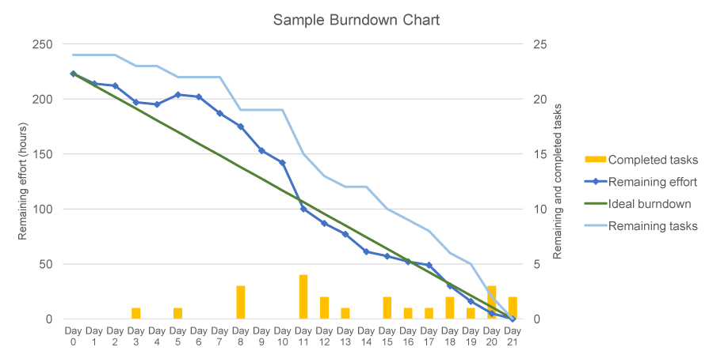

#### 7.10.3 Velocity

Velocity is de snelheid waartegen teams werk afronden. Meer bepaald, de som van de storypunten van de items van de backlog die het team succesvol kan afronden in 1 Sprint.

Eenmaal men de velocity kent na een aantal Sprints, kan men deze waarde gebruiken om het plannen van projecten te helpen en te voorspellen welke opleverdatum te voorzien.

> **Velocity**: een veelgebruikte aanduiding van de gemiddelde hoeveelheid Product Backlog die een specifiek team met zijn specifieke samenstelling tijdens een Sprint omgezet heeft in één of meerdere Incrementen.

#### 7.10.4 Definition of done

Een Definition of Done is een checklist met activiteiten die je afvinkt voor iedere User Story. Dat betekent dat het activiteiten zijn die voor iedere User Story van toepassing zijn.

> **Definition of Done**: de verzameling kwaliteiten, verwachtingen en criteria waaraan een Increment moet voldoen om te kunnen worden vrijgegeven naar de eindgebruikers – met respect voor overkoepelende organisatierichtlijnen indien beschikbaar.

De Definition of Done wordt tijdens de start van iedere Sprint in de Sprint Planning herhaald. Daarnaast wordt de Definition of Done aangescherpt op basis van voortschrijdend inzicht.

#### 7.10.5 Scrum bord

Binnen Scrum wordt gewerkt met een Scrum-bord (synoniem: ‘takenbord’ of ‘Kanban-bord’). Het Scrum-takenbord is bedoeld als hulpmiddel bij het overzichtelijk maken van de stand van zaken binnen een Sprint. Bestaat uit 3 categoriën:
- To do : Alle taken die men plant uit te voeren binnen de Sprint.
- Doing : De taken binnen de Sprint waar op dat moment aan gewerkt wordt.
- Done : Alle beëindigde taken binnen de Sprint.

Het doel is om aan het einde van iedere Sprint alle taken onder de laatste kolom te hebben geplakt. Wanneer de Sprint is afgelopen en niet alle taken staan onder ‘Done’ dan plaatsen we de niet beëindigde taken terug in de Product Backlog. De Product Owner kijkt dan vervolgens of deze taken in de volgende Sprint passen.

---

## 8. Oefeningen Agile Projectmanagement

Zie document met oefeningen

---

## 9. Informatiemanagement
### 9.1 Wat is informatiemanagement?

> Het proces dat ervoor zorgt dat de informatiebehoeften die vanuit verschillende werk- en bedrijfsprocessen van een organisatie ontstaan worden vertaald in informatievoorziening.

Op strategisch niveau is informatiemanagement verantwoordelijk voor het opstellen van de informatiestrategie, voor het opstellen van de strategie voor de informatievoorzieningsorganisatie en voor de informatiecoördinatie (het coördineren en afstemmen tussen deze strategieën en andere beleidsplannen).

Is ook verantwoordelijk voor een aantal sturende processen:

- Financieel management: Het bewaken van de kosten van de informatievoorziening
- Planning & Control: Aansturing van de tijds- en capaciteitsaspecten van de informatievoorziening
- Behoeftemanagement: Bewaken van de kwaliteit van de informatievoorziening, en vertalen van ontwikkelingen in de behoeften vanuit werk- en bedrijfsprocessen in aanpassingen aan de informatievoorziening
- Contractmanagement: Het maken van goede afspraken met de ICT-leverancier
- Tenslotte voert informatiemanagement vaak regie over projecten om te zorgen dat nieuwe ontwikkelingen aansluiten op doelstellingen voor de lange termijn.

### 9.2 Wat zijn informatievoorzieningen?

Een tekstverwerker, e-mail, het personeelsinformatiesysteem. Voorbeelden van informatievoorzieningen zijn makkelijk te geven. Processen of processtappen worden ondersteund door Informatie Diensten, zoals een polis administratie of een klantenservicesysteem (CRM, customer relationship management). Informatie Diensten maken ‘onder water’ gebruik van Infrastructuur Diensten zoals een database of een netwerk.

### 9.3 Informatiemanager

Naarmate een organisatie groter wordt, krijgt de informatiemanager steeds vaker een coördinerende en leidinggevende rol. In kleine organisaties voert hij vaak zelf taken uit, maar in grotere organisaties stuurt hij een team aan van onder andere functioneel beheerders, beleidsmedewerkers en organisatieadviseurs. Soms heet deze functie teamleider informatiemanagement.

In grote organisaties werkt de informatiemanager vooral als beleidsmedewerker, met extra managementverantwoordelijkheden.

Het is nog een relatief jong vakgebied en veel informatiemanagers hebben ipv de opleiding:
- Een hbo- of universitaire opleiding
- Aanvullende cursussen en trainingen
- Het certificaat BiSL-Foundation
- Training in soft skills (zoals adviseren en beïnvloeden)

De informatiemanager verbindt afdelingen, organisaties en processen. Belangrijke competenties zijn:
- Adviseren en analyseren
- Luisteren en netwerken
- Strategisch en tactisch denken
- Draagvlak creëren
- ...

De informatiemanager hoeft geen diepgaande technische kennis te hebben van programmeertalen of software. Wel moet hij voldoende kennis hebben om effectief te communiceren met ICT-specialisten.

### 9.4 Het 9-vlaksmodel

Het model onderscheidt drie besturingsdomeinen:
- Bedrijfsvoering (bedrijfsdomein) : in dit domein bevindt zich de reguliere bedrijfsvoering met al haar facetten, zoals mensen, middelen, processen etc
- Informatie en communicatie voorziening (Informatie domein) : in dit domein gaat het specifiek om informatie als ondersteunend middel voor het bedrijfsdomein. Hier wordt de vraag naar informatievoorziening vanuit het bedrijfsdomein vertaald in een vraag naar ICT(technologie)
- Informatie en communicatie technologie (ICT-domein) : in dit domein gaat het specifiek om de ontwikkeling en exploitatie van ICT(technologie)

Op de verticale as zien we de besturingsniveaus zoals men die kent uit het besturingsframe: strategisch(richten), tactisch(inrichten) en operationeel(verrichten).

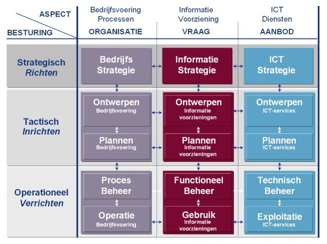

#### 9.4.1 Relatie 9-vlaksmodel en het besturingsframe

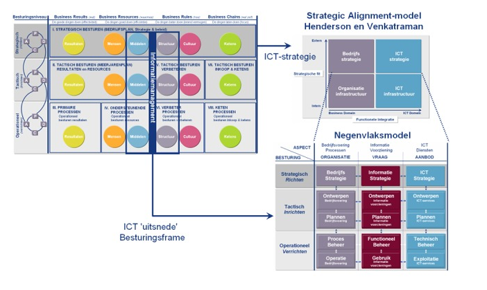

Het negenvlaksmodel is een vereenvoudigde weergave van het besturingsframe, waarbij informatievoorziening centraal staat. De aanbodkant staat rechts, terwijl resultaten, mensen en andere middelen links staan. Het model is bedoeld als praktisch hulpmiddel om over ICT en informatiemanagement te praten, maar is geen procesmodel en niet wetenschappelijk onderbouwd. Voor het begrijpen van nieuwe ontwikkelingen zoals ICT-regie en uitbesteding is het minder geschikt, omdat ketenaspecten daarin ontbreken.

#### 9.4.2 Informatiemanagementprocessen : ICT-regie

Door de toenemende verwevenheid van ICT en bedrijfsvoering krijgen organisatie-eenheden meer invloed op de aansturing. Informatiemanagement wordt belangrijker en raakt ingebed in de organisatie, terwijl ICT steeds vaker wordt uitbesteed. Dit vraagt om professionele sturing van zowel de vraag als de levering. Daarom richten organisaties een Demand-Supply Organisatie in met centrale ICT-regie. Deze ICT-governance coördineert strategische en tactische processen en integreert ook enterprise architectuur, waarbij bedrijfs-, informatie- en ICT-strategie worden samengebracht.

### 9.5 Business information services library (BiSl)

Een framework voor het uitvoeren van functioneel beheer en informatiemanagement.

Beschrijving van werkzaamheden die aan de klantzijde moeten worden uitgevoerd in een organisatie om de informatievoorziening te krijgen die zij verdient.

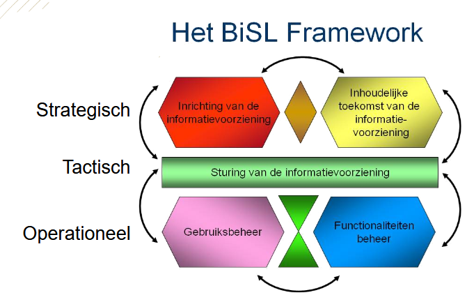

- Informatiemanagement & Functioneel beheer = business informatiemanagement
- Rollen of functies: de key-user of super user, de functioneel beheerder en de informatie manager

#### 9.5.1 BiSL framework in detail

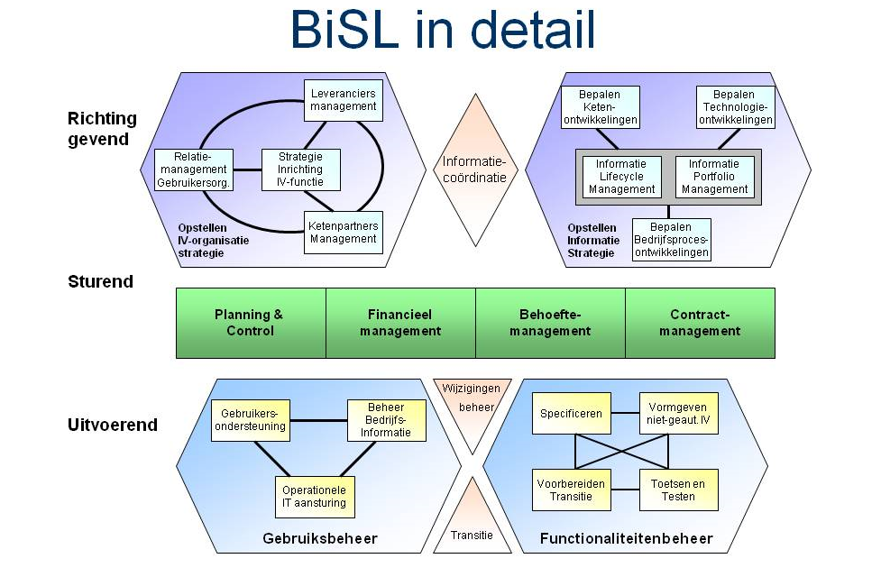

##### 9.5.1.1 Leveranciersmanagement

Focus op dat precies de juiste groep leveranciers wordt gekozen en in stand wordt gehouden

Doel Leveranciersmanagement: Bepalen welke leveranciers het meest geschikt zijn voor de gewenste informatievoorziening en ook de rol en verantwoordelijkheden van die leveranciers bepalen. (geen concrete contracten of service level agreements, SLA's)

Activiteiten:
- Opstellen beleid: het bepalen van de behoefte aan diensten en producten (assortiment) en ook de gewenste relatie
- Selectie en evaluatie: Het evalueren van bestaande leveranciers
- Beheer: Het beheer van de relaties met de leveranciers.

##### 9.5.1.2 Relatiemanagement gebruikersorganisatie

Er op gericht de relatie tussen de gebruikersorganisatie en de IV-organisatie vorm te geven.

Doel Relatiemanagement gebruikersorganisatie: het vormgeven en bewaken van de consistentie, samenhang en communicatie tussen de IV-functie en de gebruikersorganisatie.

Activiteiten:
- Evaluatie: Het evalueren van bestaande relaties met de gebruikersorganisatie
- Opstellen beleid: Het bepalen van de gewenste relatie met de gebruikersorganisatie
- Beheer: Het beheer van de relaties met de gebruikersorganisatie

##### 9.5.1.3 Ketenpartners management

Binnen dit proces worden de samenwerkingsverbanden tussen de eigen organisatie en de ketenpartners gedefinieerd en onderhouden.

Doel Ketenpartners management: zodanige samenwerkingsverbanden met andere organisaties (ketenpartners) te organiseren dat op basis hiervan informatie-uitwisseling met deze organisaties kan plaatsvinden.

Activiteiten:
- Evaluatie: Het evalueren van bestaande relaties met de ketenpartners en het onderkennen van gewenste veranderingen
- Opstellen beleid: Vormgeven gewenste organisatie rondom de eigen organisatie in relatie tot de ketenpartners
- Beheer: Het beheer van de ketenorganisatie

##### 9.5.1.4 Strategie inrichting IV-functie

Binnen dit proces wordt de gewenste inrichting van de gehele IV-functie gedefinieerd

Doel Strategie inrichting IV-functie: Het definiëren van de gewenste inrichting van de IV-functie: organisatievorm, verantwoordelijkheden, uitvoering en samenwerking.

ACtiviteiten:
- Evaluatie: Het evalueren van bestaande IV-organisatie
- Opstellen beleid: Bepalen beleid, opstellen structuur, taken, bevoegdheden en verantwoordelijkheden, werkprocessen en communicatiestructuren
- Sturing IV-organisatie: Controle op inrichting conform afspraken en waar nodig het bijsturen indien afwijkingen zijn geconstateerd

#### 9.5.2 De positie van BiSl

Binnen de ICT zijn er 3 vormen van beheer (beheerdomeinen)

**Technisch beheer (ITIL)**: Richt zich op het in stand houden, beheren en onderhoud van de IT-infrastructuur en heeft ITIL als standaard. De IT-infrastructuur is de basis waarop applicaties kunnen draaien en bestaat uit het netwerk, de computers en operating systems en overige randapparatuur.

**Applicatiebeheer (SLA en ITIL)**: het in stand houden van de bedrijfsapplicaties en gegevensverzamelingen van de organisatie. Applicatiebeheer houdt zich bezig met de creatie, beheer en wijzigen van applicaties naar aanleiding van geconstateerde fouten of veranderende technische of functionele eisen. SLA is hiervoor de standaard. SLA is nieuwer dan en deels geïnspireerd door ITIL.

**Functioneel beheer (BiSL)**: het beheren van de informatievoorziening in een organisatie. De bedrijfsapplicaties worden gebruikt door de gebruikersorganisatie en moeten eventueel aan veranderende eisen worden aangepast. Het beschrijven van deze wijzigingen, het (laten) doorvoeren van de voorgestelde wijzigingen en het controleren van de wijzigingen behoort tot het takenpakket van Functioneel Beheer. Functioneel Beheer heeft als standaard BiSL.

#### 9.5.3 Indeling

Er zijn 7 procesclusters met bijhorende processen, verdeeld over 3 niveau's:

- Strategisch/richtgevend nivau:
    - Opstellen IV-organisatiestrategie (organisatie)
    - Verbindende processen (richtinggevend niveau)
    - Opstellen informatiestrategie (vormgeving)
- Sturend niveau:
    - Sturende processen (management)
- Uitvoerend niveau:
    - Gebruiksbeheer (organisatie)
    - Verbindende processen (uitvoerend niveau)
    - Functionaliteitenbeheer (vormgeving)

---

## 10. Methodologiën
### 10.1 Watervalmodel

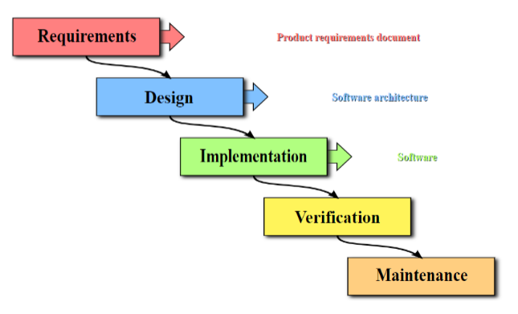

Sequentieel uitvoeren van elke fase, altijd in 1 richting

**PREDICTIVE**

### 10.2 Watervalmodel: V-model

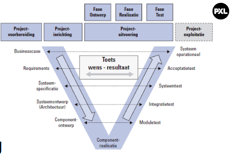

Extra testfasen per niveau, meer focus op software testing

**PREDICTIVE**

### 10.3 Spiral model

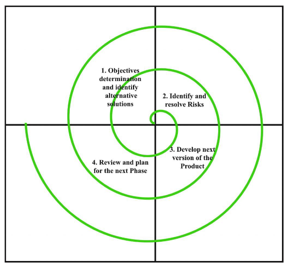

4 stappen met een lineair verloop, Na uitvoering van de vier stappen kan worden besloten om de fase te herhalen of het project te beëindigen.

**ITERATIVE**

### 10.4 Rational Unified Process

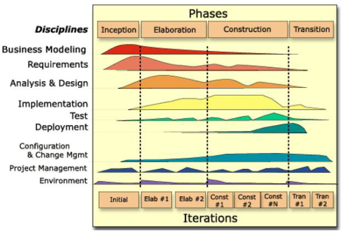

4 fasen met artifacten: Inception, Elaboration, Contruction, Transition

**ITERATIVE**

### 10.5 Rapid Application development

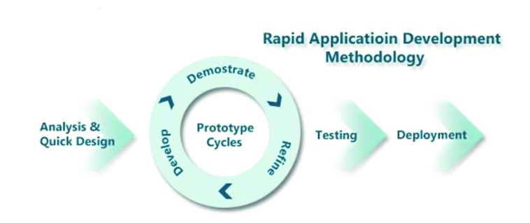

Focus op applicaties maken in zeer weinig tijd, meerdere teams kunnen parallel werken aan onafhankelijke onderdelen van de software

**ITERATIVE**

### 10.6 Open Unified Process

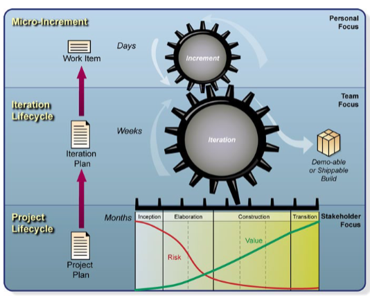

Versimpelde versie van RUP, kleine teams (3-6 personen), 3-6 maanden werk. Micro-incrementen van enkele uren tot dagen

**ADAPTIVE**

### 10.7 Agile-Scrum

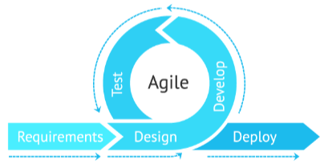

**ADAPTIVE**

### 10.8 Extreme programming

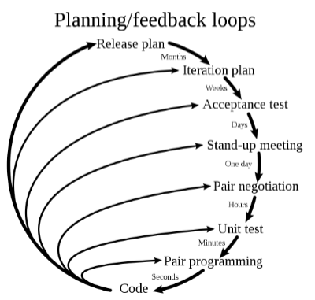

Heeft verschillende waarden:
- Communication: beschikbaarheid van klanten is belangrijk, Pair Programming, gebruik van standaarden in programmeren, …
- Simplicity: Verstaanbaar communiceren met alle stakeholders, eenvoudig design bewaken, refactoren van het design en de code is belangrijk
- Feedback: Continu testen
- Courage: Planning en inschatting in samenwerking met customer (user stories), Collective code ownership: iedereen moet expert zijn in de code van het team

**ADAPTIVE**

### 10.9 LEAN

Als technische vooruitgang legt het Lean Development-model de nadruk op de vorming van moeiteloos beheersbare software. Deze ontwikkelingstechniek is meer verdiept dan welke andere vorm van Agile methodologie dan ook. Doel: software in 1/3 van de tijd te maken, met een zeer beperkt budget en met veel minder essentiële workflows.

**ADAPTIVE**

### 10.9 Kanban

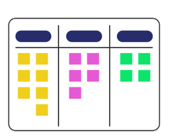

Just-in-Time delivery, Work in progress. Visualiseer het werk en maak bottlenecks zichtbaar. Bepaal het maximum en minimum werk in je Kanbanbord. Focus op flow en continuously improve.

**ADAPTIVE**

### 10.10 Feature driven development (agile)

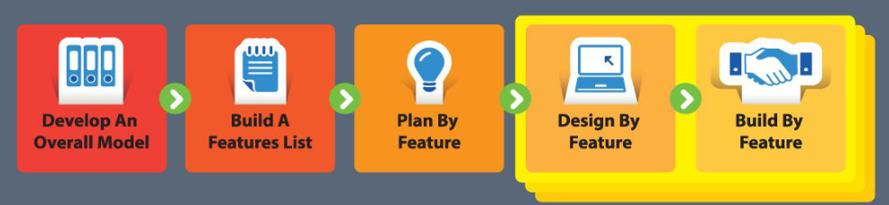

Lichtgewicht Agile methode voor software ontwikkeling, Focus op features: client-valued functionaliteiten. Focus op viable software (MVP). Iteratief model voor 2-4 weken.

**ADAPTIVE**

### 10.11 Overzicht

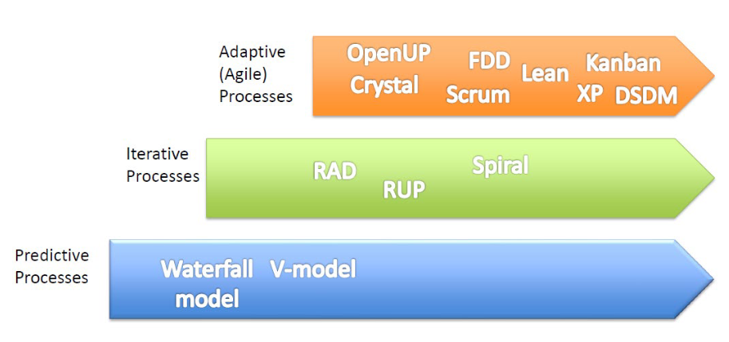